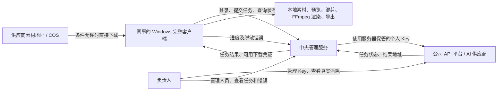

# 工作台部门多人使用与客户端部署方案梳理

日期：2026-09-16  
状态：讨论纪要与方案草案；尚未实施多人架构改造，也未完成容量测试。  
用途：供后续与 IT、产品经理及开发继续讨论，保留本次已确定方向和待确认问题。

## 1. 本次讨论结论

采用 **完整 Windows 客户端＋中央管理服务** 的方向，复用现有工作台桌面版。

最新约束：IT 已明确 Mac 不可用，排除 Mac 部署方案。中央主机按 Windows 方向继续讨论；是否提供现有专用电脑或批准采购、具体配置及部署方式仍待 IT 确认。

- 同事在自己的 Windows 电脑安装完整客户端，完成项目操作、素材下载、本地预览、自动混剪、渲染和导出。
- 中央服务负责账号、权限、真实 API Key、AI 任务提交与状态查询、部门统一排队，以及调用与错误记录。
- 真实 API Key 不下发给客户端，也不展示给同事；客户端只持有工作台自身的登录凭证。
- 希望公司 API 平台能为每位同事提供独立 Key，由负责人统一管理，并直接在公司平台查看各 Key 的真实消耗。
- 每人云端生成并发最高 10；同时受供应商和部门共享总额度约束。超出名额的任务排队。
- 钉钉登录是可选接入方式，不作为第一版必须满足的前提。第一版可以使用独立账号与密码。
- 不再以纯网页免安装为目标。完整客户端保留现有本地能力；后续可以增加网页管理入口。

以上是架构方向，不代表现有版本已经具备这些能力。尤其需要新增服务端权限、用户归属和统一调度，并拆分目前耦合在本机的生成、下载与渲染流程。

## 2. 背景与实际条件

| 项目 | 当前情况 |
| --- | --- |
| 使用范围 | 部门约 20 人，日常电脑均为 Windows |
| 公司服务器资源 | IT 表示目前没有足够性能和空余服务器可供部署 |
| 主机约束 | IT 最新明确 Mac 不可用；Windows 专用主机的来源、采购可行性和配置待确认 |
| 当前电脑 | 本次通过系统运行时读取到 i7-12700KF、64GB 内存；未进行容量压测 |
| 当前 Key | 全部门共用一个 Key |
| 当前费用 | 工作台按预估计算，与公司平台真实数据存在差异 |
| 目标 Key 管理方式 | 申请每人独立 Key，负责人获得公司 API 平台后台权限，集中管理和查看消耗 |
| 七牛 Kling 并发 | 用户提供的信息：已从 50 提高到 100；额度作用范围和其他限流待确认 |
| 每人并发 | 目前给同事设置的最高值为 10；多人版需明确成为按账号汇总的限制 |

希望解决的问题：统一管理版本和访问权限、不向员工暴露真实 Key、明确个人消耗、集中定位错误，同时避免素材存储和视频渲染集中压垮服务器。

## 3. 架构与职责分工



| 功能 | 中央管理服务 | 完整客户端 |
| --- | --- | --- |
| 身份 | 验证账号、管理会话和权限 | 登录、退出、保存受控会话凭证 |
| Key | 保管、绑定人员、选择调用凭据 | 不接收真实 Key |
| AI 调用 | 校验权限、排队、提交、轮询、记录供应商任务标识 | 编辑参数、提交请求、显示状态 |
| 文件 | 保存必要元数据；确有需要时临时中转 | 原始素材、生成结果和成片主要保存在本地 |
| 媒体处理 | 不承担日常重型视频渲染 | 下载、预览、混剪、FFmpeg 渲染和导出 |
| 排错 | 汇总任务状态、供应商错误、本地执行错误 | 上报脱敏诊断信息和执行进度 |
| 更新 | 集中发布服务端逻辑与配置 | 通过配套更新机制更新客户端程序 |

中央主机按 Windows 方向设计。客户端通过网络连接中央服务，不采用多人远程控制同一桌面的方式。Mac 已因 IT 明确限制排除，不再作为候选。

本地执行程序应由客户端主动连接中央服务。无需把同事电脑上的本地服务开放到公网。

## 4. 登录与人员权限

### 4.1 第一版可用独立账号

若钉钉接入不可用、审批较慢或成本不合适，可以先做账号密码登录：

- 由管理员创建账号，不开放自由注册。
- 密码使用成熟的安全散列方案保存，不保存明文密码。
- 管理员可以禁用账号、重置密码、绑定或替换 Key。
- 普通员工不能管理供应商、查看密钥或关闭中央服务。
- 权限检查必须覆盖后端接口，不能只在界面隐藏按钮。
- 为账号保留稳定的内部用户 ID，供项目归属、任务发起人、Key 绑定和未来钉钉接入使用。

需要进一步决定：项目默认私有还是部门共享、是否允许共同编辑、谁能删除共享项目。登录本身并不解决这些权限问题。

### 4.2 钉钉作为后续可接入选项

钉钉可提供网页登录身份验证；工作台仍需校验公司归属、获准使用的人员范围，并管理自己的权限。

接入需与 IT 确认企业应用、接口权限、回调地址和网络条件。不得仅凭姓名绑定账号，也不得认为任何扫码成功的人都能访问工作台。

后续可把钉钉身份绑定到已有内部用户 ID，保留原有项目和任务记录。

参考：[钉钉官方登录教程](https://open.dingtalk.com/tutorial/)。本次仅确认能力方向，未完成实际应用配置或登录联调。

## 5. Key 与真实消耗管理

拟采用以下对应关系：

```text
员工身份 → 工作台账号 → 中央服务保管的个人 Key → 公司平台的用量记录
```

第一版分工：

| 公司 API 平台 | 工作台 |
| --- | --- |
| 负责人创建、停用和管理 Key | 管理员工账号及其 Key 绑定 |
| 查看各 Key 的真实消耗 | 查看任务发起人、项目、模型、状态和错误 |
| 如平台支持，在平台设置 Key 额度 | 原有费用可保留，但明确标注为预估 |

**本次没有要求第一版把公司平台真实账单同步到工作台。** 因此账单接口、自动对账和真实余额同步暂不作为第一版前提。

每人一个 Key 有助于归属和分账，但不会自动修正工作台的价格估算；准确消耗仍以公司平台提供的数据为准。需确认平台支持按 Key 查看所需的消耗数据，并给 Key 添加清晰的人员备注。

需进一步确认：独立 Key 是否覆盖所有使用中的模型和供应商；是否有其他直连供应商凭据需要单独管理。

## 6. 下载为什么需要改造

当前视频流程由工作台后端下载生成结果，并写入后端所在机器的 `dataRoot()/storage/videos`。

```text
现状：后端在个人电脑
服务商结果地址 → 个人电脑上的后端下载 → 个人电脑保存

直接整体搬到服务器、不修改流程
服务商结果地址 → 服务器下载并保存 → 同事再从服务器下载

目标流程
中央服务取得生成结果地址 → 向有权限的客户端交付下载信息
服务商结果地址 → 同事客户端直接下载 → 本地保存、预览、渲染
```

区别在于执行下载和保存文件的机器，而不是素材是不是来自服务商。

需要按供应商实际能力处理：

- **结果链接可直接下载：** 客户端直接下载，不经过中央主机传输素材。
- **支持短期下载凭证：** 中央服务取得或签发受限凭证，客户端使用凭证下载。
- **下载必须带真实 Key：** 不能把 Key 下发客户端；需要服务端鉴权转发，或由网关提供短期下载能力。转发可以避免长期落盘，但仍占中央服务带宽。

当前代码兼容直接下载和带鉴权下载。七牛实际返回链接的类型、有效期、能否重新获取，仍需用真实任务验证，不能仅凭模型名称判断。

输入参考图也需要单独梳理交付路径：现有公司模型涉及 COS，客户端不得保存 COS 长期密钥。应保留服务端受控上传，或设计短期受限上传授权；具体方式待定。

## 7. 并发与排队规则

### 7.1 云端生成

已接受的方向：每人最高 10 个生成并发，另外受供应商和部门总额度限制。

以“七牛 Kling 的 100 为部门共享运行额度”为假设：

| 场景 | 处理方式 |
| --- | --- |
| 5 人各提交 10 个任务 | 名额允许时可运行 50 个 |
| 20 人各提交 10 个任务 | 最多运行 100 个，其余排队 |
| 同一个人开启多个项目或客户端 | 按同一账号合计，不能各自获得 10 个名额 |
| 一个用户提交数百条任务 | 超出个人或全局运行名额的部分进入队列 |

“每人 10”是运行上限，不是保证每个人随时都能同时运行 10 个。

需确认供应商的 100 限制属于账号、Key、模型还是渠道，以及提交、轮询是否另有频率限制。不同供应商和模型分别管理额度；公司网关的限制也要一并考虑。

建议的调度规则：

- 队列由中央服务统一维护并持久保存。
- 按用户轮流取任务，空闲名额可供其他有任务的用户使用。
- 避免单个用户的大批量任务长期阻塞其他人。
- 服务重启后恢复队列；客户端重试请求不能重复创建供应商任务。
- 对提交结果不明确的请求先核查，不能直接再次提交付费任务。
- 云端任务完成即按供应商规则释放对应名额，不应一直占用到本地渲染结束。

尚待明确：个人 10 的限制是所有云端生成任务合计，还是按图片、视频或供应商分别设置。

### 7.2 本地下载与渲染

本地渲染使用独立队列，不能沿用“云端并发 10”的设置。

- 建议初始同时渲染 1 个任务，后续根据同事电脑的实际表现调整。
- 下载并发也应单独控制，避免素材集中完成时占满网络和磁盘。
- 状态至少区分等待生成、生成中、等待下载、下载中、等待渲染、渲染中、完成和失败。
- 客户端关闭后，中央服务继续跟踪已提交的云端任务；本地下载和渲染等待客户端恢复。
- 中断后是续传、恢复还是重新执行，需按任务类型实现，不能默认现有代码已支持。

## 8. 存储、更新与集中排错

### 素材以本地为主

中央服务仍需要数据库和日志空间，但不把所有大文件长期集中保存。项目描述、任务标识、文件归属、设备标识等元数据的保存位置需进一步设计。

本地素材不会自动出现在另一台电脑。换电脑、多人协作、共享项目和本地文件丢失后的处理方式尚未确定。

客户端离线时，需考虑供应商结果链接过期。后续确定重新获取链接、临时 COS 保存或其他保留策略；不能承诺客户端任意时间上线都一定能下载。

### 更新仍分两部分

- 服务端权限、调度、供应商配置等集中更新。
- 客户端界面和本地下载、渲染能力变更仍需发布客户端版本。
- 目标是自动更新，减少逐台操作；具体机制、版本兼容和失败回退尚未设计。
- 不在正在执行的渲染中途强制更新。服务端维护也需考虑正在运行的付费任务。

因此，原先“以后只在服务器更新一次”的目标调整为：**集中发布与管理，客户端自动获取必要更新**。

### 排错需要客户端回传

中央服务可以直接记录 AI 调用错误；本地下载、磁盘、FFmpeg 等错误，必须由客户端回传后才能集中查看。

建议记录账号、项目 ID、内部任务 ID、供应商请求或任务 ID、客户端版本、阶段和脱敏错误摘要。日志不包含 API Key、鉴权头、完整签名 URL 或不必要的本地隐私信息。

## 9. 服务器选择与部署边界

当素材和重型渲染留在同事电脑后，中央服务主要承担认证、调度、数据库记录与网络请求，硬件压力比集中渲染低。

当前 i7-12700KF、64GB 机器可作为试点候选；这不是经过测试的 20 人容量保证。应先验证实际调用、轮询、排队和必要的文件转发负载，再与 IT 确定现有 Windows 专用电脑或新购 Windows 主机。Mac 已排除；Windows 主机的提供或采购尚未获确认。

正式运行还需确定：内网固定访问入口、HTTPS、开机自启、防休眠、异常恢复、数据库备份和维护窗口。

保留仓库现有红线：本机应用和 LiteLLM 不向公网开放。中央服务通过受控公司内网入口访问；需要公网交付的素材按现有约定走 COS。

## 10. 当前代码提供的基础及边界

本次已查看的相关实现：

| 文件 | 与方案的关系 |
| --- | --- |
| `desktop/main.ts`、`desktop/preload.ts` | 已有 Electron 壳、本地服务启动与桌面桥接，可复用；尚非连接中央服务的多人客户端 |
| `app/api/projects/route.ts` | 当前项目列表查询未按登录用户隔离，需要补用户归属和访问控制 |
| `app/api/providers/route.ts` | 现有接口隐藏 Key，但这不等于已经具备多人权限体系 |
| `lib/video-queue.ts` | 当前后端同时负责云端轮询、视频下载、保存及预览准备，需要拆分执行位置 |
| `lib/media-download-policy.ts`、`lib/gateway-media-url.ts` | 已存在直接下载和网关鉴权下载两类路径 |
| `lib/final-edit/renderer.ts` | 当前主成片流程使用 FFmpeg `libx264` CPU 编码，需留在同事本机执行 |
| `lib/final-edit/worker.ts` | 已有本机渲染队列与部分恢复能力，但不是部门统一调度系统 |
| `lib/usage-schema.ts`、`lib/usage-ledger.ts` | 已有用量账本，可复用任务追踪基础；不能等同于公司平台真实账单 |

实施时仍需遵守 AGENTS.md 中的追加式迁移、数据根路径、密钥脱敏、打包和模块边界约定。

## 11. 下次讨论优先确认的事项

### 与 IT / 公司平台确认

1. 能否获得后台管理权限，为每人创建独立 Key，并按 Key 查看真实消耗？
2. 平台是否支持 Key 硬额度、停用、备注和调用明细？这些 Key 覆盖哪些模型？
3. 七牛 Kling 的 100 并发具体按什么范围计算？是否还有公司网关限流？
4. 生成结果链接是否能由员工电脑直接下载、多久过期、能否重新获取？
5. IT 能否提供现有 Windows 专用电脑或批准采购？部门内网访问、HTTPS 及客户端安装和更新由谁配合？
6. 钉钉接入是否方便？若暂时不方便，先使用独立账号是否可接受？

### 产品和实现设计确认

1. 项目默认私有还是共享？是否允许多人同时编辑？
2. 每人最多 10 的计数口径是什么？
3. 是否允许一个账号登录多台电脑？本地任务绑定哪台设备？
4. 本地素材、中央项目元数据和共享项目如何关联？换电脑如何迁移？
5. 客户端离线、下载链接过期、渲染中断时如何恢复？
6. 先拿哪个完整业务流程做试点，哪些复杂功能后续再接？

## 12. 建议的后续推进顺序

以下是建议顺序，尚未排期，也不是本次已启动的开发任务：

1. 确认 Key 管理能力、并发范围和真实下载路径。
2. 明确账号、项目、设备与任务的归属，形成正式技术方案。
3. 用一个完整流程打通账号登录、中央代理调用、统一排队、本地下载和渲染。
4. 验证断网、重启、重复提交、Key 停用和权限隔离。
5. 补齐管理后台、脱敏错误回传和客户端更新。
6. 先 3～5 人试点，再扩大到接近 20 人，根据实测决定专用主机配置。

## 13. 后续继续讨论时的简短上下文

> 我们准备把 Creative Studio 改成部门约 20 人使用的“完整 Windows 客户端＋中央管理服务”。客户端复用现有桌面版，负责素材下载、本地预览、自动混剪、FFmpeg 渲染与导出。中央服务负责账号权限、保管每人独立的真实 Key、代理 AI 调用、状态查询、统一排队及集中错误记录。真实 Key 不给客户端。负责人希望直接在公司 API 平台管理 Key、查看每个 Key 的真实消耗，第一版不要求同步真实账单。钉钉登录可选，不方便就先做独立账号。每人云端并发最高 10；用户反馈七牛 Kling 总额度已提高到 100，但需确认作用范围，中央队列还要有全局限制和用户公平调度。本地渲染并发单独设置。素材希望主要保留在同事电脑，需验证供应商直下载、链接有效期及鉴权要求。IT 最新明确 Mac 不可用，已排除；中央主机按 Windows 方向继续，现有机器试点及专用主机来源、采购和配置需进一步确认。当前只完成方案讨论，没有实施多人改造或容量测试。下一步优先明确项目共享规则、设备归属、Key 能力、下载路径及离线恢复。
