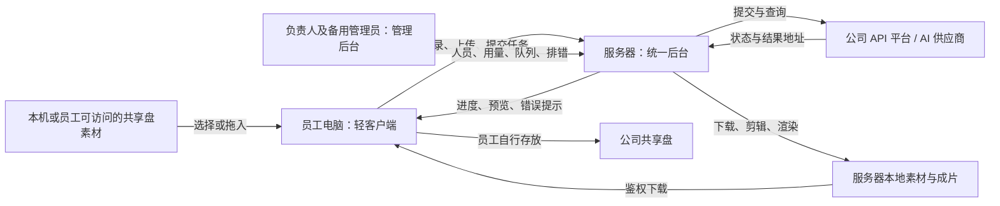

# 工作台轻客户端与服务器统一生产方案梳理

日期：2026-09-20

状态：需求访谈各项决策已收敛，形成需求基线供整体核对；尚未实施多人服务改造、核验服务器部署细节或完成容量测试。

用途：记录已确认的产品规则、现状证据和实施前核验事项，作为后续实施规格与验收的输入。

> **最新方向：仅连接服务器的轻客户端＋服务器统一生产＋个人数据隔离＋客户端下载。** 员工只能看到自己的项目、素材、任务和用量，管理员能查看全部。服务器负责 AI 调用、轮询、生成结果下载、剪辑渲染和存档；员工将结果下载到本机，再自行放入公司共享盘。第一版必须支持常规项目生产、批量生产和详情页智能脚本全部模块。
>
> 本文更新了 [2026-09-16 的方案](2026-09-16-部门多人使用与客户端部署方案梳理.md)：生成结果获取与渲染集中在服务器，客户端接收成品副本。后续访谈已替代本文早期的“部门共享项目、后台直传共享盘、兼容单机模式”设想；以当前正文为准，旧文仅保留讨论历史。

## 1. 已确认的现状

以下服务器使用情况来自负责人本轮反馈，未通过工具直接登录服务器核验。

| 项目 | 当前情况 |
| --- | --- |
| 服务器 | 已有一台 Windows Server 电脑，并已部署工作台；名称 `AI-TEST-PC`，当前内网地址 `10.20.16.165` |
| 显卡与实验计划 | 负责人确认服务器目前使用 RTX 3060 12GB，并最新反馈“GPU 渲染没问题”，已完成一次可用性测试；流程跑通后考虑申购 RTX 50 系，具体型号未定。测试素材、耗时、资源占用和多人并发吞吐尚未记录，不能据此视为容量验收通过 |
| 部署版本与位置 | 负责人确认使用 `0.6.2` Windows 免安装版，程序目录为 `F:\创意工作台-0.6.2-免安装版-20260917\创意工作台-0.6.2-免安装版-20260917`；实际数据根尚待核实 |
| 数据目录 | 负责人确认上述程序目录下存在 `data\workbench.db` 和 `storage`；整个程序文件夹约 `2.91GB`。运行进程实际使用的数据根尚未核验 |
| 备份 | 负责人于 2026-09-20 反馈已备份至 `D:\工作台备份\2026-09-20-backup\创意工作台-0.6.2-免安装版-20260917`；此前反馈目标盘可用空间约 `700GB`。备份时停写情况、文件校验及恢复验证尚未确认；D / F 是否属于不同物理磁盘待核实 |
| 接入 | 已讨论过以工号及各自设置的电脑密码远程登录的方式，账号不属于公司统一身份体系。负责人最新澄清尚未向同事开放使用或告知远程登录方式；正式使用全部走轻客户端，独立工号认证不依赖 IT |
| 启动 | 当前免安装程序入口为目录内的 `start-windows.cmd`；正式版由公共后台持续运行，员工只打开轻客户端 |
| 项目和素材 | 当前程序和 `storage` 集中存放；旧版项目可见性不做个人隔离。负责人确认尚无需要分配给员工的历史项目包袱，不建设历史项目认领流程；现有测试数据不因此自动删除 |
| 退出行为 | 负责人确认，目前退出自己的窗口不影响其他人使用 |
| 文件传输 | 已通过远程桌面的本地驱动器重定向解决本机与服务器之间的素材传输 |
| API Key | 每人独立 Key 尚未落实，当前仍按共用 Key 的条件设计过渡阶段 |
| 共享盘 | 最新交付方式为员工下载结果后自行放入共享盘；后台直传共享盘不再是第一版交付前提。员工还希望从本机或自己可访问的共享盘拖入图片、视频作为输入 |
| 使用规模 | 目标最高 20 名员工同时使用。负责人刚核实七牛 image2 与视频共用并发池，平台上限 100；工作台采用共享上限 70、每人最高 10，超额排队。每日成片量暂无法确定，服务器尚未做容量测试 |
| 管理员 | 负责人为主管理员，其领导为备用管理员；允许管理员代操作，不额外建设管理员操作记录功能 |
| 首批验收人员 | 负责人和另一位同事先测试，确认无问题后再向其他员工开放；备用管理员仍为负责人领导，测试同事不因此自动获得管理员权限 |

当前已具备服务器部署、远程使用和文件传输的初步条件，但尚未向同事正式开放。按人管理、统一调度、集中排错及可靠发布更新仍需要开发和验证；此前多人使用描述不作为实际部门上线或容量验证的证据。

## 2. 本轮确认的目标

核心原则是：**用户数据隔离＋管理员全局可见＋个人任务记账＋统一后台调度。**

- 员工日常在自己的 Windows 电脑打开工作台客户端，连接服务器使用；远程桌面仅保留给管理员运维，不作为员工过渡生产入口。
- 项目和素材在服务器集中存储，普通员工只能看到自己的内容，管理员能看全部；集中存储不等于部门共享。
- 第一版必须覆盖常规项目生产、批量生产、详情页智能脚本，不能将后两者作为首版不支持的后续模块。
- 每次任务记录真实发起人，供个人用量和错误追踪使用。
- AI 调用、结果下载、剪辑、FFmpeg 渲染均由服务端编排和执行。其中 AI 模型生成仍通过公司 API 平台或供应商完成，不代表在这台服务器本地部署生成模型。
- 结果在服务器留档；最终成片导出成功后自动下载到员工本机，其他产物按需手动下载。员工首次选择下载根目录，按项目 / 导出版本分目录；原设备重连自动补下，新设备不自动拉全部历史。员工自行将文件放入共享盘。
- 支持员工从本机或自己可访问的共享盘拖入图片、视频，由客户端上传到服务器后供任务调用，不再以远程桌面驱动器重定向作为日常素材输入方式。
- 正式版不保留独立单机生产模式；客户端所有生产入口统一提交服务器，服务器统一控制 AI 调用和队列，客户端不持有供应商 Key 或启动独立生产后台。
- 用量只做统计，暂不设个人金额、任务数量或预算限制；七牛 image2 与视频共享并发 70，每人最高 10，超额排队。数据暂不自动删除。
- 负责人可以集中更新程序、管理人员、查看消耗、控制任务并发和定位错误。

本轮产品决策已收敛，尚未实施。工号认证、个人隔离、上传下载、共享并发与排队、重试、用量统计、删除、账号生命周期、运行维护和试点方式均已确认。服务器配置、网络入口、实际数据根、上传 / 渲染容量及备份恢复能力属于待核验事实和工程参数，不把它们伪装成已完成能力。

## 3. 与此前方案的变化

| 事项 | 2026-09-16 方案 | 本轮最新方向 |
| --- | --- | --- |
| 员工端 | 完整客户端，承担下载、剪辑和本地渲染 | 仅连接服务器的轻客户端，承担登录、交互、上传、结果展示与成品下载 |
| 服务端 | 账号、Key、AI 调用和调度 | 在上述基础上承担生成结果下载、素材保存、剪辑渲染与提供下载 |
| 主要素材位置 | 员工本机 | 服务器集中存档、按用户隔离；员工下载副本后自行交付共享盘 |
| 日常使用入口 | 本地完整客户端 | 员工只使用连接服务器的客户端，远程桌面仅管理员运维 |
| 更新 | 服务端和完整客户端分别发布 | 页面和主要业务逻辑集中更新；客户端外壳按需更新 |
| 性能压力 | 重型处理分散在员工电脑 | 重型处理集中在服务器，需要独立渲染队列和容量验证 |

## 4. 目标架构与职责

| 位置 | 职责 |
| --- | --- |
| 员工客户端 | 登录、个人项目操作、本机或可访问共享盘素材的选择或拖入、上传、任务提交、状态和预览展示、结果下载 |
| 服务器后台 | 身份校验、用户数据隔离、Key 保管、统一队列、AI 调用与轮询、生成结果下载、渲染、用量记录、错误收集、提供鉴权下载 |
| 服务器本地磁盘 | 数据库、队列状态、上传素材、生成结果、渲染中间文件和必要日志 |
| 公司共享盘 | 员工自行存放下载后的交付文件，也可作为员工可访问的输入素材来源；本版不要求后台自动发布或同步 |
| 公司 API 平台 | 提供 AI 调用能力和真实账单；独立 Key、硬额度、停用和查询能力以平台实际支持为准 |
| 管理后台 | 人员管理、所有个人用量及部门总用量、全部项目与任务、错误详情、并发调度与下载故障定位；暂不做预算限制 |

客户端可复用现有 Electron 外壳，但需要新增连接中央服务的能力。客户端到服务器采用符合公司网络要求的受控内网入口和认证连接；保留现有不向公网开放本机应用及 LiteLLM 的约束。身份模块由工作台自行实现与管理，不以 IT 提供统一认证为前置条件；部署所需的网络和系统权限仍须具备。

## 5. 员工完整使用流程

1. 在自己的电脑打开客户端并登录工作台。
2. 查看自己的项目，创建项目或进入自己的已有项目；管理员另有全局查看入口。
3. 从本机或自己可访问的共享盘选择、拖入素材并上传到服务器；上传完成后才可作为服务器任务的输入。
4. 编辑生成参数并提交任务，显示排队、执行、下载、渲染等状态。
5. 查看结果、继续生成或混剪；每次新任务都记录实际发起人。
6. 结果在服务器存档；最终成片导出成功后自动下载到员工自己的电脑，其他产物按需下载。
7. 员工自行将选定结果放入共享盘，工作台不宣称已完成共享盘交付。

目标行为：关闭客户端不会停止已被服务器接受的任务；重新登录可以查询进度和结果。上传需支持多文件和文件夹导入、进度、取消及中断恢复；尚未完成上传的本机文件不属于已接受的生成任务。

客户端关闭或本机离线时，不能当场完成写入本机的下载；服务器保留结果，原设备重新打开客户端后自动补下未完成的导出。新设备登录仅显示成果列表，由员工选择下载，不自动拉取全部历史。拖入客户端的是文件内容上传入口，不是把本机盘符当成服务器可访问路径。

## 6. 人员身份、个人数据隔离与权限

### 人员身份

**已确认方向：工作台独立账号认证，固定工号作为登录名，由负责人管理账号，不依赖 IT 或公司统一登录。** 负责人说明现有密码由各自设置，账号不属于公司统一身份体系。员工尚未获知远程登录方式，正式使用只通过轻客户端；远程桌面用于管理员运维。

第一版账号流程已确认，具体实现仍待开发：

- 管理员按工号和姓名创建员工账号，不开放仅填工号即可认领身份的自助注册。工号作为唯一登录名按文本保存，保留前导零；后台另有稳定内部用户 ID，用于任务、用量和个人 Key 关联。
- 员工使用“工号＋工作台密码”登录。工作台密码单独设置，不收集、不校验或同步电脑开机密码；首次使用管理员提供的一次性初始凭据后设置个人密码。
- 管理员可新增、停用账号、重置密码和调整角色。管理员不能查看原密码；忘记密码由管理员重置，重置后要求员工重新设置。
- 支持“记住登录”30 天；主动退出使对应登录会话立即失效，重置密码或停用账号使该账号既有会话失效。服务器保存密码的安全哈希，登录保持通过会话实现，不保存明文密码。登录传输保护、失败尝试限制、首个管理员初始化和管理员恢复路径由实施规格落实。
- 停用账号后立即禁止登录和新增任务，暂停尚未执行的任务；已提交供应商的任务继续收取结果并保存在服务器，但不启动后续付费步骤。历史项目和用量保留，管理员可查看。
- 员工身份必须从服务端验证过的会话取得，提交任务时固定记录发起人；不能相信客户端自报工号，也不能读取公共后台的 Windows 用户名作为操作员工。
- 管理员与普通员工权限分开；后端接口、素材访问和任务操作均实施访问检查。第一版不接 AD、钉钉或其他公司统一登录，后续如有条件可通过内部用户 ID 做身份绑定。

负责人为主管理员，负责人领导为备用管理员；两位管理员可查看全部并代操作。负责人明确不需要额外的管理员操作记录，且认为代生成极少发生，不为此建设特殊流程、账单转记或身份切换；普通生产任务沿用本方案已确认的登录用户归属规则，不另设一套例外。工作台账号不会自动获得 Windows 管理权限或共享盘权限；公共后台服务账号需具备实际数据目录权限，员工客户端按自己的文件访问权限读取素材和保存下载。

### 个人项目与任务归属

| 示例 | 归属规则 |
| --- | --- |
| 张三创建项目 | 项目归张三，张三及管理员可查看 |
| 李四登录工作台 | 只能看到李四自己的项目、素材、任务、错误和用量，不能访问张三的数据 |
| 张三生成或重新生成视频 | 新任务发起人及预估用量归张三，保留历史记录 |
| 管理员查看生产情况 | 可查看所有人的项目、任务、个人预估用量和部门总预估用量 |
| 管理员替员工操作 | 允许管理操作，不建设专门代生成、身份切换、账单转记或额外操作记录功能；普通任务沿用统一归属规则 |

个人隔离必须覆盖后端接口、文件预览与下载、搜索、日志、导出以及全部生产模块，不能只隐藏列表。

- **删除**：员工可以删除自己的项目或素材，使其从日常界面消失、进入回收站；被任务引用也允许执行此操作。先隐藏记录，保留任务依赖文件；不自动中断已经提交的任务，也不自动下载已删除项目的新结果。“取消任务”是独立操作，按第 8 节执行。回收站不自动清空，永久清理由管理员执行，仍被任务使用的文件暂缓物理删除。
- **公共资源**：管理员发布的模板、BGM、音色、知识库等可供所有员工使用，普通员工不能修改公共版本；员工自己创建或上传的资源仅本人及管理员可见。
- **历史数据**：负责人确认尚未向同事开放，无历史员工项目分配需求，第一版不建设历史认领 / 分配功能。现有测试数据的保留或清理属于部署事项，不由“无历史包袱”推导为允许删除。

## 7. API Key 与用量统计

### 当前过渡阶段：共用 Key

- 先对新任务记录人员、项目、模型、调用和预估费用。
- 第一版只统计，不做任务数量、金额或预算限制；员工查看本人用量，管理员查看每个人及部门合计。
- 界面明确区分“工作台预估消耗”与“公司平台真实账单”。
- 公司平台的共享 Key 账单用于核实部门总消耗，不能直接当作准确的个人账单。
- 当前用量看板只覆盖固定核心模型；需覆盖全部生产模块的计费调用，并区分已知预估费用、未定价和费用不确定记录，不能将缺失值当成零消耗。
- 供应商、API Key、开放模型和并发上限由管理员统一配置；员工只选择管理员开放的模型，不得自行配置供应商或凭据。

### 后续阶段：每人独立 Key

- 目标为管理员将个人 Key 绑定到已有工作台用户，服务端按任务发起人选择凭据。
- 真实 Key 由服务端保管，员工客户端不接收或展示。
- 负责人希望直接在公司 API 平台查看每个 Key 的真实消耗、管理额度和停用；这些权限与能力尚未落实。
- 第一版不强制同步真实账单。若以后需要工作台展示真实余额，再评估平台接口、延迟与对账方式。

第一版不实施预算预留与拦截。失败不一定代表上游未收费，重试也不应自动视为免费；统计需保留调用与重试记录。未定价和费用不确定调用单独标示，不能把缺失值当作零。

已确认统计支持今日、本月、自选日期，显示任务数、成功 / 失败、模型分类和预估金额；管理员可以导出 CSV。普通员工只能查看本人，管理员查看个人明细和部门合计。

## 8. 统一调度与资源控制

“共用一个程序文件夹”与“共用一套后台调度”是两回事。目标由服务器统一维护执行服务和权威队列，员工打开客户端时只连接该服务。

正式版不提供独立单机生产入口，常规项目、批量生产、详情页脚本及其分析、配音、对齐、渲染等子任务都必须进入统一资源控制。客户端不携带供应商凭据或独立执行队列。负责人尚未向员工开放旧版，不建设员工旧版迁移流程；管理员测试用旧版仍须避免与公共后台同时执行生产任务。

- 任务持久保存，服务重启后可恢复，员工断线不丢任务。
- 七牛 image2 与视频跨模块共用一个资源池：工作台总并发上限 70，每个账号在该池内最多 10；单人空闲时也不突破 10。
- 个人计数跨项目、窗口和模块汇总；不同供应商和本地任务另按实际资源设置上限，不能把所有服务都套用七牛的 70。
- 超额任务持久排队，每名员工队内按提交顺序执行，用户之间轮流获得空闲名额；已执行的任务不被抢占，每人始终不超过 10。
- 云端生成与本机下载、渲染分别控制并发；不能把云端并发上限直接用于 FFmpeg 渲染。
- 已提交上游但结果不明的任务，先查询状态再决定是否重新提交，减少重复生成和重复计费。
- 关闭客户端或退出登录不停止已接受任务；账号停用按第 6 节暂停待执行任务并收取已提交结果；显式取消与停止服务按下面规则执行。
- 服务器磁盘空间提前告警；低于安全余量时暂停新上传和新生产提交，保留排队状态，清理或扩容后恢复，不自动删素材。安全余量及已有任务的空间预留需在容量核查后配置，不能继续无限启动会写入磁盘的新执行阶段。

负责人本轮刚核实七牛 image2 与视频共享平台并发上限 100，并选择工作台内部上限 70、个人 10。此为用户提供的平台信息与产品配置决策，不是代理已核验的平台数据，也不保证其他系统不会占用同一平台额度。

业务目标最高 20 人同时使用，每日成片量暂无法确定。服务器尚未做容量测试，七牛上限 70 不代表服务器可以同时渲染 70 条视频。容量验证应覆盖 CPU、内存、磁盘空间与读写、素材上传 / 成品下载带宽及混剪渲染耗时。

### 显式取消任务

- 尚在排队的任务直接取消，不再执行或占用新的供应商调用。
- 运行中的任务尽可能停止，停止其后续执行步骤；不能将取消本地等待等同于供应商已经终止生成。
- 若供应商不支持取消已受理任务，继续收取该任务结果，提示“已停止后续执行，当前生成可能仍计费”，不承诺退款。
- 供应商任务真正结束前仍按实际在途状态占用并发名额，不能点击取消就释放远端仍在使用的额度。

### GPU 加速进展与容量验证

负责人提出多人导出时 CPU 渲染可能影响流畅度，并确认服务器实验显卡为 RTX 3060 12GB，流程跑通后考虑申购 RTX 50 系；最新反馈已测试 GPU 渲染正常。此为负责人测试反馈，代理未直接观察服务器运行，也未获得完整测试条件和性能记录。

当前工作区已有单条混剪与批量导出共用的 `lib/media-core/export-video-encoder.ts`，通过真实编码探测优先选择 `h264_nvenc`，不可用或 GPU 编码失败时回退 `libx264`；详细行为见 [导出硬件编码](reference/导出硬件编码.md)。现有字幕叠加、缩放、调色等滤镜仍走 CPU，不能把“GPU 编码可用”表述为整条剪辑流水线已在 GPU 上运行。当前源码与服务器测试版本的对应关系尚未核验。

- RTX 3060 具备 NVENC H.264 硬件编码能力，可用于验证当前 H.264 成片的硬件编码方案；这不是已证明可承载 20 人生产或某个渲染并发数的结论。
- 下一步用现有 3060 验证多人统一渲染队列，保留受资源限制的 CPU 回退；通过相同素材和输出规格比较耗时、CPU 占用、编码器占用、显存、磁盘、画质及客户端响应，再确定渲染并发。GPU / CPU 回退不能绕过统一资源限制。
- 核验必须在服务器实际后台服务账号下进行，检查 Windows Server 版本、驱动、实际 FFmpeg 构建，并做真实编码试验；仅发现 `h264_nvenc` 编码器名称不代表硬件调用成功。
- 50 系不同桌面型号的 NVENC 数量不同，升级选型应依据实测瓶颈与编码能力，不能只按显存、CUDA 核心数或型号高低判断。编码并行能力与字幕 / 合成 / 磁盘等环节的吞吐需要分别衡量。
- 根据 NVIDIA 当前支持矩阵，桌面 RTX 3060 / RTX 5070 为 1 个 NVENC，RTX 5070 Ti / RTX 5080 为 2 个，RTX 5090 为 3 个；编码器数量不等于完整工作台吞吐的倍数。具体型号采购、渲染并发和质量参数尚未确定，采购时需重新核对支持矩阵。

依据：[NVIDIA 视频编解码支持矩阵](https://developer.nvidia.com/video-encode-decode-support-matrix)、[FFmpeg 硬件加速说明](https://docs.nvidia.com/video-technologies/video-codec-sdk/13.1/ffmpeg-with-nvidia-gpu/index.html)。七牛共享 70 / 每人 10 仍是云端生成限制，不用于本机 GPU 渲染任务数。

### 现有重试与并发机制核查

以下为当前源码的只读核查，不等于服务器 0.6.2 包已验证。负责人希望沿用已有自动尝试机制，不能把此次多人改造解释为取消自动恢复能力。

- 常规图片和视频的 `maxAttempts` 默认 2，通常表示总共 2 次（首次加 1 次重试），不是首次后再重试 2 次。依据：`lib/queue.ts:862`、`lib/video-queue.ts:239`、`:557`。
- 已保存上游任务 ID 时，图片可转 `needs_check` 补抓，视频可以继续查询同一个 ID；轮询 / 下载恢复不等于重新生成。上游明确返回失败也不一定自动重新生成。依据：`lib/queue.ts:415`、`lib/video-queue.ts:316`、`:490`。
- 视频限流 / 过载另有最多 5 次重排逻辑；网关网络下载最多 3 次尝试。脚本生成、内容修复和对齐有各自的局部重试；批量生产与混剪任务的一般失败并非统一自动完整重跑 2 次。不能用一个“2 次”描述全部模块。
- 提交请求已被供应商接受但本地未收到任务 ID 时，当前重试仍存在受理状态不明的窗口。负责人已确认新服务规则：明确未受理的失败按次数自动重试、已受理任务继续查询 / 补下载、受理不明先核查；图片 / 视频普通提交默认总共 2 次，限流等待、轮询和下载另算，脚本等保留合理局部重试，不把整个生产流程失败后从头自动跑两遍。
- 当前图片与视频队列没有共同的七牛资源池，也没有个人账号并发闸门。图片 / 视频分别设 70 会形成两个额度，不满足目标。需将七牛 image2 和视频映射到同一个池，跨项目和模块合计控制总数 70 / 每人 10。
- 共享池应依据远端任务实际在途状态持有名额；本地轮询超时或进入待核查状态不能直接视为远端结束并释放额度。下载、脚本和本地渲染另行控制资源。

## 9. 素材上传、客户端下载与共享盘交付

**最新交付边界：服务器存档 → 员工下载本机 → 员工自行放入共享盘。** 后台直传共享盘及其服务账号授权不再是第一版前提；不追踪或承诺员工手动复制的完成状态。

- 输入：员工从本机或自己有权限访问的共享盘选择 / 拖入图片、视频，客户端上传文件内容，服务端校验、存储并归属该用户。已确认支持多文件、文件夹导入、上传进度、取消和中断恢复；文件类型及大小、批次规模上限尚未明确。
- 输出：服务器保留结果，并提供经过身份与归属校验的预览和下载；最终成片导出成功后自动下载，其他产物按需下载。员工首次选择下载根目录，之后按项目 / 导出版本分目录，同名文件不覆盖，提供“打开所在文件夹”。
- 下载失败只补下载，不重新调用 AI 或重新渲染；服务器生成成功与客户端下载成功分别记录。
- 客户端关闭、断网、本机休眠或本机磁盘不足时，服务器任务继续运行、结果继续保留；原设备重新打开客户端后自动补下未完成导出，下载条件仍不满足时显示失败并可重试。
- 同账号新设备登录只显示成果列表，不自动下载全部历史；员工按需选择下载。下载状态需区分设备，不能因另一设备已下载就误判本机已有文件。
- 用户确认暂不自动删除数据。员工删除后从日常界面隐藏并进入回收站，任务引用文件保留；管理员负责永久清理，仍在使用的文件暂缓清理。删除项目不取消已提交任务，但抑制该项目新结果自动下载。
- 服务器磁盘空间不足时提醒管理员并暂停新上传 / 新提交，保留任务和素材，释放空间后恢复；这属于容量保护，不是个人用量限制。

共享盘文件拖入要求员工本机能够读取该文件；此方案消除的是远程桌面的驱动器重定向要求，不会绕过共享盘自身的访问权限。服务器无需理解员工的盘符，也不直接读取客户端提交的任意本地路径。

## 10. 管理后台与集中排错

### 人员与用量

- 员工查看本人任务数、模型分布和预估消耗；管理员查看所有个人及部门总用量。
- 管理个人 Key 绑定（平台落实后）和账号启停，第一版不配置预算限制。
- 支持停用账号：禁止登录和新提交、暂停未执行任务，已提交供应商的任务收取结果保存，不再启动后续付费步骤；历史项目和用量保留。

### 任务中心

- 汇总排队、执行、成功、失败、待核查任务及客户端下载异常，普通员工仅能查看自己的记录。
- 按人员、项目、模型、阶段、时间筛选。
- 查看部门和个人并发占用，区分 AI 生成与渲染资源。
- 重试前确认原任务状态和可能的费用影响。

### 错误中心

目标是让同事提供错误编号后，负责人能够查到对应现场：人员 → 项目 → 内部任务 → 上游请求 / 任务 → 失败阶段 → 版本与诊断信息。

- 服务端采集 API 调用、轮询、生成结果下载、存储和 FFmpeg 等错误。
- 客户端采集界面异常、素材上传失败、成品下载失败、关键操作失败与版本信息；界面卡死未必产生后端日志，需要单独设计诊断方式。
- 提供脱敏诊断包，支持进一步定位和复现；日志不保证所有问题自动复现。
- 不记录 API Key、鉴权头、完整签名 URL 等敏感内容，限制不必要的素材和个人信息采集。
- 通知只在客户端显示，包含任务完成 / 失败、下载异常、错误编号及管理员告警；不做桌面系统通知、邮件或钉钉通知。用户未打开客户端时不会收到外部提醒。
- 日志容量和保留策略仍需在实施规格明确，不能把“素材不自动删除”直接套用为诊断日志无限增长。

## 11. 集中更新与运维

页面和主要业务逻辑由服务端集中提供。涉及客户端外壳或系统交互的改动仍需发布客户端版本，不能承诺客户端永远不更新。

已确认公共后台无人值守运行：服务器开机后自动启动，员工退出客户端或管理员断开远程桌面均不影响生产；异常退出后重启并恢复任务。恢复遵守已有远端任务续查与幂等规则，不能把恢复实现为所有任务重新提交。

程序更新由负责人选择维护时段执行，不自动强制更新生产服务。发布流程如下，具体命令和回退实现由实施规格落实：

1. 先在测试环境验证新版本和数据迁移。
2. 进入维护状态，停止接收新任务，处理在途的付费任务与渲染任务。
3. 备份数据库及必要配置，保留可回退的程序版本。
4. 更新程序，执行经过验证的迁移与启动检查。
5. 验证登录、用户隔离、全部生产模块的任务恢复、生成、渲染及客户端下载后恢复接单。

数据库迁移后的回退必须有数据兼容与恢复方案，不能只替换旧程序。所有迁移继续遵守仓库的追加式迁移、备份与模块边界要求。

负责人和开发落实服务自启、异常恢复、维护账号、磁盘容量、备份与恢复验证；具备权限的事项自行落实，超出权限的基础设施事项再由相应管理者处理。程序更新与运行数据分离，避免覆盖工程或密钥。

### 自动备份与恢复

- 每天自动备份数据库和素材到 `D:\工作台备份`，程序升级前额外备份；这是待实现的后台能力，本轮未创建计划任务或执行新的备份。
- 日常自动备份保留最近 14 个成功版本，只轮换过期备份副本，不删除生产项目和素材。既有手动备份及升级前备份需与日常轮换明确区分，不能误清理已有 `2026-09-20-backup`。
- 备份失败或备份盘空间不足在管理后台提示；失败产物不能计入成功版本，也不能因此淘汰仍需保留的有效备份。
- 每个保留版本应能恢复对应数据库及所引用的素材；若使用增量或去重，清理过期副本不得破坏保留版本。运行中的一致性备份、必要配置保护、校验和隔离恢复由实施规格落实。
- 实际备份耗时、14 个版本所需空间和恢复时间须验证，不因当前 2.91GB 目录与 700GB 空间就保证后续生产容量充足。

### 测试与开放

负责人和另一位同事先测试全部模块、个人隔离、70 / 10 并发、断线恢复、自动下载与用量统计，确认无问题后再向其他员工开放，目标最高 20 人同时使用。不额外要求领导参与首批测试或先组织 3～5 人试点；两位管理员的角色安排不变。正式开放前仍需完成容量和恢复验证。

## 12. 现有代码基础与改造边界

以下为本轮检查本地仓库所得，不代表服务器所部署文件已经逐一核验。

| 现有实现 | 可复用基础与边界 |
| --- | --- |
| `desktop/main.ts`、`desktop/service-spawn.ts` | 已有 Electron 外壳；当前成功启动的实例会创建私有后台，尚非连接中央服务的轻客户端 |
| `scripts/start-desktop-windows.ps1` | 当前桌面启动与 sidecar 启停入口，不是部门公共服务管理器 |
| `desktop/service-state.ts` | 运行状态文件基于数据根保存；共享数据根时需要审视多实例写入的影响 |
| `app/api/projects/route.ts` | 当前项目列表没有按登录用户实施归属与权限过滤；需实现普通用户隔离和管理员全局访问 |
| `lib/usage-schema.ts`、`components/UsageDashboard.tsx` | 已有用量账本与固定核心模型预估看板，需补人员归属、全部模块覆盖、个人与部门统计；本版不做预算限制 |
| `lib/logger.ts`、项目日志 API | 已有项目 / 任务日志基础，需补跨项目管理、人员关联和客户端诊断 |
| `lib/queue.ts`、`lib/video-queue.ts` | 已有生成与轮询流程，部分队列控制在内存中；需要统一调度和重启恢复设计 |
| `lib/final-edit/worker.ts` | 现有恢复逻辑会重置运行中渲染任务；多后台共用库时存在互相干扰风险，须在公共执行架构中处理 |
| `components/ImageUploader.tsx`、`components/mixcut/MaterialStep.tsx`、`components/script-studio/ScriptStudioPanel.tsx` | 当前源码已有图片或视频拖拽、文件内容上传基础；远程版仍需接入认证、归属检查及统一上传行为 |
| `desktop/window.ts`、`app/api/desktop/import-linked/route.ts`、详情页 `import-directory` 路由 | 现有部分导入入口只传绝对文件 / 目录路径，依赖客户端和后台在同机；必须改为上传文件内容或另行设计受控服务端素材源 |
| `app/api/batch-production/assets/import/route.ts` | 当前源码已有托管副本上传，但限制单文件 256MB、单次 512MB / 100 个文件；目标上传规模待确定，不能直接据此承诺多人传大视频的能力 |

以上上传核查针对当前源码，不等于已核验服务器 0.6.2 包。现有 `request.formData()` 上传不是已完成的断点续传方案；多用户大文件上传的资源占用、进度和恢复需单独设计。

此前“多人可同时打开”“退出自己的窗口不影响别人”的描述仅作为早期讨论背景；负责人最新确认尚未向员工开放使用，不视为实际部门运行或容量验证。多后台共用数据时的任务恢复、总并发和长期稳定性仍需验证。

正式使用全部走客户端，员工不开放服务器远程登录和生产数据目录访问；服务器程序、数据库、密钥和素材的文件权限由后台服务账号及管理员持有，不能只靠界面隐藏实现隔离。

## 13. 实施前核验与工程落地事项

### 基础设施权限持有人 / 公司 API 平台

不以 IT 参与应用身份开发为前置条件。以下配置由负责人在已有授权范围内核实和落实；共享盘、网络或平台权限不足时，仍需相应管理者处理。

- 服务器配置、操作系统版本、固定内网入口、HTTPS 和网络访问范围。
- 公共服务运行账号、服务管理方式、程序与数据目录权限。
- 员工本机对共享盘输入素材和交付目录的访问权限；后台直传共享盘不属于当前首版范围。
- 能否创建每人独立 Key、负责人是否有管理权限、平台是否支持硬额度与按 Key 查询真实消耗。
- 各供应商实际并发、限流和额度作用范围。
- 备份、恢复、磁盘扩容、维护窗口与故障响应分工。

### 负责人 / 产品与开发

业务规则已确认，下面是后续实施规格和现场核验的工作，不再作为未回答的业务偏好：

- 落实全部模块的认证、归属和文件访问检查，设计追加式迁移、管理员初始化及账号恢复路径。
- 统一持久队列和七牛共享池，覆盖全部提交入口、远端在途计数、重试、取消、停用和异常恢复，验证上限 70 / 每人 10。
- 核对全部模块的用量覆盖、价格来源及未定价显示；真实账单与独立 Key 能力不作为首版前置条件。
- 用实际素材验证多文件 / 文件夹上传、分片恢复、进度和取消；设置可调整的文件 / 批次上限、上传下载并发和磁盘安全余量。
- 核验设备下载记录、项目 / 导出版本目录、同名处理、原设备补下载及新设备按需下载；确认客户端发布与版本兼容方案。
- 核验服务器 CPU / 内存 / 磁盘 / 网络和实际数据根，确定渲染、分析、配音等独立资源上限，完成最高 20 人使用目标的容量测试。
- 落实每日备份、14 个成功版本轮换、升级前备份、配置保护及恢复演练；保护现有测试数据和手动备份。
- 制定负责人和另一位同事可执行的全模块验收清单，通过后开放其他员工；不建设员工旧版及历史项目迁移功能。

### 需求访谈决策树

本轮业务决策分支已收敛，Q1～Q35 的回答以正文为准。只有工程参数与环境事实需在实施阶段核验；发现会改变已确认体验的约束时再回到对应业务分支讨论。

- **身份与隔离** → 管理员建号、首次改密、记住登录 30 天、重置 / 停用撤销会话；两位管理员、员工只看自己、无特殊代生成 / 操作日志、公共资源与私人资源分开；无需历史认领。
- **统一生产** → 全模块首版支持；七牛图片视频共享 70 / 每人 10，用户轮转、队内先进先出、不抢占；按受理状态重试，取消与停用保留已受理结果且停止后续执行。
- **输入与交付** → 多文件 / 文件夹、上传进度 / 取消 / 中断恢复；成片导出成功自动下载、其他按需、用户选择根目录、项目版本分目录、不覆盖、原设备补下、新设备按需；员工自行放共享盘。
- **用量与管理** → 统计不限制，今日 / 本月 / 自选日期、模型 / 成败 / 预估金额、管理员 CSV；供应商 / Key / 模型 / 并发统一管理员配置，通知仅客户端内。
- **删除与容量** → 界面删除保留在途任务，已删项目不自动下载，引用文件暂缓永久清理，生产数据不自动删除，低空间暂停新上传 / 新提交。
- **运维与上线** → 后台开机自启、无人值守、异常恢复、管理员安排维护更新；每日备份、日常保留 14 个成功版本、升级前额外备份；负责人和另一同事先测，通过后开放全员。

## 14. 建议的实施顺序与验收重点

以下为建议顺序，尚未排期或启动功能开发。

1. **部署核实与备份**：核对服务器实际版本、进程、数据根和账号权限，确认当前共享数据位置并备份。负责人已反馈完成首次备份，升级或多人改造前仍需核验备份范围及恢复能力；备份流程应先确认数据库、素材和必要配置的位置，再安排停止接单、处理在途任务及确认所有相关后台停止写入的维护窗口，保存程序与完整数据副本。备份目标应位于源目录之外，优先使用独立存储，并限制含密钥副本的访问权限；完成文件校验和隔离恢复验证后再记录为可恢复备份。仅复制正在使用的 `workbench.db`，或仅关闭某位员工的窗口，不能作为完整备份已完成的依据。
2. **公共后台与身份基础**：分离客户端与服务生命周期，落地工号登录的独立账号认证、两位管理员、个人数据隔离和任务发起人记录；不等待公司统一身份接入。
3. **全部模块统一生产**：常规项目、批量生产、详情页智能脚本均打通客户端上传 → 服务端执行 / 下载 → 渲染；补齐统一队列、并发调度、幂等与重启恢复。可以按链路分步开发，但首版上线验收必须覆盖全部模块。
4. **上传与客户端下载**：多文件 / 文件夹上传、进度、取消、中断恢复；成片导出成功自动下载、其他按需下载，落实用户选定根目录、项目 / 版本分目录、不覆盖、原设备补下和新设备按需下载；员工自行交付共享盘。
5. **管理能力**：交付个人及部门预估用量、任务中心、错误中心和脱敏诊断；这些记录字段应从前面阶段就开始采集，不做预算限制。
6. **运维与开放验收**：落地后台自启 / 恢复、维护更新、每日备份及恢复验证；负责人和另一同事先完成全模块测试，通过并验证容量后开放其他员工。个人 Key 在平台条件具备后接入，不阻塞首版。

关键验收场景：

- 普通员工只能访问自己的项目、素材、任务、日志、用量和下载，管理员能查看全部；全部生产模块均通过隔离验收。
- 所有生产入口均由服务器统一调度，无独立单机生产入口绕过排队；任务与用量归到实际发起人。
- 关闭客户端不影响已接受任务，重新连接后可查结果。
- 七牛 image2 与视频跨模块共享并发不超过 70，同一账号在该池不超过 10；上传、下载和渲染单独控制资源，不能套用 70 并发。
- 员工可以删除被任务引用的素材使其从日常界面消失，同时任务依赖的服务端文件仍可用；回收站不自动清空。
- 公共模板等资源员工可使用但不可修改公共版本；个人资源不能被其他员工直接访问。
- 重启、断网和重复点击不会无意重复提交付费任务。
- 客户端断网或下载失败时服务器结果保留，恢复后只补下载；共享盘手动交付不作为系统已完成状态。
- 同账号原设备重连补下载、新设备不拉全部历史；已删除项目的新结果不自动下载；同名文件不覆盖。
- 队内按提交顺序、用户间轮转，已执行任务不抢占；受理不明不直接重复提交生成。
- 低空间告警并暂停新上传和新生产提交，任务状态保留，不自动删素材；员工无供应商 / Key / 并发配置权限。
- 管理员通过错误编号查到人员、任务、阶段与版本，诊断信息经过脱敏。
- 普通员工不能读取真实 Key、访问他人文件、越权删除项目或关闭公共服务。
- 首次改密、30 天记住登录、主动退出 / 重置 / 停用后的会话撤销均符合规则；停用暂停未执行任务，已提交结果收取后不再启动付费步骤。
- 显式取消立即停止排队和后续步骤，供应商不支持取消时继续收取已受理结果，费用提示准确且并发名额不提前释放。
- 断开管理员远程桌面不停止后台，开机自启与异常恢复不重复提交生成；更新仅在管理员安排的维护时段执行。
- 每日备份可恢复数据库及其素材，保留最近 14 个成功日常版本，失败备份不挤掉有效副本，升级前另有备份且不误删手动备份。
- 更新保留项目与素材，备份与恢复过程经过验证。

### 首次备份记录与校验安排

负责人于 2026-09-20 反馈已完成备份，目标为 `D:\工作台备份\2026-09-20-backup\创意工作台-0.6.2-免安装版-20260917`。此前反馈源程序文件夹约 2.91GB，目标盘可用空间约 700GB。当前状态为“用户反馈已备份”；尚未核实是否按以下流程停写、完整复制和校验，也未完成恢复验证。以下流程保留为本次核对和后续备份的依据。

1. 先核实运行进程实际数据根是否就是上述程序目录；若有外置数据或配置，也纳入备份范围。
2. 约定维护时段，请所有人员停止提交任务，待在途生成、下载与渲染任务处理完毕，再从各自会话正常退出工作台。由管理员确认属于该程序目录的所有后台及相关写入进程均已停止；仅断开远程桌面不算退出。
3. 在 `D:\工作台备份` 下新建唯一的日期时间目录，例如 `2026-09-20-首次备份-213000`（示例，按实际时间命名），将最内层完整程序文件夹复制进去；使用复制，不移动或覆盖源目录，也不覆盖旧备份。
4. 确认复制无错误、无跳过，核对 `data\workbench.db`、完整 `storage`、程序及必要配置均在副本内，并核对文件清单、大小与校验值。数据库同目录中的 WAL 等伴随文件如仍存在，应随完整目录一起保留，不手工删除。备份可能含 Key，目录访问权限应限制到负责人和运维。
5. 校验完成后按原方式启动 F 盘原目录，检查项目和素材；备份副本保留不启动。另行在隔离环境验证数据库完整性、素材可用性与恢复步骤，避免恢复副本自动执行生产任务。记录备份时间、来源、目标和校验结果，区分“已复制”“已校验”和“已验证恢复”。

备份由负责人反馈完成，代理未连接服务器、停机或执行备份，也未直接校验副本。不同盘符不一定代表不同物理磁盘，后续应由 IT 确认故障隔离与长期备份策略。

## 15. 后续继续讨论的简短上下文

身份决策：工号固定，第一版使用独立工作台密码，由负责人管理账号，不依赖 IT 统一登录。负责人及其领导为两位管理员，可看全部并代操作，不额外建设管理员操作记录；普通员工只看自己。员工尚未获知远程登录方式，正式使用全部走客户端，无历史项目分配需求；功能尚未实现。

备份进展：已确认程序目录内有 `data\workbench.db` 和 `storage`，完整文件夹约 2.91GB；负责人反馈已备份至 `D:\工作台备份\2026-09-20-backup\创意工作台-0.6.2-免安装版-20260917`。停写情况、文件校验及恢复验证待确认。

> 已有 Windows Server（10.20.16.165），运行 0.6.2 免安装版，程序目录为 `F:\创意工作台-0.6.2-免安装版-20260917\创意工作台-0.6.2-免安装版-20260917`；负责人已反馈完成首次备份，校验与恢复验证待完成。员工尚未开放旧版或远程登录，无历史项目分配包袱。正式版仅连接公共后台，工号独立认证；员工只看自己，负责人及其领导两位管理员看全部，允许管理操作但不建设专门代生成 / 转记 / 额外操作日志。常规项目、批量生产、详情页智能脚本首版全部支持。后台统一 AI 调用、轮询、结果下载、渲染与存档；本机 / 可访问共享盘的多文件及文件夹上传支持进度、取消、中断恢复。成片导出成功自动下载，其他按需；首次选择根目录，按项目 / 版本分目录且不覆盖，原设备重连补下，新设备不拉全部历史，员工自行放入共享盘。最高 20 人同时使用；用户核实七牛 image2 与视频共享平台并发 100，工作台共用上限 70 / 每人 10，用户间轮转、每人队内按提交顺序，已执行任务不抢占。保留自动恢复，普通图片 / 视频提交默认总共 2 次，已受理续查、受理不明先核查，不整条链从头重跑。用量只统计，支持今日 / 本月 / 自选日期、模型、成功失败、预估金额及管理员 CSV；供应商 / Key / 模型 / 并发仅管理员配置。数据不自动删除，界面删除不打断已提交任务，也不自动下载已删项目新结果；任务引用文件暂缓物理清理。低空间告警并暂停新上传 / 新提交，公共资源管理员发布、员工可用不可改；通知只在客户端显示。管理员建号、首次改密、记住登录 30 天；停用立即禁止登录和新提交、暂停待执行任务，收取已提交结果后不再启动付费步骤。显式取消停止排队和后续执行，不能取消的上游任务收取结果并提示可能计费。后台开机自启、无人值守和异常恢复，更新由管理员安排维护窗口。每天备份数据库与素材到 D 盘备份目录，日常保留最近 14 个成功版本，升级前额外备份，仅轮换备份副本。负责人和另一位同事先测全部模块，通过并完成容量及恢复验证后向其他员工开放；备用管理员仍是领导。本轮业务决策已收敛，形成需求基线供整体核对；代码改造、服务器核验和容量测试尚未开展。
