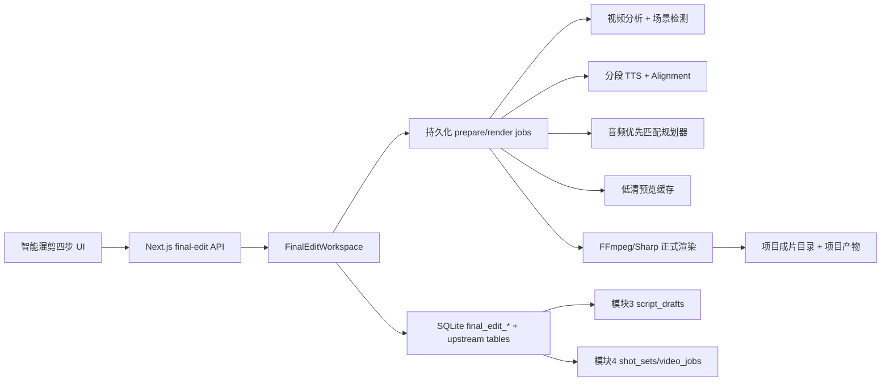

# 智能混剪 V1 技术执行文档

> 日期：2026-07-23  
> 状态：待执行  
> 产品依据：`../specs/2026-07-23-mixcut-prd.md`  
> 原始移植规格：`../specs/2026-07-23-mixcut-port-from-ai-remix.md`  
> 当前成片领域基线：`../specs/2026-07-16-final-video-editing-technical-design.md`

## 0. 执行方式与文档优先级

本文件用于把最终 PRD 拆成可逐阶段实施和验收的工程任务。

执行者必须遵守：

1. 产品行为以最终 PRD 为准。
2. 当前仓库真实结构优先于原始移植规格中的假设路径。
3. AI-remix 是交互和算法参考，不复制 Python、Electron、MUI 或 Tailwind 实现。
4. 当前 `final_edit_*` 数据模型、`FinalEditWorkspace`、持久化 worker、TTS/Alignment adapters、FFmpeg renderer 是正式基线；不得再平行建立一套 `mixcut_sessions` 状态机。
5. UI 可以使用 `components/mixcut/` 作为新表面，但后端继续收敛到 `lib/final-edit/` 和 `/api/final-edit-*` 深模块。
6. `/mixcut-preview` 只用于视觉评审。正式实现完成并通过验收后才能删除，且不得把其中硬编码任务、模拟素材或定时假进度带入生产。
7. 每个 Phase 通过门禁后再进入下一阶段；不以“页面能打开”替代真实数据和媒体验收。

## 1. 当前基线与差距

### 1.1 可直接复用

| 能力 | 当前来源 |
|---|---|
| 分镜组 | `shot_sets`，项目内正式分组边界 |
| 模块 3 脚本 | `script_drafts.outputJson`，V2 脚本含 `shotSetId` 和 `segments[]` |
| 模块 4 视频 | `video_jobs`，含 `projectId`、`shotSetId`、`shotId`、`localVideoPath`、状态 |
| 成片组/草稿 | `final_edit_groups`、`final_edit_variants`、revision 和 command 历史 |
| 视频分析 | `final_edit_asset_analysis` 与 Vision adapter |
| TTS/Alignment | `lib/final-edit/adapters/` |
| 后台任务 | `final_edit_jobs`、`worker.ts`、重启恢复 |
| 预览/时间轴 | `FinalEditPreview`、`FinalEditTimeline`、Canvas 文字渲染 |
| 封面与文字 | `coverCandidates`、双段标题、`TextStyle`、overlay bundle |
| 自定义预设 | `final_edit_title_presets` 与相关 API |
| FFmpeg | `lib/ffmpeg.ts`、`lib/final-edit/renderer.ts` |
| 路径安全 | `dataRoot()`、`lib/final-edit/storage-path.ts` |

### 1.2 必须补齐

- 新四步智能混剪表面及左辅栏分镜组导航。
- 外部素材按 `shotSetId` 归属的正式模型。
- 脚本下拉与手动编辑快照，而不是只读取脚本标题。
- AI-remix 风格四阶段可见进度与音频优先匹配规划器。
- 有边界的播放器和可横/纵滚动、可缩放时间轴。
- 根级封面精调抽屉、真实帧选择、主副标题完整独立样式。
- 预设需要同时覆盖文字样式与画面 framing。
- 项目级任务目录、标准导出名、同名防覆盖和项目产物注册。

## 2. 目标架构



### 2.1 深模块边界

外部调用继续只通过 `FinalEditWorkspace` 及命令接口完成：

- 加载当前项目的分组、脚本、素材和草稿 read model。
- 创建或更新当前分镜组混剪会话。
- 启动 prepare/analyze/match/preview 任务。
- 通过显式 command 修改时间轴、字幕、封面和 BGM。
- 创建不可变渲染快照并排队导出。

路由不得：

- 任意覆盖整个 timeline JSON。
- 直接接受客户端文件系统绝对路径。
- 在 HTTP 请求中同步等待完整 FFmpeg 或付费 AI 任务。
- 绕过 project/shotSet/group/variant 归属校验。

## 3. 目录与文件规划

### 3.1 新建

| 文件 | 职责 |
|---|---|
| `components/mixcut/MixcutPanel.tsx` | 第五步四阶段总控、常驻步骤状态 |
| `components/mixcut/MixcutSidebar.tsx` | 分镜组、统计、历史会话 |
| `components/mixcut/MaterialStep.tsx` | 当前组模块 4 素材与外部导入 |
| `components/mixcut/CreationStep.tsx` | 脚本选择、文案编辑、音色和进度 |
| `components/mixcut/PreviewStep.tsx` | 播放器、时间轴与右侧摘要 |
| `components/mixcut/ExportStep.tsx` | 预检、命名、进度和结果 |
| `components/mixcut/CoverEditorDrawer.tsx` | 根级封面精调抽屉 |
| `components/mixcut/MixcutTimeline.tsx` | 可滚动、可缩放多轨时间轴 |
| `lib/final-edit/material-import.ts` | 外部素材登记、probe、缩略图与组归属 |
| `lib/final-edit/audio-first-matcher.ts` | 音频优先的确定性匹配输入/输出与求解 |
| `lib/final-edit/export-naming.ts` | 任务名、输出名、碰撞序号和安全路径 |
| `lib/final-edit/cover-frame.ts` | 真实帧提取和缓存 |
| `app/api/projects/[id]/final-edit/context/route.ts` | 分镜组、脚本、视频和项目信息 read model |
| `app/api/system-fonts/route.ts` | 系统字体列表与字体文件读取（路径安全校验；§10.5 的数据来源） |
| `lib/final-edit/system-fonts.ts` | 平台字体目录扫描（macOS：/System/Library/Fonts、/Library/Fonts、~/Library/Fonts；Windows：C:/Windows/Fonts）与 .ttc 标记 |
| `app/api/final-edit-groups/[id]/external-assets/route.ts` | 当前组外部素材列表/导入 |
| `app/api/final-edit-groups/[id]/cover-frame/route.ts` | 指定来源与时间的封面帧 |
| `scripts/final-edit-audio-first-matcher.test.ts` | 匹配规划器测试 |
| `scripts/final-edit-export-naming.test.ts` | 命名、路径与冲突测试 |
| `scripts/final-edit-material-import.test.ts` | 外部素材归属和探测测试 |
| `scripts/final-edit-cover-frame.test.ts` | 截帧边界与缓存测试 |
| `scripts/final-edit-mixcut-flow.test.ts` | API/工作区集成测试 |
| `scripts/final-edit-mixcut.playwright.test.mjs` | 正式浏览器交互回归 |

### 3.2 修改

| 文件 | 修改 |
|---|---|
| `app/projects/[id]/page.tsx` | 第五步挂载 `MixcutPanel`，保留项目上下文 |
| `lib/final-edit/schema.ts` | 追加版本化迁移，不修改已发布 migration |
| `lib/final-edit/types.ts` | 扩展脚本快照、外部素材、进度、封面 framing/preset、产物 read model |
| `lib/final-edit/workspace.ts` | 增加 context、script snapshot、external asset、prepare 与 export commands |
| `lib/final-edit/runtime.ts` | 四阶段 prepare 编排、失败降级和恢复 |
| `lib/final-edit/worker.ts` | 执行真实阶段进度、预览和导出任务 |
| `lib/final-edit/renderer.ts` | 标准输出路径、音轨结束、封面和字幕 WYSIWYG |
| `lib/final-edit/title-presets.ts` | 扩展预设为双标题样式 + framing |
| `components/final-edit/text-canvas-renderer.ts` | 单行测量、独立主副标题样式、导出一致性 |
| `app/api/final-edit/title-presets/**` | 预设新契约和兼容读取 |
| `app/api/final-edit-variants/[id]/render/route.ts` | 返回目标名称、目录和任务信息 |
| `app/api/final-edit-jobs/[id]/**` | 进度、产物路径与安全文件访问 |
| `app/api/projects/[id]/creative-package/route.ts` | 把成功成片和封面加入项目 ZIP |

### 3.3 最终删除

只有在正式页面完成全部浏览器验收后才能删除：

- `app/mixcut-preview/`
- `components/mixcut-prototype/`
- 被新 `MixcutPanel` 完整替换且已无引用的旧第五步 UI 组件

不得提前删除 `lib/final-edit/`、现有 adapters、worker、renderer 或历史数据表。

## 4. 数据模型与迁移

所有变更追加到 `lib/final-edit/schema.ts` 新 migration，例如 version 4；禁止修改 version 1～3。

### 4.1 外部素材

```sql
CREATE TABLE final_edit_external_assets (
  id TEXT PRIMARY KEY,
  projectId TEXT NOT NULL,
  shotSetId TEXT NOT NULL,
  originalFilename TEXT NOT NULL,
  relativePath TEXT NOT NULL,
  thumbnailRelativePath TEXT,
  mimeType TEXT NOT NULL,
  mediaKind TEXT NOT NULL CHECK(mediaKind IN ('video','image')),
  durationUs INTEGER NOT NULL DEFAULT 0,
  width INTEGER,
  height INTEGER,
  fileFingerprint TEXT NOT NULL,
  status TEXT NOT NULL,
  errorMessage TEXT,
  createdAt TEXT NOT NULL,
  UNIQUE(shotSetId, fileFingerprint)
);
CREATE INDEX idx_final_edit_external_assets_group
  ON final_edit_external_assets(projectId, shotSetId, createdAt);
```

规则：

- 服务端从当前 group 解析 `projectId/shotSetId`，不接受客户端自行声明归属。
- `relativePath` 必须位于 `storage/final-edits/projects/<projectId>/groups/<shotSetId>/materials/`。
- 重复文件在同一组内复用，在不同组内保持不同归属记录。
- **V1 仅接受视频**：导入接口与 UI 拒绝图片文件（静态图片为已否决需求）；`mediaKind` 的 `image` 枚举仅作为 schema 扩展位保留，避免未来改 CHECK 需要重建表。

### 4.2 混剪脚本快照

向 `final_edit_groups` 追加：

```sql
ALTER TABLE final_edit_groups ADD COLUMN editedNarrationText TEXT NOT NULL DEFAULT '';
ALTER TABLE final_edit_groups ADD COLUMN scriptSyncState TEXT NOT NULL DEFAULT 'synced';
ALTER TABLE final_edit_groups ADD COLUMN sourceScriptUpdatedAt TEXT;
```

`scriptSnapshotJson` 保存所选草稿的不可变原文和 segments；`editedNarrationText` 保存用户在混剪中修改后的版本。生成任务只能读取任务快照，不得在执行中重新读取模块 3 最新草稿。

### 4.3 封面预设

现有 `final_edit_title_presets.stylesByPresetJson` 扩展为版本化 JSON：

```ts
interface CoverPresetV2 {
  version: 2;
  stylesByPreset: Record<OutputPresetId, {
    primary: TextStyle;
    secondary: TextStyle;
    framing: { scale: number; offsetX: number; offsetY: number };
  }>;
}
```

不保存：标题文字、`coverKey`、截帧时间。旧预设读取时填入默认 framing，保存后升级为 V2。

### 4.4 项目产物

如果当前仓库尚无通用项目产物表，追加：

```sql
CREATE TABLE project_artifacts (
  id TEXT PRIMARY KEY,
  projectId TEXT NOT NULL,
  kind TEXT NOT NULL,
  displayName TEXT NOT NULL,
  relativePath TEXT NOT NULL,
  mimeType TEXT NOT NULL,
  sourceJobId TEXT,
  createdAt TEXT NOT NULL
);
CREATE INDEX idx_project_artifacts_project ON project_artifacts(projectId, createdAt);
```

不得复用 `image_assets` 保存 MP4。

## 5. 上游联动契约

### 5.1 Context 查询

`GET /api/projects/:projectId/final-edit/context`

返回：

```ts
interface MixcutContextResponse {
  project: {
    id: string;
    name: string;
    productName: string;
    productCode: string;
    createdAt: string;
  };
  shotSets: Array<{
    id: string;
    name: string;
    shotCount: number;
    succeededVideoCount: number;
    totalDurationUs: number;
  }>;
  currentShotSetId: string | null;
  drafts: Array<{
    id: string;
    shotSetId: string;
    title: string;
    narrationText: string;
    targetDurationSec: number;
    provider: string;
    model: string;
    createdAt: string;
  }>;
  videoAssets: Array<{
    videoJobId: string;
    shotSetId: string;
    filename: string;
    durationUs: number;
    width: number;
    height: number;
    thumbnailUrl: string;
    source: 'module4';
  }>;
}
```

查询规则：

- `shot_sets.projectId = :projectId`。
- 脚本解析 `script_drafts.outputJson`，只接收 V2 且含合法 `shotSetId` 的草稿。
- 视频必须满足 `video_jobs.projectId = :projectId`、`shotSetId = currentShotSetId`、`status = succeeded`、`localVideoPath` 存在且通过安全路径校验。
- 不通过文件名、标题或创建时间推断分组。

### 5.2 当前组切换

当前 `shotSetId` 存在客户端工作区状态；已有草稿恢复时以 group 的 `shotSetId` 为准。切组前：

1. 检查当前未提交 script/cover/timeline 修改。
2. 有修改则要求保存或取消。
3. 清空只属于旧组的选中素材、脚本和预览缓存引用。
4. 加载目标组现有 group；没有则进入新会话设置态。

## 6. API 规划

延续仓库现有 JSON 风格，错误统一至少包含 `{ error, message }`；不得为了移植源项目而在部分路由引入不一致的 `{code,data}` 包装。

| 方法 | 路径 | 职责 |
|---|---|---|
| GET | `/api/projects/:id/final-edit/context` | 上游分组、脚本、视频和项目元数据 |
| POST | `/api/projects/:id/final-edit/preflight` | 校验当前组、脚本、素材、服务和成本 |
| POST | `/api/projects/:id/final-edit/start` | 创建 group 与 prepare job |
| GET | `/api/final-edit-groups/:id` | 完整编辑 read model |
| PATCH | `/api/final-edit-groups/:id` | 脚本文案、字幕、共享样式等 group command |
| POST | `/api/final-edit-groups/:id/external-assets` | FormData 外部素材导入 |
| DELETE | `/api/final-edit-groups/:id/external-assets/:assetId` | 删除未被草稿引用的外部素材 |
| GET | `/api/final-edit-groups/:id/cover-frame` | `sourceKey + timeUs + preset` 提取真实帧 |
| PATCH | `/api/final-edit-variants/:id` | 时间轴、BGM、封面、framing command |
| POST | `/api/final-edit-variants/:id/render` | 创建不可变渲染快照并排队 |
| GET | `/api/final-edit-jobs/:id` | 真实阶段、进度、错误、产物 |
| GET/POST | `/api/final-edit/title-presets` | 列表与保存 V2 预设 |
| PATCH/DELETE | `/api/final-edit/title-presets/:id` | 改名与删除 |

所有修改接口必须带 `expectedRevision`。冲突返回 409 和当前 revision，不做 last-write-wins。

## 7. Prepare 流程与进度

### 7.1 状态机

```text
queued
  -> analyzing          0%–30%
  -> synthesizing       30%–55%
  -> matching           55%–80%
  -> previewing         80%–100%
  -> succeeded
  -> failed / partial
```

阶段映射到 UI：

1. 文案拆分与素材分析：`analyzing`
2. 逐句口播生成：`synthesizing`
3. 节拍检测与场景匹配：`matching`
4. 预热低清预览：`previewing`

任务进度按已完成子任务加权计算，并落库到 `final_edit_jobs.progress`。前端只轮询或订阅真实值。

### 7.2 文案与 TTS

- 从 `editedNarrationText` 构建当前任务脚本快照。
- 优先保留模块 3 V2 `segments[]` 的句段边界；用户大幅改写后用确定性标点切句，禁止再次让 LLM 改写文案。
- 每句独立 TTS，保存每句真实时长，再拼接口播主音轨。
- Alignment 成功则使用真实词级/句级时间；失败按音频时长比例降级并记录 issue。

### 7.3 视频分析与缓存

- 先 FFprobe 获取时长、尺寸、帧率、旋转信息。
- 场景检测必须同时扫描 FFmpeg stdout 和 stderr。
- 视觉分析结果以文件 fingerprint + provider + model + analyzerVersion 缓存。
- 单素材失败写 `final_edit_asset_analysis.status = failed`，从自动池排除，但保留人工使用入口。

### 7.4 音频优先匹配

匹配分两层：**LLM 语义打分（缓存产物）+ 确定性求解器**。语义打分是源项目验证效果的核心信号（2026-07-23 主理人确认必须保留），不得用关键词相似度替代；求解器保持纯函数，确定性由「矩阵作为输入」保证。

#### 7.4.1 语义分矩阵（matching 阶段第一步）

- 对当前脚本句段 × 候选场景，一次 LLM 调用产出 `semanticScores[n][m]`（0~1）与每场景 `hookScores[m]`（开场钩子吸引力，0~1，同一通调用多问一句，零额外成本）。提示词对照移植规格 §5.6 与源项目 `ai_service.py::_llm_score_matrix`。
- 缓存键：`脚本快照 hash + 场景描述集 fingerprint + provider + model + promptVersion`；命中则本次 matching 零 LLM 调用。
- LLM 失败：回退全 0.6 均匀矩阵 + 全 0 hook 分，流程不中断，`MatchDiagnostics.semanticFallback = true`。

#### 7.4.2 求解器契约

`audio-first-matcher.ts` 输入：

```ts
interface AudioFirstMatchInput {
  sentences: Array<{ id: string; text: string; startUs: number; endUs: number; keywords: string[] }>; // 口播句段（TTS 真实时长）
  assets: Array<{
    assetKey: string;
    shotId?: string;
    durationUs: number;
    scenes: Array<{ startUs: number; endUs: number; labels: string[]; quality: number }>;
    source: 'module4' | 'external';
  }>;
  semanticScores: number[][];  // n 句 × m 场景，0~1，来自 7.4.1（缓存或回退矩阵）
  hookScores: number[];        // m 场景，0~1
  beatPoints: number[];        // 口播静音气口中心（us），来自 silencedetect；无气口时为空数组
  manualLocks: TimelineLock[];
  maxReuse: number;
}
```

输出必须是确定性的 `TimelinePlan + MatchDiagnostics`。成本函数按优先级：

1. LLM 语义分为主信号；语义地板 = `max(0.3, 红线 0.35, 该句最佳分 × 0.85)`，低于地板的候选重罚，仅无可选时兜底使用并记入 `backoffSentences`。
2. 脚本原始 `shotId` 匹配先验。
3. 文案关键词与场景标签相似度（`semanticFallback` 态下的替补主信号）。
4. 可用时长、质量问题和裁剪损失。
5. 重复镜头惩罚（同一源素材每重复使用一次递增加价，λ 初值 0.15）、相邻视觉重复惩罚。
6. 开场句在语义可接受集合内偏好高 hook 分（权重初值 0.2，偏好不强压，集合外自动回退）。
7. 用户锁定片段为硬约束。

#### 7.4.3 节拍吸附

求解完成后，对每个气口找最近切点：偏移 ≤ 0.2s、相邻两段等量互补（+Δ/−Δ）后仍满足各自素材边界与最短段长时才吸附；**Σ 时长不变**。吸附结果记入 `MatchDiagnostics.snappedCuts`；`beatPoints` 为空时跳过。

实现可采用最小费用流（参照移植规格 §5.6 参数表与源项目 `match_solver.py`），但对相同输入必须返回相同输出。素材不足产生显式 gap/issue，不得跨组取材。

## 8. 前端状态与布局

### 8.1 状态分层

- Server state：context、group、variant、job、presets，通过 API 加载。
- Draft UI state：面板宽度、当前 Tab、滚动位置、时间轴 zoom、抽屉未应用修改。
- Persisted edit state：文案、素材选择、时间轴、字幕、封面、BGM，必须通过 command 落库。
- 运行状态：只以 `final_edit_jobs` 为准，不把 `running` 写进可长期恢复的浏览器 storage。

### 8.2 常驻步骤

四步使用 CSS 隐藏/显示或稳定的页面状态容器保持挂载。切换步骤不能重建 `<video>`、时间轴缩放或未提交抽屉状态；真正离开项目时才卸载。

### 8.3 防溢出规则

- 主工作区所有 grid child 设置 `min-width: 0`。
- 文案与音色区域在可用宽度不足时改为垂直排列。
- 视频预览容器使用明确高度和 `overflow: hidden`；画布使用 `object-fit: contain`。
- 时间轴外层 `overflow: auto`，内层宽度由时长 × zoom 计算，设置最小轨道高度。
- 右侧属性栏独立滚动，固定操作区不覆盖正文。

## 9. 时间轴实现

### 9.1 坐标

- 内部一律使用整数微秒或整数帧，禁止用浮点秒作为持久化主值。
- `pxPerSecond` 只用于显示；zoom 范围建议 40～240 px/s。
- 播放头、视频块、字幕块、口播波形和 BGM 波形共享相同时间原点。

### 9.2 滚动与拖拽

- 横向滚动：时间内容层。
- 纵向滚动：轨道区域；轨道标签列保持 sticky。
- 播放控制栏固定在时间轴顶部，不占用轨道滚动高度。
- 拖动片段使用 pointer events 与捕获，结束后发送显式 command。
- 边缘裁剪约束在源素材区间内，最小时长由领域常量控制。
- 用户拖动只更新本地预览，pointerup 后一次提交，避免每像素写数据库。

### 9.3 浏览器预览

- 使用双 video slot 预加载硬切片段，避免切点黑帧。
- Web Audio 分别控制 TTS 和 BGM；源视频默认静音。
- 到时间轴结束必须停止所有音轨。
- 低清拼接预览是性能降级路径，不取代可编辑时间轴数据。

## 10. 封面精调

### 10.1 抽屉事务

打开时复制当前 cover draft：

```ts
interface CoverEditorDraft {
  sourceKey: string;
  frameTimeUs: number;
  framing: { scale: number; offsetX: number; offsetY: number };
  primary: { text: string; style: TextStyle };
  secondary: { text: string; style: TextStyle };
}
```

- 抽屉内操作只修改本地 draft。
- `应用封面` 发送一个原子 command，带 `expectedGroupRevision/expectedVariantRevision`。
- 关闭、取消、Esc、遮罩均丢弃 draft。

### 10.2 真实帧

- 通过 FFmpeg 在 `timeUs` 截取 JPG/WebP（V1 封面来源仅视频帧）。
- 缓存键：`fileFingerprint + timeUsBucket + outputPreset`。
- 时间必须 clamp 到 `[0, durationUs]`；不得显示其他片段或占位渐变冒充结果。
- 列表缩略图和大画布均通过安全媒体路由读取，不暴露绝对路径。

### 10.3 双标题对等能力

`TextStyle` 必须同时用于 primary 和 secondary，至少包含：

```ts
interface TextStyle {
  fontFamily: string;
  fontSizePx: number;
  color: string;
  italic: boolean;
  strokeColor: string;
  strokeWidthPx: number;
  x: number;
  y: number;
  align: 'left' | 'center' | 'right';
  boxWidthPx: number;
}
```

主副标题不得共用 `italic`、描边颜色、描边宽度或位置字段。

### 10.4 单行约束

- 输入移除 `\r/\n`。
- Canvas 使用与导出相同字体和字号测量文本宽度。
- 超出 `boxWidthPx` 时显示溢出状态；可以提供“适配单行”确定性缩小字号。
- 不使用浏览器普通文本自动换行；导出前再次校验测量值。
- Canvas 预览与 overlay bundle 必须共享同一测量函数和 font resolution。

### 10.5 字体与 FFmpeg

- 浏览器字体列表来自 `/api/system-fonts`。
- 渲染快照记录可解析字体文件或标准字体名称。
- drawtext/ASS 参数必须经过专用 escaping；输入路径不得使用 filter escaping。
- 如果字体不可用于服务端渲染，导出预检阻断并提示替换。

## 11. 导出命名、路径与产物

### 11.1 数据来源

```ts
interface ExportIdentity {
  projectId: string;
  taskName: string;     // projects.name
  productCode: string;  // projects.productCode
  taskDate: string;     // projects.createdAt -> Asia/Shanghai YYYYMMDD
}
```

明确禁止使用 `projects.model` 作为产品型号；该字段属于图片生成供应商模型。

### 11.2 安全命名

`export-naming.ts` 提供纯函数：

```ts
buildExportBaseName(identity): string
reserveExportPath(storageRoot, identity, extension): ReservedPath
```

规则：

- 基础名：`成片-${sanitize(productCode)}-${taskDate}`。
- 去除 `/ \\ : * ? \" < > |`、控制字符和尾部点/空格。
- `productCode` 为空时返回领域错误 `product_code_required`。
- 冲突时按 `-02` 起递增；预留路径与写文件必须在同一服务端事务/原子创建流程中完成。

### 11.3 物理路径与 UI 路径

内部渲染路径继续保留现有不可变任务目录：

```text
<dataRoot>/storage/final-edits/jobs/<renderJobId>/
  final.mp4
  cover.jpg
```

渲染成功后，再以原子复制/重命名发布到当前项目的用户可见成片目录：

```text
<dataRoot>/storage/projects/<projectId>/成片/
  成片-<型号>-<日期>.mp4
  成片-<型号>-<日期>-封面.jpg
```

UI 展示：

```text
工作台/<projects.name>/成片/
```

`final_edit_jobs.outputJson` 同时记录内部任务产物和已发布项目产物的相对路径。UI 不显示 `dataRoot()` 内部技术路径，只显示上面的工作台语义路径；成功结果可通过“在文件夹中查看”调用受控的本地桌面能力。普通 Web 运行形态没有该能力时隐藏按钮，保留下载。

### 11.4 渲染约束

- 清晰度 V1 固定 1080 档（沿用现有 `OUTPUT_PRESETS`）；**2K 扩展口子** = 未来向 `OUTPUT_PRESETS` 增加宽 1440 条目即可，WYSIWYG 换算已按预设高度比例推导，不新增独立分辨率状态或公式。
- 使用不可变 input snapshot；重试读取同一 snapshot。
- FFmpeg 用异步进程，不使用阻塞式 `execFileSync`。
- 输入相关 `-ss/-t` 放在对应 `-i` 前后正确位置并由 fixture 验证。
- 末段不足用 `tpad=stop_mode=clone`，且在最终 `-t` 之前处理。
- TTS 与 BGM 在成片结尾停止；BGM 按配置淡出。
- 合成阶段先在不可变 job 目录输出 MP4 + JPG，通过校验后原子发布到项目成片目录，再写 `project_artifacts` 并更新 job outputJson。
- ZIP 路由从 `project_artifacts` 收集实际存在且属于该项目的文件。

## 12. 分阶段执行计划

### Phase 0 — 契约冻结与基线测试

**目标：** 在改 UI 前锁定上游/下游数据合同。

- [ ] 为 `script_drafts` V2、`shot_sets`、`video_jobs`、`projects.productCode/createdAt` 写 fixture。
- [ ] 定义 `MixcutContextResponse`、command 和错误码。
- [ ] 写 `export-naming` 与 audio-first matcher 的失败测试。
- [ ] 记录当前 final-edit 相关测试和构建基线。

**门禁：** 文档字段与真实数据库一致；没有把 `projects.model` 当型号。

### Phase 1 — 分组上下文与素材导入

**目标：** 第一步使用真实模块 4 分组和视频。

- [ ] 实现 context route，按 `shotSetId` 聚合脚本和视频。
- [ ] 增加外部素材迁移、工作区方法、FormData 路由、probe 和缩略图。
- [ ] 实现左辅栏分组选择和 MaterialStep。
- [ ] 加入文件丢失、重复导入、跨组访问测试。

**门禁：** 两个分镜组的数据在 API、UI 和自动选择中均无法串组。

### Phase 2 — 脚本、音色与真实进度

**目标：** 模块 3 脚本可切换、编辑并驱动后台任务。

- [ ] 实现当前组脚本下拉、同步/手改状态和恢复导入版本。
- [ ] 保存 `editedNarrationText` 和脚本不可变快照。
- [ ] 重构 CreationStep 为不拥挤的纵向布局。
- [ ] 将 prepare job 映射为四阶段真实进度。
- [ ] 保留 TTS 配置脱敏和音色试听。

**门禁：** 切脚本不会丢未保存修改；刷新后进度和脚本文案一致。

### Phase 3 — 音频优先自动编排

**目标：** 移植 AI-remix 的分析/节拍/匹配能力到 final-edit worker。

- [ ] 完整探测视频并缓存分析。
- [ ] 分句 TTS，保存真实时长和对齐结果。
- [ ] 产出并缓存 LLM 语义分矩阵与 hook 分（§7.4.1；失败回退均匀矩阵并记 `semanticFallback`）。
- [ ] 静音气口检测（silencedetect，noise −35dB、d 0.20s）与切点吸附（§7.4.3，Σ 时长不变）。
- [ ] 实现 audio-first matcher 与 diagnostics。
- [ ] 把结果转换为现有 `FinalEditVariant` timeline。
- [ ] 对素材不足、分析失败和对齐降级生成显式 issues。
- [ ] 生成可缓存低清预览。

**门禁：** 相同输入产生相同时间轴；素材与脚本未变时重跑命中矩阵缓存（零 LLM 调用）；不会跨组；TTS、字幕、视频、BGM 总时长一致。

### Phase 4 — 正式预览与可操作时间轴

**目标：** 解决预览越界、时间轴锁死和轨道不可见。

- [ ] 实现限定尺寸的画幅播放器。
- [ ] 实现横向/纵向滚动、zoom 和 sticky 轨道标签。
- [ ] 接通播放头、双 video slot、Web Audio 和波形。
- [ ] 接通片段排序、裁剪、字幕块和持久化 command。
- [ ] 用 Playwright 覆盖 9:16、3:4、小屏/宽屏和滚动。

**门禁：** 用户能浏览完整时间轴和全部轨道；视频永不覆盖时间轴；刷新后编辑不丢失。

### Phase 5 — 封面精调与预设

**目标：** 提供真实画面、对等双标题和 WYSIWYG 抽屉。

- [ ] 实现 root portal 抽屉和取消/应用事务。
- [ ] 实现真实来源缩略图、截帧路由和时长滑杆。
- [ ] 实现画面平移/缩放、文字拖拽和 4% 安全区。
- [ ] 补齐副标题正斜体、独立描边和位置。
- [ ] 扩展预设 V2，保存/应用/删除并兼容 V1。
- [ ] 统一预览/overlay/renderer 的单行测量与字体。

**门禁：** 主副标题能力对等；短中文不异常换行；预览与导出像素级可接受一致。

### Phase 6 — 导出与工作台产物

**目标：** 以真实任务身份命名并写回当前项目。

- [ ] 实现 `export-naming.ts`、碰撞序号与目录创建。
- [ ] ExportStep 显示任务名、型号、日期、文件名和目标目录。
- [ ] renderer 保留内部 job 产物，并原子发布到项目成片目录后注册 `project_artifacts`。
- [ ] job result 返回实际相对路径、下载 URL 和封面 URL。
- [ ] 项目 creative-package/ZIP 收录成片产物。
- [ ] 桌面安装版接通受控“在文件夹中查看”；Web 模式降级。

**门禁：** `成片-型号-日期` 正确；同名不覆盖；结果可预览、下载、查看并进入 ZIP。

### Phase 7 — 替换、清理与双平台验收

**目标：** 用正式智能混剪替换旧第五步表面。

- [ ] `app/projects/[id]/page.tsx` 默认挂载正式 MixcutPanel。
- [ ] 完成真实项目端到端测试后删除原型路径和无引用旧 UI。
- [ ] `npm run lint`。
- [ ] 运行相关 `node scripts/*.test.ts` 和 FFmpeg fixture。
- [ ] `npm run build`。
- [ ] 运行 Playwright 正式浏览器测试。
- [ ] 构建并验证 macOS/Windows 安装包的字体、FFmpeg、路径和数据排除。

**门禁：** PRD 第 10 节全部通过；旧数据可读；无模拟数据、假进度或跨组素材。

## 13. 测试矩阵

| 层级 | 必测内容 |
|---|---|
| 纯函数 | 命名清洗、日期、冲突序号、文本单行测量、匹配确定性、语义地板与 hook 偏好、节拍吸附不变量、语义矩阵回退、gap |
| 数据库 | migration 追加、外部素材组归属、preset V1→V2、artifact 注册 |
| API | 项目/组归属、revision 409、FormData、媒体路径安全、错误码 |
| Worker | 四阶段进度、重启恢复、单素材失败、TTS/Alignment 降级 |
| FFmpeg | probe、截帧、低清预览、正式 9:16/3:4、音轨结束、中文路径 |
| React | 脚本切换保护、面板不溢出、抽屉取消/应用、组切换 |
| Playwright | 预览不盖时间轴、横纵滚动、zoom、拖拽、真实封面、导出流程 |
| 安装包 | macOS arm64 与 Windows 的 Node ABI、FFmpeg、字体、数据目录 |

建议命令按改动范围执行：

```bash
node scripts/final-edit-export-naming.test.ts
node scripts/final-edit-audio-first-matcher.test.ts
node scripts/final-edit-material-import.test.ts
node scripts/final-edit-cover-frame.test.ts
node scripts/final-edit-mixcut-flow.test.ts
node scripts/final-edit-render.test.ts
node scripts/final-edit-mixcut.playwright.test.mjs
npm run lint
npm run build
```

本文件编写阶段不执行上述命令；它们是实现阶段门禁。

## 14. 安全与实现红线

- 所有磁盘路径必须经 `dataRoot()` 和安全 relative-path 解析。
- 禁止接收客户端传入绝对路径，禁止目录穿越和任意本地文件读取。
- FormData 中的文件直接读取，不 JSON stringify 文件对象。
- API Key 只显示是否配置，日志不得输出请求头、密钥或鉴权串。
- FFmpeg/FFprobe 必须异步执行，超时、取消、stderr 尾部错误可观察。
- 场景检测同时处理 stdout/stderr；concat 列表使用 UTF-8 和安全路径。
- drawtext/ASS 文本、滤镜参数、输入路径分别使用正确的 escaping 规则。
- 任务快照不可变；UI 自动建议不得覆盖用户 revision。
- React 的轮询、媒体事件和拖拽回调必须使用正确依赖或 ref/useEvent 读取最新 group、variant 与 revision，禁止 stale closure 回写旧状态。
- 持久化状态不得保存无法恢复的 `running`；启动时恢复为 queued 或 failed/retryable。
- 物理文件删除前校验项目归属、草稿引用和 artifact 引用。
- 安装包继续排除 `data/`、`storage/`、`outputs/`、`docs/`、`scripts/`、`.git/`。

## 15. 实施完成定义

只有同时满足以下条件，智能混剪 V1 才能标记完成：

1. 第五步使用真实模块 3/4 数据，不依赖原型 mock。
2. 分镜组边界在查询、自动匹配、人工导入和导出全链路成立。
3. 四阶段进度来自持久化后台任务。
4. 时间轴可完整浏览和编辑，预览不越界。
5. 封面显示真实帧，主副标题能力对等，自定义预设可持久化。
6. 正式渲染与浏览器预览在裁切、字体、文字位置和时长上通过验收。
7. 输出命名、目录、冲突处理和项目 ZIP 注册正确。
8. 相关单元、集成、FFmpeg、浏览器、构建和双平台安装验收全部通过。
9. 原型和无引用旧 UI 已清理，但现有 `final_edit_*` 数据及适配器未被破坏。
