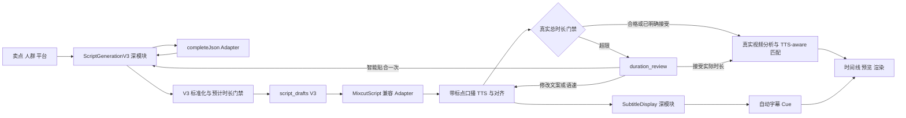

# 脚本生成 V3 技术执行文档

> 日期：2026-07-28
>
> 状态：待执行
>
> 对应 PRD：`docs/superpowers/specs/2026-07-27-script-generation-v3-prd.md`
>
> 代码基线：`mixcut01` / `e22085c`
>
> 适用范围：第三步“口播脚本”与第五步“智能混剪”的脚本、TTS 时长门禁、封面标题和自动字幕联动

## 0. 一句话目标

把第三步从“看图、写文案、绑定分镜”收敛为一个只负责内容策略的深模块；把第五步继续作为真实素材理解与剪辑的唯一责任方；同时以“脚本预计时长门禁 + 真实 TTS 时长门禁”保证目标时长不是装饰性配置，并让所有 V3 脚本稳定产出两段式封面标题和无语言标点的自动字幕。

本文是可执行技术方案，不是已完成声明。实施完成必须以各 Phase 的代码、自动化测试、真实 TTS/FFmpeg 验收和用户验收为准。

---

## 1. 执行优先级与文档效力

冲突时按以下顺序执行：

1. 本文对应 PRD 的产品口径；
2. 本文冻结的数据契约、状态机和服务端不变量；
3. 现有 `final_edit_*`、`FinalEditWorkspace`、TTS、对齐、语义矩阵、音频优先时间线和 FFmpeg 渲染路径；
4. 现有代码中仅服务 V2“一句一图”的实现细节。

硬约束：

- 不新增第二套智能混剪工作区或 `mixcut_sessions` 一类平行数据模型。
- `shotSetId` 继续作为第三步、第四步和第五步的数据隔离边界。
- V3 不发送分镜图片给脚本模型，不保存自动 `shotId` / 图片 ID 绑定。
- V2 历史草稿只兼容读取，不批量迁移、不静默回写。
- 已创建的 `final_edit_groups` 继续使用创建时快照，不能被上游脚本刷新覆盖。
- TTS、强制对齐、切句和语义匹配始终使用带自然标点的口播。
- 自动字幕使用统一派生规则；`textSource='manual'` 的字幕原文不被自动改写。
- 目标时长越界不能只靠前端提示；进入匹配和进入渲染前都必须有服务端门禁。

---

## 2. 已核实基线与真实差距

### 2.1 当前可直接复用的能力

| 能力 | 当前实现 | V3 处理 |
|---|---|---|
| 多协议脚本 LLM | `lib/script-providers/index.ts#completeJson` 已统一原生 Gemini、OpenAI Chat Completions、OpenAI Responses | 作为唯一 LLM Adapter 复用，不再在三种协议中复制 V3 校验 |
| 脚本草稿存储 | `script_drafts.inputSnapshot/outputJson` | 继续使用；新草稿写 `version: 3` |
| 分镜组所有权 | 脚本 API 和 Mixcut preflight 已校验项目与 `shotSetId` | 保留并加强，不再要求组内必须有可读图片才能生成脚本 |
| 封面时长 | `FINAL_EDIT_INTRO_FRAMES=20`、`FINAL_EDIT_FPS=24` | 作为正文预算唯一来源，禁止另写 `1 秒` 常量 |
| 混剪脚本快照 | `lib/final-edit/mixcut-script.ts` | 扩展为兼容 V2/V3，不重建体系 |
| 真实 TTS 与对齐 | `FinalEditWorkspaceDependencies.synthesize` 返回音频、真实时长、段落/字级时间 | 在合成后、语义匹配前加入真实时长门禁 |
| 视频理解与匹配 | 视频分析、语义矩阵、TTS-aware 句段细分、audio-first matcher | 保持为实际素材选择的唯一责任方 |
| 手工字幕保护 | `SubtitleCue.textSource` 和现有 group command | 继续复用；只规范化自动 Cue |
| 组级封面快照 | `final_edit_groups.coverTitleJson` | V3 主副标题直接复制；历史脚本仍走确定性拆分 |

### 2.2 当前必须修正的行为

1. `app/api/projects/[id]/script/route.ts` 在生成时读取全部分镜图片、转 base64，并要求至少一张图片可读。
2. `ScriptInput`、提示词和 `normalizeScriptOutput` 围绕 `shotId/imageAssetId/rationale/droppedShots` 组织，和当前真实视频理解职责重叠。
3. 当前时长只有 prompt 中的粗略“25 字约 5 秒”，服务端没有字符预算、预计时长校验或修正循环。
4. `coverTitleParts` 在 V2 是可选字段，供应商漏返时脚本结果页不能稳定展示两段标题。
5. `buildMixcutTaskScriptSnapshot` 当前把 `subtitle` 直接设为 `narration`。
6. `buildAlignedSubtitleCues` 当前在 Cue 文本中保留语言标点。
7. TTS 合成后直接进入 `matching`，没有将真实总时长与用户目标比较。
8. audio-first matcher 的 `sameShotPrior` 对 V2 有兼容价值，但 V3 必须天然不携带该先验。
9. `creative-package` 仍尝试按 `shotId` 把脚本逐句回填到每张分镜；V3 不应伪造这种关系。

### 2.3 已有真实样本对默认校准的约束

现有沙发脚本样本在 1.0x 下约为：

- 106 个可朗读内容字符；
- TTS 正文约 24.1～25.2 秒；
- 加封面后成片约 25.6 秒；
- 实际约 4.2～4.4 内容字符/秒。

因此 V3 第一版默认使用保守的 `4.2 内容字符/秒`，而不是继续沿用 `5 字/秒`。15 秒总时长扣除 20 帧封面后正文约 14.17 秒，对应合格范围约 54～59 个内容字符；UI 可以按便于理解的口径展示为约 55～60 字。

该值是版本化默认策略，不是永远不变的业务常量。真实 TTS 仍是最终依据。

---

## 3. 目标架构



### 3.1 Module、Interface、Implementation、Seam、Adapter

本次用两个深 Module 收敛变化：

1. `ScriptGenerationV3`
   - Interface：分析策略、生成合格 V3 脚本、按真实偏差贴合文案。
   - Implementation：提示词、模型响应解析、标题兜底、字符计数、时长预算、最多两次修正、派生全文。
   - 外部 Adapter：现有 `completeJson`。
   - 主测试 Seam：给模块注入可控 `completeJson`，通过完整生成循环观察最终契约和调用次数。

2. `SubtitleDisplay`
   - Interface：将带标点口播切成展示片段，并将单个片段规范化为自动字幕文本。
   - Implementation：语言标点边界、空格归一、成对符号处理、参数符号保护、空 Cue 清理。
   - 主测试 Seam：纯输入输出；脚本结果和 Mixcut Cue 必须调用同一接口。

这种边界提供足够 Depth：路由和 UI 只看到稳定结果，不需要知道不同供应商提示词、Unicode 符号判断或修正循环细节。它也提高 Leverage 和 Locality：以后调整语速校准或字幕符号规则时只改一个位置。

### 3.2 不建立的抽象

- 不为 Gemini、Chat Completions、Responses 各写一套 V3 generator。
- 不建立“脚本图片理解服务”；第五步已经拥有真实视频理解。
- 不把时长规则散落到 React 组件、prompt 和 workspace 三处。
- 不把自动字幕去标点写进 Canvas 或 FFmpeg renderer；渲染只消费已经确认的 Cue。
- 不将 `duration_review` 伪装成普通 `failed`；它是可继续操作的业务状态。

---

## 4. V3 数据契约

### 4.1 分析输入与输出

修改 `lib/script-providers/types.ts`，新增 V3 类型；保留 V2 类型供历史读取。

```ts
export interface ScriptStrategyAnalysisV3 {
  version: 3;
  rankings: Array<{
    rank: number;
    title: string;
    priority: 'highest' | 'high' | 'medium' | 'low';
    reason: string;
  }>;
  audienceInsight: string;
  platformAdvice: string;
  recommendedTemplate: {
    id: string;
    name: string;
    reason: string;
  };
}
```

规则：

- `recommendedTemplate.id` 必须属于服务端允许的模板集合。
- 模板集合从新增的 `lib/script-templates.ts` 读取，`ScriptTemplatePicker`、分析标准化和生成校验共用；禁止前后端维护两份 ID/名称映射。
- 模型返回未知模板时，按平台和最高优先级卖点走确定性默认模板，并记录 `recommendationSource='system_fallback'`。
- 不再依赖每条卖点各自返回的 `recommendedTemplateId`。

### 4.2 V3 脚本输出

```ts
export interface ScriptOutputV3 {
  version: 3;
  title: string;
  coverTitleParts: {
    primary: string;
    secondary: string;
    source: 'model' | 'system_split';
  };
  platform: string;
  tone: string;
  templateId: string;
  template: string;
  shotSetId: string;
  targetDurationSec: number;
  targetNarrationDurationSec: number;
  contentCharacterCount: number;
  estimatedNarrationDurationSec: number;
  durationStatus: 'qualified';
  durationPolicyVersion: 'zh-tts-budget-v1';
  segments: ScriptSegmentV3[];
  fullScript: string;
  fullSubtitle: string;
}

export interface ScriptSegmentV3 {
  id: string;
  narration: string;
  subtitle: string;
  sellingPointRefs: string[];
  visualIntent: string;
  visualKeywords: string[];
}
```

服务端不信任并重新派生以下字段：

- `id`：空值、重复值时按顺序生成稳定 ID；
- `subtitle`：由 `narration` 通过 `SubtitleDisplay` 派生；
- `fullScript`：由标准化后的 `segments[].narration` 顺序拼接；
- `fullSubtitle`：由标准化后的 `segments[].subtitle` 顺序拼接；
- 所有时长和字符字段；
- `shotSetId`、平台、语气、模板和目标时长：以已校验的请求上下文为准。

模型响应中出现 `shotId`、`imageAssetId`、`droppedShots`、图片 base64 或具体素材顺序时全部忽略，不写入 V3 草稿。

### 4.3 口播全文和字幕全文的换行

- `fullScript` 使用 `\n` 拼接段落，保留每段自然标点。
- 脚本阶段的 `fullSubtitle` 是“无时间码预览稿”，使用 `\n` 拼接每段派生字幕。
- Mixcut 的最终字幕仍以真实 TTS 后的 `SubtitleCue[]` 为准；它会重新按真实边界派生，不能把脚本阶段的 `fullSubtitle` 当作最终时间轴 Cue。

这解决了 PRD 中“脚本结果要立即显示无标点字幕”和“最终 Cue 必须在 TTS/对齐后生成”两个时点的差异。

### 4.4 V2/V3 兼容联合类型

```ts
export type StoredScriptOutput = ScriptOutputV2 | ScriptOutputV3;
```

判定只能使用 `version`，禁止通过字段猜测：

- `version === 2`：保留 `shotId` 弱先验；缺标题时只在读取层派生。
- `version === 3`：不产生或传播具体 `shotId` 先验；使用 V3 视觉意图和关键词。
- 未声明版本的历史数据：继续走现有 legacy 兼容读取，不回写原 JSON。

---

## 5. 时长策略

### 5.1 统一预算函数

`lib/script-generation-v3.ts` 内部实现并只导出供 UI/API 共用的只读预算结果：

```ts
interface ScriptDurationBudget {
  targetTotalSec: number;
  introDurationSec: number;
  targetNarrationSec: number;
  minEstimatedNarrationSec: number;
  maxEstimatedNarrationSec: number;
  minContentCharacters: number;
  maxContentCharacters: number;
  calibratedCharsPerSecond: number;
  policyVersion: 'zh-tts-budget-v1';
}

buildScriptDurationBudget(targetTotalSec: number): ScriptDurationBudget;
```

第一版计算：

```text
introDurationSec = FINAL_EDIT_INTRO_FRAMES / FINAL_EDIT_FPS
targetNarrationSec = targetTotalSec - introDurationSec
minEstimatedNarrationSec = targetNarrationSec * 0.90
maxEstimatedNarrationSec = targetNarrationSec
calibratedCharsPerSecond = 4.2
minContentCharacters = ceil(minEstimatedNarrationSec * 4.2)
maxContentCharacters = floor(maxEstimatedNarrationSec * 4.2)
estimatedNarrationDurationSec = contentCharacterCount / 4.2
```

计数只统计 Unicode 字母和数字；标点、符号、空格、换行不计。计数用于可理解的产品指标；参数符号虽然不计数，但原文本必须保留。

所有时长内部以微秒或完整浮点秒计算，只在 UI 显示时四舍五入。禁止在计算前把封面变成整数 1 秒。

### 5.2 脚本生成修正循环

```text
首次生成
  -> 服务端标准化
  -> 校验标题、事实边界、段落、字符数和预计时长
  -> 合格：保存
  -> 偏长/偏短：携带原结果和机器可读问题，完整重写
  -> 最多修正 2 次
  -> 仍不合格：422，不保存草稿
```

每次修正请求必须包含：

- 目标正文秒数和目标字符范围；
- 当前内容字符数与预计时长；
- `too_long` 或 `too_short`；
- 必须保留的已选卖点；
- 禁止新增的事实；
- 保持主副标题与正文一致；
- 要求返回完整 JSON，不允许只返回差异或截断文本。

失败响应：

```json
{
  "error": "script_duration_unresolved",
  "message": "模型两次修正后仍未达到时长要求",
  "details": {
    "targetNarrationSec": 14.166667,
    "estimatedNarrationSec": 18.1,
    "contentCharacterCount": 76,
    "targetCharacterRange": [54, 59],
    "attempts": 3
  }
}
```

HTTP 使用 `422`。没有合格结果时不得插入 `script_drafts`。

### 5.3 真实 TTS 门禁

统一函数放在 `lib/final-edit/duration-gate.ts`：

```ts
export interface DurationGateEvaluation {
  targetTotalUs: number;
  targetNarrationUs: number;
  actualNarrationUs: number;
  actualTotalUs: number;
  toleranceUs: number;
  deltaUs: number;
  status: 'within_tolerance' | 'too_short' | 'too_long';
}

evaluateFinalDurationGate(input): DurationGateEvaluation;
```

计算：

```text
actualTotalUs = FINAL_EDIT_INTRO_DURATION_US + narration.durationUs
toleranceUs = max(500_000, targetTotalUs * 0.05)
withinTolerance = abs(actualTotalUs - targetTotalUs) <= toleranceUs
```

`targetDurationSec` 必须来自创建组时的脚本快照，不从可变上游草稿重读。

### 5.4 为什么真实 TTS 超限不是普通失败

TTS 已经产生了有价值的真实音频和对齐信息，用户也有三个合法选择。把它标为 `failed` 会丢失恢复语义并诱导用户盲目重跑。因此新增业务状态：

- job：`status='needs_input'`、`phase='duration_review'`；
- group：`status='needs_input'`、`phase='duration_review'`；
- 当前音频、真实时长、字级时间和自动 Cue 先持久化；
- 不创建时间线 variant，不执行语义矩阵和 audio-first matching。

### 5.5 持久化的时长门禁状态

在 `FINAL_EDIT_MIGRATIONS` 追加版本 10：

```sql
ALTER TABLE final_edit_groups
  ADD COLUMN durationGateJson TEXT NOT NULL DEFAULT '{}';
```

禁止修改已有迁移。JSON V1：

```ts
interface FinalEditDurationGateStateV1 {
  version: 1;
  narrationHash: string;
  targetTotalUs: number;
  targetNarrationUs: number;
  actualNarrationUs: number;
  actualTotalUs: number;
  toleranceUs: number;
  deltaUs: number;
  status:
    | 'unchecked'
    | 'within_tolerance'
    | 'needs_input'
    | 'accepted_actual';
  reason: 'too_short' | 'too_long' | null;
  smartFitAttempts: 0 | 1;
  checkedAt: string | null;
  acceptedAt: string | null;
}
```

`accepted_actual` 只对同一个 `narrationHash` 有效。文案、音色、语速或供应商变化产生新 hash 后，状态必须重置为 `unchecked`。

### 5.6 时长处理 API

新增：

```text
POST /api/final-edit-groups/:id/duration-resolution
```

请求联合类型：

```ts
type DurationResolutionRequest =
  | { action: 'smart_fit'; expectedRevision: number }
  | {
      action: 'retry_with_changes';
      expectedRevision: number;
      editedNarrationText: string;
      speed?: number;
    }
  | { action: 'accept_actual'; expectedRevision: number };
```

响应为新的 prepare `JobRef`。所有 action 必须校验：

- group 存在且属于请求上下文中的项目；
- group 当前是 `duration_review`；
- `expectedRevision` 与当前 revision 一致；
- 最新 prepare job 是该 group 的 `needs_input`；
- 门禁状态的 `narrationHash` 与当前 group 相同；
- `smart_fit` 尚未使用；
- `retry_with_changes` 的文案非空，speed 继续通过现有速度校验；
- 不能跨 `shotSetId`。

动作语义：

1. `smart_fit`
   - 通过 `FinalEditWorkspaceDependencies.fitNarrationDuration` 调用 `ScriptGenerationV3` 的真实偏差贴合接口；
   - 使用 group 创建时已经选定的 `analysisProviderId` 作为贴合模型；该供应商不可用时保留 review 状态并提示用户手动修改，不能改用未选择的外部供应商；
   - 同一段落尽量保留 ID、卖点引用、画面意图和关键词；
   - 禁止新增事实；
   - 标准化成功后更新组级脚本快照和编辑文案；
   - 清除旧音频、时长、字级时间和自动字幕，`smartFitAttempts=1`；
   - 创建同 group 的新 prepare job，重新合成并重新过门禁。

2. `retry_with_changes`
   - 用户文本或语速成为新快照；
   - 清除旧 TTS 派生数据和旧门禁接受状态；
   - 保留 group 已经消耗的 `smartFitAttempts`，手工修改不能重置自动贴合次数；
   - 创建同 group 的新 prepare job。

3. `accept_actual`
   - 不改口播、音色或语速；
   - 将当前 hash 标记为 `accepted_actual`；
   - 创建同 group 的新 prepare job；
   - 重用已持久化 TTS 和 Cue，直接通过时长确认后进入匹配。

所有动作使用 DB transaction 更新 group 和插入新 job，避免“状态已改但没有可恢复任务”。LLM/TTS 等外部调用不能包在 SQLite transaction 内。

### 5.7 渲染前第二道门禁

`enqueueRender` 必须重新计算：

- 当前 group 的 `actualTotalUs`；
- 当前 narration hash；
- 是否在容差内，或是否存在同 hash 的 `accepted_actual`。

不满足时抛出 `FinalEditError('target_duration_unconfirmed', ...)`。这是防止前端绕过或旧 job 状态损坏的最终不变量。

如果用户接受实际时长：

- group 和每个 variant 增加 warning issue：`duration_target_overridden`；
- 预览和导出页持续展示目标总时长、实际总时长与偏差；
- warning 不阻断导出，但不能被普通刷新静默消失。

---

## 6. 自动字幕规则

### 6.1 共享接口

新增 `lib/subtitle-display.ts`：

```ts
export interface SubtitleDisplayPart {
  sourceText: string;
  displayText: string;
}

export function splitNarrationForDisplay(
  narration: string,
  options?: { maxContentCharacters?: number },
): SubtitleDisplayPart[];

export function normalizeAutomaticSubtitleText(text: string): string;
```

`splitNarrationForDisplay` 先利用自然标点确定边界，再调用 `normalizeAutomaticSubtitleText`。脚本结果页与 `buildAlignedSubtitleCues` 都必须使用它。

### 6.2 语言标点与语义符号

实现不能使用 `text.replace(/[\p{P}\p{S}]/gu, '')`。处理顺序：

1. 保护语义 token；
2. 用句尾标点和句中停顿建立候选边界；
3. 删除句尾语言标点；
4. 将同一 Cue 内的逗号、顿号、冒号等变为一个半角空格；
5. 去除引号、书名号和成对括号本身，保留内部内容；
6. 合并连续空格并 trim；
7. 丢弃空 Cue；
8. 恢复语义 token 并再次验证。

首版必须覆盖的 token：

- 小数：`3.5`；
- 百分比：`20%`；
- 角度：`112°`；
- 比例：`9:16`；
- 范围：`5～8`、`5-8`；
- 型号：`A-01`；
- 紧邻数字的常见单位：`cm`、`mm`、`kg`、`斤`、`小时` 等不被拆散。

不确定的符号优先保留。自动化测试必须用完整电商短句，不只测单个正则。

### 6.3 Cue 构造顺序

修改 `buildAlignedSubtitleCues`：

1. `segment.narration` 仍是输入；
2. 使用带标点原文和真实 `segmentTimings/wordTimings` 决定 Cue 边界；
3. 对每个已经定界的 Cue 执行展示规范化；
4. 保存 `textSource='script'`；
5. 规范化为空时不保存，并把相邻时间边界收敛到有效 Cue，禁止制造零长度 Cue。

用户命令 `set_subtitle_cue_text`、`insert_subtitle_cue` 继续写 `textSource='manual'`。保存、预览、渲染不得再次调用自动规范化。

新增显式 group command：

```ts
{ scope: 'group'; type: 'restore_automatic_subtitles'; groupId; expectedRevision }
```

该命令才允许依据当前带标点脚本和已存 word timings 重建全部自动 Cue。若没有有效对齐结果，返回可行动错误，不猜测时间。

### 6.4 脚本阶段与混剪阶段的区别

- 脚本阶段：无真实时间，只生成可复制、可下载的无标点预览稿。
- 混剪阶段：TTS 和对齐完成后重新生成带真实时间的 Cue。
- 两阶段共享字符规范化规则，但只有混剪阶段决定最终 Cue 时间和拆分粒度。

---

## 7. 脚本与智能混剪联动

### 7.1 `MixcutSourceScript` 扩展

`lib/final-edit/mixcut-script.ts` 增加 V3 可选字段：

```ts
interface MixcutSourceSegment {
  id?: string;
  shotId?: string; // 仅 V2/legacy
  narration?: string;
  subtitle?: string;
  sellingPointRefs?: string[];
  visualIntent?: string;
  visualKeywords?: string[];
}
```

`MixcutTaskScriptSegment` 同步保留抽象语义字段。V3 synced 状态下直接保留稳定段落边界；用户可映射的逐行修改只保留对应段的语义字段；无法可靠映射时清空这些派生提示，绝不按数组下标错绑。

### 7.2 V3 不触发同分镜先验

不要在 matcher 内新增 `if (version === 3)` 的散落特判。正确边界是 Adapter：

- V2 source segment 带合法 `shotId`，task snapshot 保留，现有弱先验继续生效。
- V3 source segment 没有 `shotId`，task snapshot 不生成，matcher 自然只使用真实语义、质量和时长。

为防回归，新增断言：V3 即使段落 ID 类似 `shot-1` 也不能被当作 `shotId`。

### 7.3 语义评分输入

V3 的语义句文本应组合：

```text
口播正文 + 抽象画面意图 + 画面关键词 + 卖点引用
```

组合只用于 semantic matrix prompt，不改变 TTS 文本和字幕。V2/手工文案继续只使用 narration。必须限制关键词数量和总长度，防止辅助信息盖过真实口播。

TTS-aware 细分后，辅助语义必须通过现有 `sourceSegmentId` 回查原始 V3 段落，禁止按细分数组下标关联。最终 clip 的 `boundSegmentId` 和 issue 的 `targetId` 仍映射回 canonical source segment ID，保持字幕定位、时间线编辑和错误提示一致。

### 7.4 封面标题快照

- V3：直接使用 `coverTitleParts.primary/secondary`。
- V2/legacy：继续调用 `splitCoverTitle`，只影响新 group 快照。
- `coverTitleParts.source='system_split'` 作为提示信息进入 group 快照或 view，但不改变现有主副标题独立编辑能力。
- group 创建后任何上游草稿刷新都不能覆盖 `coverTitleJson`。

### 7.5 创意包导出

修改 `app/api/projects/[id]/creative-package/route.ts`：

- V2：继续按 `shotId` 给 manifest shot 添加逐镜脚本。
- V3：不向 shot manifest 伪造逐镜脚本；在 manifest 顶层增加 `script` 摘要，包含版本、标题、主副标题、目标时长、完整配音稿和完整字幕稿。
- TXT 默认明确分成“配音稿”和“字幕稿”，不再只导出 `fullScript`。
- JSON 保留完整 V3 契约，不包含任何图片 base64 或供应商鉴权数据。

---

## 8. API 契约调整

### 8.1 `POST /api/projects/:id/script` — analyze

请求保持兼容：

```json
{
  "action": "analyze",
  "sellingPoints": ["..."],
  "targetAudience": "...",
  "platform": "抖音",
  "providerId": "..."
}
```

响应改为 V3 analysis，含唯一综合推荐模板。服务端保存的 `sellingPointAnalysisJson` 增加 `version: 3` 和推荐来源。

### 8.2 `POST /api/projects/:id/script` — generate

请求继续包含 `shotSetId`，但服务端只验证：

- shot set 存在；
- 属于当前 project；
- 与用户当前选择一致。

禁止：

- 查询图片文件并转 base64；
- 因组内无图或图片丢失拒绝脚本生成；
- 把 image paths/base64 写进 input snapshot。

成功响应增加：

```json
{
  "draftId": "...",
  "script": { "version": 3 },
  "provider": "...",
  "model": "...",
  "attempts": 1
}
```

修正后成功时 `attempts` 为 2 或 3。失败使用第 5.2 节的 `422`。

### 8.3 时长预算查询

优先不新增独立网络 API。`ScriptStrategyConfig` 可从共享纯函数的序列化常量得到 15/20/30/45/60 秒预算；Next 客户端不能直接导入含服务端依赖的模块时，将纯预算函数拆到 `lib/script-duration-policy.ts`，并由 `ScriptGenerationV3` 内部调用同一函数。

不得在组件里复制公式。

### 8.4 Job GET 响应

`GET /api/final-edit-jobs/:id` 在 prepare job 为 `needs_input` 时返回公开的 `durationReview`：

```ts
{
  status: 'needs_input';
  phase: 'duration_review';
  durationReview: {
    targetTotalSec: number;
    targetNarrationSec: number;
    estimatedNarrationSec: number | null;
    actualNarrationSec: number;
    actualTotalSec: number;
    deltaSec: number;
    toleranceSec: number;
    reason: 'too_short' | 'too_long';
    smartFitAvailable: boolean;
  };
}
```

不要向前端返回完整 `inputSnapshotJson`、供应商密钥或鉴权配置。

---

## 9. 前端执行

### 9.1 `ScriptPanel.tsx`

- analyze 成功后默认选中 `recommendedTemplate.id`。
- 默认勾选最高优先级卖点；用户选择继续拥有最终权力。
- generate 成功后不再调用 `loadShotImages`。
- V3 结果判定使用 `version === 3`，历史 V2 继续旧展示分支。
- 422 时显示当前/目标字符数和预计/目标正文秒数，不把旧成功结果误当成本次结果。

### 9.2 `ScriptStrategyConfig.tsx`

- 显示“目标总时长包含封面”。
- 显示正文预算，例如 `15 秒总时长 · 口播正文约 14.17 秒`。
- 显示建议内容字符范围。
- 卖点数量明显过多时显示非阻断提示；生成模块仍负责最终合格性。
- 继续要求选择 `shotSetId`，文案明确为“用于后续素材隔离”，不暗示“一句绑定一图”。

### 9.3 `ScriptResultView.tsx`

V3 展示顺序：

1. 脚本名称；
2. 主标题、副标题和标题来源提示；
3. 平台、语气、模板、目标总时长；
4. 内容字符数、预计正文时长、`时长合格`；
5. 分段无标点字幕、可展开带标点口播、卖点引用、画面意图和关键词；
6. 完整无标点字幕稿；
7. 可展开完整配音稿。

按钮：

- `复制字幕稿`：默认动作；
- `复制配音稿`；
- `.txt`；
- `.json`。

V3 不加载/展示图片、画面理由或未使用分镜。V2 继续走现有兼容卡片，不重写历史内容。

### 9.4 Mixcut duration review

更新 `components/mixcut/CreationStep.tsx` 和 `MixcutPanel.tsx`：

- 正常阶段增加 `duration_check`（真实时长校验）。
- `needs_input/duration_review` 停止轮询但不显示为失败。
- 展示目标、实际、偏差、容差和预计值。
- 操作：`智能贴合时长`、`修改文案或语速后重试`、`按实际时长继续`。
- `smartFitAttempts === 1` 后隐藏或禁用再次自动贴合。
- 25.6 秒对 15 秒目标时明确说明不能只靠自动加速解决。
- 用户接受实际时长后，在预览和导出步骤保持 warning。

前端只表达状态和发送 action，不自行判定门禁是否通过。

---

## 10. 文件变更清单

### 10.1 新建

| 文件 | 责任 |
|---|---|
| `lib/script-generation-v3.ts` | V3 分析、生成、标准化、标题兜底、最多两次预计时长修正、真实偏差贴合入口 |
| `lib/script-duration-policy.ts` | 浏览器与服务端共享的纯预算函数和版本化默认校准 |
| `lib/script-templates.ts` | 脚本模板 ID、名称、说明和默认选择的前后端共享目录 |
| `lib/subtitle-display.ts` | 自动字幕切分和显示规范化唯一实现 |
| `lib/final-edit/duration-gate.ts` | 真实总时长计算、容差判断、持久化状态解析/校验 |
| `app/api/final-edit-groups/[id]/duration-resolution/route.ts` | 三种时长处理 action 的 HTTP 入口 |
| `scripts/script-generation-v3.test.ts` | V3 深模块主接缝测试 |
| `scripts/subtitle-display.test.ts` | 语言标点和语义符号回归 |
| `scripts/final-edit-duration-gate.test.ts` | 真实 TTS 门禁纯规则和 hash 绑定测试 |

### 10.2 修改

| 文件 | 变更 |
|---|---|
| `lib/script-providers/types.ts` | 增加 V3/联合类型；保留 V2 读取类型 |
| `lib/script-providers/index.ts` | 继续提供 `completeJson`；逐步移除无调用的视觉脚本生成出口 |
| `app/api/projects/[id]/script/route.ts` | 去图片读取；调用 V3 深模块；合格后才写草稿 |
| `components/ScriptPanel.tsx` | 推荐模板默认选择、V3 分支、去图片加载 |
| `components/ScriptStrategyConfig.tsx` | 正文预算和字符范围 |
| `components/ScriptResultView.tsx` | V3 双标题、双文本、时长状态和复制/下载 |
| `app/api/projects/[id]/creative-package/route.ts` | V3 顶层脚本摘要，不伪造 shot 绑定 |
| `lib/final-edit/mixcut-script.ts` | V2/V3 Adapter、V3 抽象语义字段、无 `shotId` 先验 |
| `lib/final-edit/schema.ts` | 追加 migration 10：`durationGateJson` |
| `lib/final-edit/types.ts` | group view/job view 增加公开时长门禁状态 |
| `lib/final-edit/workspace.ts` | TTS 后门禁、needs_input 持久化、resolution runtime、自动 Cue 共用模块、渲染前校验 |
| `lib/final-edit/runtime.ts` | 注入 `fitNarrationDuration` Adapter |
| `lib/final-edit/start-http.ts` | 如有需要扩展公开输入类型，保持项目/组校验 |
| `app/api/final-edit-jobs/[id]/route.ts` | 安全输出 `durationReview` |
| `components/mixcut/CreationStep.tsx` | duration_check/review 状态和操作区 |
| `components/mixcut/MixcutPanel.tsx` | 轮询终态、action 调用、刷新 group |
| `scripts/script-workflow.test.ts` | 更新为 V3 API/持久化主路径，保留历史 V2 fixture |
| `scripts/final-edit-mixcut-script.test.ts` | V2/V3 Adapter 和 shot prior 分流 |
| `scripts/final-edit-short-material-matching.test.ts` | 细分句通过 `sourceSegmentId` 继承 V3 辅助语义并回写 canonical ID |
| `scripts/final-edit-workspace.test.ts` | 可控 TTS 门禁、恢复流程、手工字幕保护 |
| `scripts/final-edit-schema-migrations.test.ts` | migration 10 新库/旧库验证 |
| `scripts/final-edit-mixcut-ui-contract.test.mjs` | duration review UI 契约 |
| `scripts/final-edit-mixcut.playwright.test.mjs` | 用户操作与警告持续展示 |

### 10.3 最后才能清理

只有 `rg` 确认无生产调用并且 V2 历史读取测试通过后，才可删除：

- `ShotContext` 及生成路径中的图片 base64 组装；
- `buildScriptPrompt` 中“一句一图”约束；
- `geminiGenerateScript` 等仅服务旧生成路径的重复实现；
- V3 结果页的图片加载和 dropped-shot 展示分支。

不要删除 V2 数据类型、历史读取逻辑或 Mixcut 的 V2 `shotId` 兼容能力。

---

## 11. 分阶段执行计划

每个 Phase 独立提交、独立过门禁；不要先大面积改 UI 再补服务端规则。

### Phase 0 — 冻结契约与失败基线

任务：

1. 增加 V3、时长预算、门禁状态和字幕显示类型测试 fixture。
2. 用当前 V2 路径记录失败基线：106 内容字符的 15 秒脚本会被保存；25 秒 TTS 会进入 matching；自动 Cue 带句尾标点。
3. 保留历史 V2 草稿、手工字幕、组级标题和 current `shotSetId` 测试。

门禁：

- 新测试按预期失败，失败原因命中本次需求而不是测试环境。
- 当前既有 Mixcut 关键测试仍通过。

建议提交：`test: freeze script v3 and duration gate contracts`

### Phase 1 — 共享纯规则

任务：

1. 实现 `script-duration-policy.ts`。
2. 实现 `subtitle-display.ts`。
3. 实现 `final-edit/duration-gate.ts`。
4. 覆盖 15/20/30/45/60 秒、边界容差、参数符号和空 Cue。

门禁：

```bash
node scripts/subtitle-display.test.ts
node scripts/final-edit-duration-gate.test.ts
```

建议提交：`feat: add shared script duration and subtitle policies`

### Phase 2 — V3 脚本生成深模块与 API

任务：

1. 增加 V3 输入/输出与 analysis 契约。
2. 通过 `completeJson` 实现 analyze、generate、最多两次修正。
3. 服务端派生 ID、标题、字幕、全文和时长字段。
4. route 去除图片查询、文件读取、base64 和 `shots.length` 门禁。
5. 合格后才写 `script_drafts`；失败返回 422。
6. 更新 input snapshot，记录 policy version、字符预算和实际修正次数。

门禁：

```bash
node scripts/script-generation-v3.test.ts
node scripts/script-workflow.test.ts
node scripts/openai-responses-adapter.test.ts
```

必须断言三种 API style 共用同一标准化结果，测试不得锁定 prompt 全文。

建议提交：`feat: generate validated image-free v3 scripts`

### Phase 3 — 第三步 UI 与导出

任务：

1. 综合推荐模板默认选中。
2. 配置页展示正文预算和字符范围。
3. V3 结果页使用双标题、双文本和时长状态。
4. 移除 V3 图片加载和逐镜展示。
5. 更新复制、TXT、JSON 和 creative package。
6. 保留 V2 展示和导出兼容。

门禁：

- V3 页面不发起 shot image 请求。
- 默认复制文本没有语言标点，但带标点配音稿可单独复制。
- JSON 中没有 base64、具体素材绑定或密钥。
- V2 fixture 仍能展示和下载。

建议提交：`feat: present v3 scripts with cover titles and subtitle copy`

### Phase 4 — Mixcut V2/V3 Adapter 与自动字幕

任务：

1. 扩展 Mixcut source/task snapshot。
2. V3 传播抽象语义，不传播 `shotId`。
3. semantic matrix 使用 V3 辅助语义；TTS 仍只读 narration。
4. `buildAlignedSubtitleCues` 接入共享字幕模块。
5. 增加恢复自动字幕 command，保护 manual Cue。

门禁：

```bash
node scripts/final-edit-mixcut-script.test.ts
node scripts/final-edit-audio-first-matcher.test.ts
node scripts/final-edit-short-material-matching.test.ts
node scripts/final-edit-workspace.test.ts
```

必须证明：

- V3 不应用 same-shot prior；
- V2 仍应用；
- TTS 输入保留标点；
- 自动 Cue 无语言句尾标点；
- `3.5cm`、`20%`、`112°`、`9:16`、`5-8`、`A-01` 完整；
- manual Cue 原样保留。

建议提交：`feat: adapt v3 scripts and normalize automatic subtitles`

### Phase 5 — 真实 TTS 时长状态机

任务：

1. 追加 schema migration 10。
2. TTS 后先构建/保存对齐与自动 Cue，再执行真实时长门禁。
3. 超限写入 needs_input，不运行 semantic matrix/matcher，不创建 variant。
4. 实现三种 resolution action 和同 group 新 prepare job。
5. 智能贴合只允许一次，重合成后再次检查。
6. `accept_actual` 与 narration hash 绑定。
7. `enqueueRender` 增加第二道服务端门禁。
8. 恢复逻辑只重启 queued/running，不自动跨越 needs_input。

门禁：

```bash
node scripts/final-edit-schema-migrations.test.ts
node scripts/final-edit-duration-gate.test.ts
node scripts/final-edit-workspace.test.ts
node scripts/final-edit-mixcut-flow.test.ts
```

核心用例：

- 15 秒目标 + 实际总长 15.4 秒：继续 matching。
- 15 秒目标 + 16.2 秒：needs_input。
- 15 秒目标 + 25.6 秒：needs_input，不能通过自动速度修改解决。
- smart fit 后合格：同 group 继续并只创建期望数量 variants。
- smart fit 后仍失败：保持 review，不能第二次 smart fit。
- accept actual：可继续、警告持续、可渲染。
- 改文案/语速：旧音频和旧接受状态失效。

建议提交：`feat: enforce recoverable real tts duration gates`

### Phase 6 — Mixcut review UI 与浏览器验收

任务：

1. 支持 `duration_check` 和 `duration_review`。
2. needs_input 停止轮询并展示可行动数据。
3. 接入 smart fit、retry、accept actual。
4. 预览和导出持续显示 override warning。
5. 验证历史 group 不被批量改字幕或标题。

门禁：

```bash
node scripts/final-edit-mixcut-ui-contract.test.mjs
node scripts/final-edit-mixcut.playwright.test.mjs
node scripts/final-edit-canvas.playwright.test.mjs
```

建议提交：`feat: add mixcut duration review controls`

### Phase 7 — 全量回归、真实验收与清理

自动化：

```bash
npm run lint
npm run build
```

再运行本次涉及的全部脚本测试。不要把 lint/build 当作真实 TTS 或真实 FFmpeg 验收的替代。

真实验收必须先取得外部调用授权，然后用用户当前沙发项目：

1. 真实生成 15 秒 V3 脚本；
2. 验证未发送分镜图片；
3. 真实 1.0x TTS；
4. 验证总时长进入 15 秒容差；
5. 真实视频分析与匹配，无跨组素材；
6. 真实预览和 FFmpeg 导出；
7. 检查主副标题、自动字幕和参数符号；
8. `ffprobe` 验证音视频时长，可人工播放检查黑屏、冻结和截断。

最后用 `rg` 清理无生产调用的 V2 视觉生成代码，单独提交，便于回滚。

建议提交：`refactor: remove obsolete storyboard-bound script generation`

---

## 12. 测试矩阵

| 层级 | 主要 Seam | 必测行为 |
|---|---|---|
| 纯规则 | duration policy | 封面扣减、90%～100%、字符边界、浮点精度 |
| 纯规则 | subtitle display | 标点边界、空格、成对符号、语义 token、空 Cue |
| 深模块 | injected `completeJson` | 初次合格、偏长修正、偏短修正、两次后失败、标题兜底、全文派生 |
| API/DB | script route + memory DB | 无图片、所有权、V3 入库、失败不入库、input snapshot |
| Adapter | mixcut script | V2/V3/legacy、同步/轻改/不可映射、shot prior 分流 |
| Workspace | injected TTS/analyzer/scorer | 门禁前后调用次序、needs_input 持久化、恢复、接受实际时长 |
| Migration | old/new memory DB | version 10 只追加、默认 JSON、重复初始化安全 |
| UI contract | component source contract | 推荐默认值、预算提示、review action、warning |
| Browser | real route with mocks | 用户完整路径、复制下载、轮询终态、手工字幕保护 |
| Real provider | approved external calls | 实际模型/TTS 时长与不同协议一致性 |
| Real render | FFmpeg + ffprobe | 目标时长、音频完整、字幕/封面、可解码 |

最高可行测试接缝要求：

- 不只测 `normalizeScriptOutputV3`，还要走“LLM 返回 → 修正 → 标准化 → DB 草稿”。
- 不只测 `evaluateFinalDurationGate`，还要走“prepare → TTS → needs_input/匹配”。
- 不只看 Canvas DOM，真实验收还要检查导出的 MP4。

---

## 13. 可观测性与错误码

新增稳定错误码：

| 错误码 | 含义 | HTTP/状态 |
|---|---|---|
| `script_duration_unresolved` | 两次修正后仍不合格 | 422 |
| `script_contract_invalid` | V3 段落或标题无法标准化 | 422 |
| `target_duration_out_of_tolerance` | 真实 TTS 超出目标 | job `needs_input`，不是 HTTP 失败 |
| `duration_review_required` | 当前动作只允许在 review 状态执行 | 409 |
| `duration_fit_already_used` | 已用完一次智能贴合 | 409 |
| `duration_state_stale` | narration hash/revision 已变化 | 409 |
| `target_duration_unconfirmed` | 渲染前仍未确认超限时长 | 409 |

日志允许记录：

- job/project/group ID；
- policy version；
- 字符数、目标范围、预计/实际/偏差秒数；
- 修正次数和状态转移；
- provider ID/model 名称。

日志禁止记录：

- API Key、Authorization header；
- 图片 base64；
- 完整供应商请求头；
- 不必要的完整用户文案。错误日志最多记录 hash 和长度，调试正文需要显式本地诊断开关。

---

## 14. 并发、恢复与一致性

1. resolution action 必须带 `expectedRevision`，复用现有 409 冲突语义。
2. 同一 group 同一时刻只允许一个 queued/running prepare job；插入前在 transaction 中校验。
3. `needs_input` job 不被启动恢复逻辑自动改回 queued。
4. smart fit 的外部 LLM 调用失败时，原 group、音频、Cue 和 review 状态保持不变。
5. smart fit 返回后必须在 transaction 中再次校验 `expectedRevision`；等待外部响应期间状态已变化时丢弃候选并返回 409。
6. 新文案校验成功后，才在 transaction 中替换快照、清除旧 TTS 派生数据并插入新 job。
7. prepare 重试不得重复追加 variants；进入 Phase 5 前先断言 group 尚无 variants，或对同一次 prepare 使用明确的 replacement transaction。
8. `accepted_actual` 必须和 narration hash 一起校验，不能只看布尔值。
9. group/script/asset 所有查询继续带 projectId + shotSetId 约束。

---

## 15. 发布与兼容策略

### 15.1 数据迁移

- `script_drafts` 无 schema 迁移；通过 `outputJson.version` 区分。
- `final_edit_groups` 只追加 migration 10。
- 不更新既有 `script_drafts.outputJson`。
- 不更新既有 group 的 `subtitleStateJson` 或 `coverTitleJson`。
- 旧 group 的空 `durationGateJson` 在读取时视为 legacy；若已存在 variants，继续可编辑/渲染，不反向强制 V3 门禁。只有新创建或重新生成 TTS 的 group 使用新门禁。

### 15.2 分步启用

建议使用代码级版本分流，不新增永久 feature flag：

- 新脚本一律 V3；
- V2/legacy 只读兼容；
- 新 group 依据源脚本版本决定是否携带 shot prior；
- 所有新生成自动字幕，无论来自 V2 还是 V3，都使用统一无标点规则；
- 已存在 group 保持原字幕。

### 15.3 回滚

- Phase 1～4 可通过回滚代码恢复 V2 新生成，不损坏 V3 JSON；旧代码看不懂 V3 时必须在路由/UI 显示版本不支持，不能按 V2 猜测。
- Phase 5 migration 是追加列，无需删除；代码回滚后旧版本会忽略该列。
- 不执行 destructive DB migration，不删除用户草稿、音频、字幕或 group。

---

## 16. 实施完成定义

只有同时满足以下条件才能称为完成：

- [ ] 新脚本不读取、不上传分镜图片，且不因图片缺失失败。
- [ ] V3 草稿无具体素材绑定，`shotSetId` 隔离仍严格生效。
- [ ] 综合推荐模板默认选中且可修改。
- [ ] 15 秒目标的正文预算来自 20 帧 / 24fps，而不是写死 14 或 15 秒。
- [ ] 超长/超短模型响应最多修正两次；不合格时不落库。
- [ ] 所有 V3 都有非空主副标题，系统拆分可见。
- [ ] 复制、TXT、JSON 同时支持无标点字幕稿和带标点配音稿。
- [ ] TTS 输入仍保留自然标点。
- [ ] 自动字幕 Cue 不以语言标点或空格结尾，语义符号完整。
- [ ] manual Cue 原样保存，只有显式恢复自动字幕才重建。
- [ ] TTS 超限进入可恢复 review，不执行最终匹配。
- [ ] 智能贴合最多一次，失败后状态仍可操作。
- [ ] 未明确接受实际时长时，服务端拒绝超限渲染。
- [ ] 接受实际时长后，预览和导出 warning 持续存在。
- [ ] V2 草稿、legacy 草稿和既有 group 不被迁移或破坏。
- [ ] 自动化测试、lint、build 全部通过。
- [ ] 经授权的真实模型、真实 TTS、真实视频分析和真实 FFmpeg 验收通过。
- [ ] 最终报告明确区分 mock、代码测试、真实供应商、真实渲染和用户验收。

---

## 17. 实现红线

- 不从字符串尾部硬截文案以满足时长。
- 不自动把用户 1.0x 改成更快语速。
- 不用大于 1.15x 的建议掩盖明显超长文案。
- 不在 TTS 或对齐前去除口播标点。
- 不用一个全局正则删除所有 Unicode 标点与符号。
- 不把 V3 段落 ID 当成 shot ID。
- 不让静态图分析结果覆盖第五步真实视频分析。
- 不为了 V3 绕开 `FinalEditWorkspace` 另建 prepare/worker。
- 不在前端单独实现时长公式或字幕清洗规则。
- 不把 `needs_input` 当失败自动无限重试。
- 不把外部 LLM/TTS 调用包进 SQLite transaction。
- 不记录密钥、鉴权串、图片 base64 或无必要的完整文案。

执行时如果发现本文与当前代码出现新的结构性差异，应先更新本文和对应 PRD，再继续实现；不要通过局部特判绕过已经冻结的边界。
