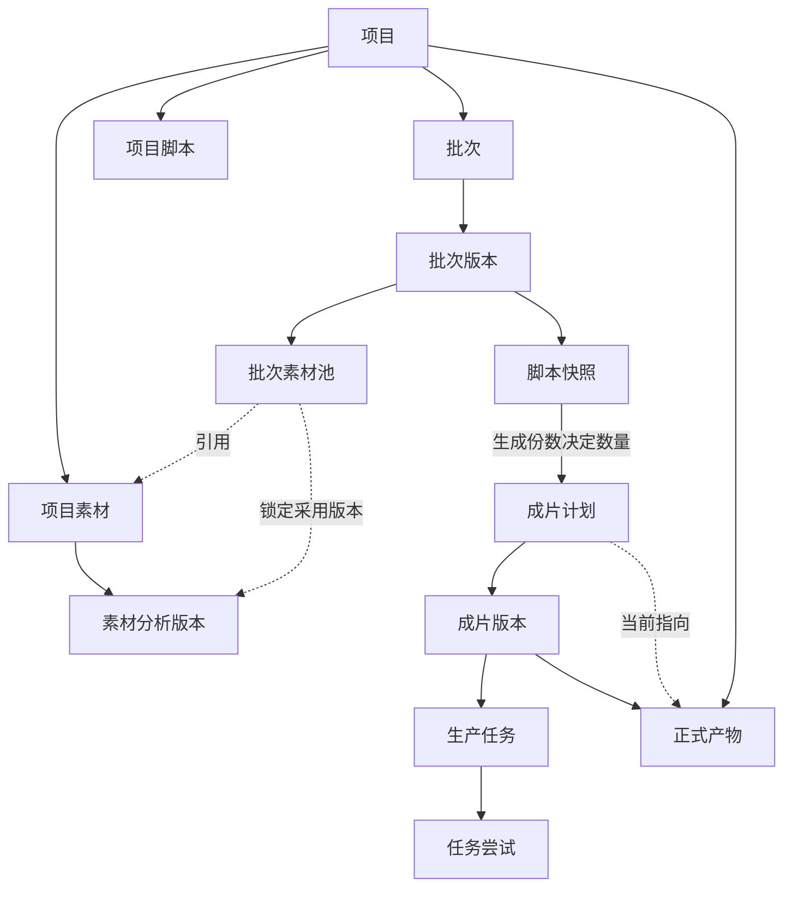

# 批量生产数据模型

- 决定日期：2026-07-31
- 决定性质：领域与数据边界设计，不代表数据库或业务代码已经实现
- 对应票据：[定义批量生产的数据模型](../02-定义批量生产的数据模型.md)
- 产品依据：[批量混剪与桌面化 V1 PRD](../../../specs/2026-07-31-batch-mixcut-desktop-prd.md)

## 给非技术人员的结论

批量生产不能只保存“现在页面上显示什么”，而要保存一条完整、可追溯的生产链：用了哪些素材和脚本、计划生成几条、每条执行过几次、最终产生了哪些文件。

这套模型采用一条简单原则：

- 项目里的素材和脚本可以继续整理、更新。
- 批次一旦开始，本次真正使用的输入就固定下来。
- 重试只是再次执行，不会偷偷增加用户要求的成片数量。
- 成功产物永不被新版本覆盖，平时只把一个版本标为“当前成片”。

## 对象关系

## 每个对象拥有什么

| 对象 | 归属与身份 | 需要保存的业务事实 |
|---|---|---|
| 项目素材 | 只属于一个项目，拥有不依赖文件名和路径的素材身份 | 来源类型、原文件定位信息、内容身份、媒体属性、在线／离线／归档状态和当前分析版本 |
| 素材分析版本 | 属于一份项目素材，可跨批次复用 | 本次分析所得的时长、方向、可用区间、内容理解、分析来源与版本 |
| 项目脚本 | 只属于一个项目，可以来自第 3 步脚本生成或用户明确保存的外部文案 | 稳定来源身份、当前正文、标题和来源版本 |
| 批次 | 只属于一个项目，是一次批量生产工作单 | 名称、整体状态、当前批次版本、创建时间和汇总进度 |
| 批次版本 | 属于一个批次，代表一次已经确认的整体输入 | 批次素材池、脚本快照、生成份数、默认设置及其形成的成片计划 |
| 批次素材池 | 属于一个批次版本 | 被选素材的引用、采用的素材分析版本和本批次选择状态 |
| 脚本快照 | 属于一个批次版本，来源可以是项目脚本或批次内外部文案 | 开始生产时的正文、标题、来源身份、来源版本和生成份数 |
| 成片计划 | 属于一个批次版本和一份脚本快照，一张成片卡片对应一个计划 | 该条成片的序号、素材区间与顺序、封面、音乐、目标时长及分配诊断 |
| 成片版本 | 属于一条成片计划 | 单条局部调整后的完整成片安排；旧版本继续保留 |
| 生产任务 | 服务于素材准备或某个成片版本 | 工作类型、所属对象、当前状态和汇总进度；具体状态机由后续调度票决定 |
| 任务尝试 | 属于一个生产任务 | 某次真实执行的开始、结束、进度、结果或失败记录 |
| 正式产物 | 属于项目，并保留批次版本、成片计划和成片版本来源 | 视频或封面身份、版本、文件位置、校验结果和生成时间 |
| 当前成片 | 是成片计划指向某个正式视频产物的可变选择 | 平时默认展示哪个成功版本；历史产物不因此删除 |

这张票只确定业务对象和关系，不把上表直接等同于数据库表。具体表、字段、索引和迁移步骤要在兼容迁移设计中落定。

## 快照与版本规则

### 批次开始前

- 项目素材、项目脚本、启用状态、生成份数和批次默认设置都可以修改。
- 第 3 步保存的项目脚本自动出现在智能混剪中，同一来源不会重复导入。
- 外部文案默认只属于当前批次；只有用户明确选择“保存为项目文案”，才写回项目。

### 批次第一次开始后

- 本次使用的素材、素材分析版本、脚本正文、标题、生成份数和默认设置形成固定的批次版本。
- 上游项目脚本或素材分析后来更新，不会静默改写已经开始的批次。
- 修改整体素材、脚本、生成份数或批次默认设置时，形成新的批次版本；旧版本及其结果保留。
- 只调整某条成片的镜头、字幕、封面或音乐时，形成新的成片版本，不改变同批次其他成片。

## 数量、任务和重试

- 一份脚本快照的生成份数直接决定成片计划数量。例如脚本 A 生成 3 份，就预先建立 3 条成片计划。
- 每条成片计划有稳定身份；失败重试只产生新的任务尝试，不产生“第 4 条成片”。
- 计划生成 20 条而 18 条成功、2 条失败时，批次进入“部分完成：18/20”。
- 已成功的 18 条可以直接预览和导出；失败项单独重试，不回滚成功项。
- 失败项重试时批次重新进入运行状态；全部成功后变为已完成。

任务的原子领取、暂停、继续、真实停止、应用重启恢复和自动资源控制不在本票决定，由 [设计可恢复任务调度与自动资源控制](../05-设计可恢复任务调度与自动资源控制.md) 继续细化。

## 素材身份与分析复用

- 文件名和路径只是寻找链接素材的线索，不是素材身份。
- 链接素材移动或改名后标记为离线；重新定位并核验为同一内容后恢复使用。
- 同一路径变成另一段视频时，必须作为新素材加入，不能静默替换旧素材；要用于生产则形成新的批次版本。
- 素材分析结果属于项目素材，可以被多个批次复用；批次保存自己实际采用的分析版本。
- 移动、改名或生成代理文件不会触发重分析；内容变化或分析能力升级时才形成新版分析。
- 新版分析不改写旧批次的计划依据。

文件身份算法、批量重新定位和分析失效判定由 [设计项目素材库与原文件引用](../04-设计项目素材库与原文件引用.md) 继续细化。

## 归档、清理与删除边界

- 已被历史批次引用的项目素材，普通“移除”操作实际进入归档：不再参与新批次，但历史仍可追溯，也可以恢复。
- 托管素材仍被任何批次或正式产物引用时，不删除其受管文件；释放空间必须经过单独的安全清理。
- 链接素材只移除项目记录，任何项目操作都不能删除手机、相机或移动硬盘中的原文件。
- 代理和中间文件是可重建缓存，可以集中清理；它们不是正式产物。
- 删除或清理批次时默认保留正式产物；删除正式产物是独立操作，需要再次确认。

## 正式产物版本

- 每次成功导出都会新增一份正式产物，不覆盖旧文件。
- 第一次成功导出的版本自动成为当前成片。
- 后续重新导出成功后，最新版自动成为当前成片；用户可以从历史中恢复旧版为当前成片。
- 成片计划通过当前成片提供简单的默认结果，项目仍保存所有正式产物及其来源。
- 其他成片失败，不影响已登记的正式产物。

## 必须通过的模型场景

1. 脚本 A 生成 3 份，第二条失败后重试两次，系统仍只有 3 张成片卡片。
2. 20 条计划中 18 条成功、2 条失败，批次显示部分完成，18 条可立即导出。
3. 项目脚本在批次开始后被修改，旧批次仍显示并使用原来的正文与标题。
4. 素材产生新版分析，旧批次仍能说明自己采用的是旧分析版本。
5. 链接素材移动后可以重新定位；同名但内容不同的文件不能冒充原素材。
6. 素材归档后，新批次不再看到它，历史批次仍能保留引用和说明。
7. 同一成片重新导出三次，产生三份不覆盖的正式产物，其中一个被标记为当前成片。
8. 清理代理、临时文件或批次工作数据，不会删除原片和正式产物。

## 本票明确不决定的内容

- 不决定 SQLite 表名、字段名、索引、外键和迁移 SQL。
- 不决定文件指纹算法、重新定位交互和素材分析的具体供应商结构。
- 不决定任务状态机、资源并发公式和 FFmpeg 停止实现。
- 不决定脚本同步去重算法、联合分配算法、代理编码参数、LUT 缓存规则或批量工作区 UI。
- 不改变现有单条精准混剪的 `projectId + shotSetId` 隔离和历史版本规则。
