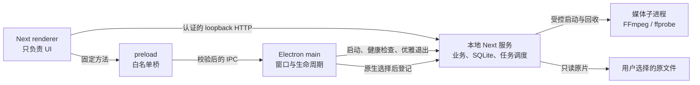

# Electron 官方资料研究：桌面壳与本地服务边界

- 研究日期：2026-07-31
- 研究性质：官方资料核对，不代表 Electron 迁移已经实现
- 对应票据：[确定桌面应用与本地服务的边界](../03-确定桌面应用与本地服务的边界.md)
- 资料范围：Electron 官方文档；涉及当前项目的具体取舍均标为“工程建议”或“工程推论”

## 给非技术人员的结论

桌面化不等于推翻现有 Next.js、SQLite 和 FFmpeg 后端。更稳妥的做法是增加一个很薄的 Electron 外壳：

- Electron 主进程负责应用窗口、启动与退出、本机文件选择，以及看管本地 Next 服务。
- 当前 Next/React 页面继续负责界面，不获得读取硬盘或启动命令的通用权限。
- preload 只提供几项明确命名的桌面能力，不把 Electron 或 Node.js 整体交给页面。
- SQLite、AI 适配器、FFmpeg、任务调度和业务规则仍留在本地 Next 服务。

这样做既能解决几十条大视频经过浏览器上传的问题，又不会把现有业务逻辑复制到 Electron 中形成第二套后端。

## 资料可信度标记

- **官方事实**：Electron 文档直接陈述的行为或安全要求。
- **工程建议**：依据官方边界，结合本项目现状得出的推荐方案。
- **工程推论／待实测**：Electron 官方没有直接规定，需要实现后在 macOS 与 Windows 真机验证。

## 本仓库现状核对

- `package.json` 当前没有 Electron；现有 macOS 和 Windows 安装包都携带 Next standalone、私有 Node 22、FFmpeg 和原生模块，这套业务运行时可以继续复用。
- `installer/macos/launcher.sh` 和 `installer/windows/launcher.cs` 当前使用固定 `3000` 端口并打开系统浏览器；已有服务判断只证明端口上存在网页，不能可靠证明它就是本次 Creative Studio 实例。
- `app/api/shutdown/route.ts` 当前在响应后直接 `process.exit(0)`，没有桌面会话认证，也没有先让任务、FFmpeg 和数据库进入安全退出状态。
- `lib/final-edit/worker.ts` 已能把重启前的渲染任务从 `running` 恢复为 `queued`，但 `lib/ffmpeg.ts` 的运行 Interface 还没有统一取消信号；这证明恢复基础可复用，优雅停止仍需后续调度票补齐。
- macOS 安装版数据根位于 `~/Library/Application Support/CreativeStudio`，Windows 安装版当前把数据留在每用户安装目录；桌面壳必须继续通过 `CREATIVE_STUDIO_DATA_ROOT` 传入既有数据位置，不能擅自换目录。
- 参考混剪项目虽然已有 Electron，但其 `sandbox: false`、通用 `backendRequest` 和向 renderer 暴露后端端口的方式不符合本项目的最小桥接目标，不作为迁移模板。

## 1. main、renderer 与 preload 各自负责什么

### 官方事实

Electron 每个应用只有一个 main process。它运行在 Node.js 环境，负责创建和管理窗口、应用生命周期以及原生桌面 API。每个 `BrowserWindow` 的页面运行在单独的 renderer process；renderer 应按照普通网页环境编写，默认不能直接使用 Node.js。preload 在页面加载前运行，用来通过受控接口连接页面与原生能力。[Process Model](https://www.electronjs.org/docs/latest/tutorial/process-model)

`contextIsolation` 会把 preload 与页面的 JavaScript 世界隔开；需要用 `contextBridge.exposeInMainWorld` 暴露明确的 API。Electron 明确警告，不应把整个 `ipcRenderer` 暴露给页面，而应为每一种允许的消息提供单独包装函数。[Context Isolation](https://www.electronjs.org/docs/latest/tutorial/context-isolation)、[contextBridge](https://www.electronjs.org/docs/latest/api/context-bridge)、[IPC guide](https://www.electronjs.org/docs/latest/tutorial/ipc)

### 本项目的边界建议

| 层 | 应负责 | 不应负责 |
|---|---|---|
| Electron main | 单实例、窗口、原生文件／文件夹选择、启动和看管本地服务、受控的“在文件夹中显示”、应用退出 | 混剪领域模型、SQLite 业务查询、脚本同步、素材分配、FFmpeg 参数拼装 |
| preload | 暴露少量、强类型、逐项命名的方法；转发调用与安全结果 | 暴露 `ipcRenderer`、`fs`、`path`、`child_process` 或任意 IPC channel |
| Next renderer | 现有 React UI、状态展示、进度和用户操作 | 直接读取任意路径、启动命令、访问 Node API |
| 本地 Next 服务 | SQLite、项目媒体库、任务调度、AI/FFmpeg 执行、进度、恢复和正式产物登记 | 创建桌面窗口、处理系统应用生命周期 |

建议的 preload Interface 只包含以下一类能力：

```ts
interface DesktopBridge {
  platform(): Promise<'macos' | 'windows'>
  chooseMediaFiles(): Promise<SelectedMedia[]>
  chooseFolder(): Promise<SelectedFolder | null>
  revealManagedPath(artifactId: string): Promise<void>
  getAppVersion(): Promise<string>
}
```

这里的 `artifactId` 是业务对象身份，不是让页面提交任意绝对路径。是否提供显式 `quit()` 应由最终交互决定，不建议页面拥有无条件退出能力。

## 2. 必须固定的 BrowserWindow 安全基线

### 官方事实

Electron 的安全清单要求：禁用页面 Node 集成、启用 context isolation、启用 renderer sandbox、保持 `webSecurity`、限制导航、限制新窗口、验证所有 IPC sender，并且不要向不可信页面暴露 Electron API。当前 Electron 默认已经是 `nodeIntegration: false`、`contextIsolation: true`，renderer sandbox 也已成为默认值，但官方仍建议显式遵循这些约束。[Security checklist](https://www.electronjs.org/docs/latest/tutorial/security)、[Process Sandboxing](https://www.electronjs.org/docs/latest/tutorial/sandbox)

### 本项目建议的显式配置

```ts
webPreferences: {
  preload,
  nodeIntegration: false,
  contextIsolation: true,
  sandbox: true,
  webSecurity: true,
  webviewTag: false,
}
```

即使这些选项当前有安全默认值，也应显式写入并通过测试锁定，避免未来重构或依赖升级时被无意改掉。

## 3. IPC sender 校验与桥接白名单

### 官方事实

Electron 要求默认校验每一条 IPC 消息的 `sender`。原因是 iframe、子窗口等 Web Frame 在某些情况下也可以向 main 发送 IPC；官方示例使用 `event.senderFrame` 的 URL 和真实 URL parser 做 allowlist 校验。[Validate the sender of all IPC messages](https://www.electronjs.org/docs/latest/tutorial/security#17-validate-the-sender-of-all-ipc-messages)

### 本项目的工程建议

- 每个 `ipcMain.handle` 都先确认 `event.senderFrame` 存在。
- sender 必须是主窗口当前的 main frame，并且 URL origin 必须精确等于本次启动的本地服务 origin。
- 不能使用 `startsWith('http://127.0.0.1')` 之类字符串判断；使用 `new URL(...)` 后逐项比较 protocol、hostname 和 port。
- preload 每项方法固定 channel 和参数结构，在 main 再做 schema、数量、扩展名及路径来源校验。
- 页面只能请求“选择文件”“显示已登记产物”等业务动作，不能传入命令名、可执行文件或任意 IPC channel。

随机端口会使允许的 origin 每次不同，所以应在本地服务就绪、实际端口确定后，再建立 sender allowlist 和加载窗口。

## 4. 禁止意外导航与新窗口

### 官方事实

Electron 建议在不需要页面导航时监听 `will-navigate` 并调用 `event.preventDefault()`；若允许少量导航，应使用 URL parser 精确校验。官方也建议通过 `webContents.setWindowOpenHandler()` 限制或拒绝 renderer 创建新窗口。`setWindowOpenHandler` 返回 `{ action: 'deny' }` 可以取消窗口创建。[Security: limit navigation and new windows](https://www.electronjs.org/docs/latest/tutorial/security#13-disable-or-limit-navigation)、[Opening windows from the renderer](https://www.electronjs.org/docs/latest/api/window-open)

官方同时警告，不要把用户可控 URL 直接传给 `shell.openExternal`。[Security: shell.openExternal](https://www.electronjs.org/docs/latest/tutorial/security#15-do-not-use-shellopenexternal-with-untrusted-content)

### 本项目的工程建议

- 主窗口只允许首次加载本次启动的精确本地 origin；其余顶层导航全部拦截。
- 默认对所有 `window.open`、`target="_blank"` 返回 `deny`。
- 如果未来需要“打开帮助页面”，由 main 对固定的 HTTPS 域名和协议做 allowlist 后再调用 `shell.openExternal`。
- 不使用 `<webview>` 承载业务页面。

## 5. 原生文件选择与路径如何传递

### 官方事实

`dialog` 是 main-process API，`showOpenDialog` 支持 `openFile`、`openDirectory` 和 `multiSelections`，结果包含用户明确选择的 `filePaths`。Electron IPC 官方教程也用 `ipcMain.handle` 调用原生文件对话框，再由 preload 暴露单一 `openFile()` 方法；教程明确说明不要直接暴露完整 `ipcRenderer.invoke`。[dialog](https://www.electronjs.org/docs/latest/api/dialog)、[IPC two-way pattern](https://www.electronjs.org/docs/latest/tutorial/ipc#pattern-2-renderer-to-main-two-way)

Windows 和 Linux 上，同一个对话框不能同时作为文件选择器与目录选择器；两类操作需要分别提供入口。[dialog platform note](https://www.electronjs.org/docs/latest/api/dialog)

### 本项目的工程建议

原始路径只在 main 和本地服务之间传递。推荐流程是：

1. renderer 调用 `chooseMediaFiles()`。
2. main 打开原生多选对话框。
3. main 将用户本次明确选中的路径提交给本地项目媒体库登记。
4. renderer 只收到媒体 ID、文件名、类型、大小、时长和在线状态等安全描述。

这比让某个 HTTP API 接收页面任意填写的绝对路径更安全，也让“链接素材不复制原文件”的语义可控。

**工程推论：** Electron 官方示例允许把所选路径返回 renderer，但没有规定必须这样设计。本项目还存在一个有文件系统权限的本地服务，因此进一步采用“选择令牌或登记后的媒体 ID”是缩小攻击面的项目级选择。

## 6. 单实例与窗口恢复

### 官方事实

`app.requestSingleInstanceLock()` 返回当前进程是否取得单实例锁；未取得锁的实例应立即退出。主实例收到 `second-instance` 后，通常恢复最小化窗口并聚焦。macOS 从 Finder 启动通常已有系统单实例行为，但从命令行仍可能绕过，因此官方仍要求需要时使用该 API。[app.requestSingleInstanceLock](https://www.electronjs.org/docs/latest/api/app#apprequestsingleinstancelockadditionaldata)

### 本项目的工程建议

- 在创建窗口和启动本地服务之前取得单实例锁。
- 第二次启动不再创建 SQLite 连接或第二个本地服务，只唤醒、恢复并聚焦已有窗口。
- `additionalData` 只传递已经校验的启动意图，不传密钥。

这不仅防止重复窗口，更重要的是避免两套本地服务和任务调度器同时争用同一数据库。

## 7. ready、activate、window-all-closed 与 before-quit

### 官方事实

- `ready`／`app.whenReady()`：Electron 初始化完成后再创建 `BrowserWindow`；`BrowserWindow` 本身不能在 `ready` 之前使用。[BrowserWindow](https://www.electronjs.org/docs/latest/api/browser-window)、[app ready](https://www.electronjs.org/docs/latest/api/app#event-ready)
- `activate`：macOS 上点击 Dock、重新启动应用等行为会触发，可用于在没有窗口时重新创建窗口。[app activate](https://www.electronjs.org/docs/latest/api/app#event-activate-macos)
- `window-all-closed`：关闭全部窗口时触发。Electron 教程通常在非 macOS 平台退出，在 macOS 保留应用以符合平台惯例。[Process Model lifecycle](https://www.electronjs.org/docs/latest/tutorial/process-model#application-lifecycle)
- `before-quit`：在应用开始关闭窗口前触发，可以 `preventDefault()`；但 Windows 因系统关机、重启或注销退出时不会触发。`autoUpdater.quitAndInstall()` 的事件顺序也不同。[app before-quit](https://www.electronjs.org/docs/latest/api/app#event-before-quit)
- `app.exit()` 会直接退出，不触发 `before-quit` 和 `will-quit`，不适合承担正常清理流程。[app.exit](https://www.electronjs.org/docs/latest/api/app#appexitexitcode)

### 本项目建议的生命周期顺序

1. 顶层先取得 single-instance lock。
2. `app.whenReady()` 后启动本地服务并等待其健康检查返回实际端口。
3. 服务就绪后再创建安全配置的 `BrowserWindow` 并加载精确 origin。
4. macOS `activate` 或 Windows 再次点击应用图标时，恢复并聚焦已有窗口，不创建第二套服务。
5. 用户真正退出时，main 先停止接收新桌面操作，通知本地服务优雅关闭，等待有限时间，再回收子进程。
6. 因 Windows 系统退出不保证触发 `before-quit`，生产任务必须随进度持久化，重启后由服务恢复，不能把正确性寄托在退出回调。

### 用户已确认的跨平台关窗规则

- 关闭窗口只隐藏应用，macOS 与 Windows 都继续在后台运行；正在执行的任务不因此停止。
- 首次关窗时给出一次系统提示，明确说明任务仍在后台处理，并提供重新打开入口。
- 再次点击应用图标时恢复原窗口和原任务页面，不创建第二个本地服务或调度器。
- 只有明确点击“退出 Creative Studio”才真正退出。若仍有任务，先提示“暂停任务并退出”；确认后保存可恢复状态、停止领取新任务、回收本地服务和媒体进程。
- 电脑关机、崩溃或强制结束来不及走正常退出流程时，下次启动仍依靠持久化任务恢复。

## 8. 本地 HTTP 服务：绑定、随机端口与认证

### 官方事实

Electron 安全文档面向网络内容时建议只加载安全协议，并警告普通 HTTP 缺乏传输完整性与加密。官方文档没有给出“Electron 包装本机 Next HTTP 服务”这一场景的完整绑定、随机端口和认证方案。[Only load secure content](https://www.electronjs.org/docs/latest/tutorial/security#1-only-load-secure-content)

因此以下内容均为**工程推论，必须通过安全评审与真机测试确认**：

- 服务只绑定 `127.0.0.1`，不绑定 `0.0.0.0`、局域网地址或外部网卡。
- 由操作系统分配本次启动的可用随机端口，避免固定端口冲突；随机端口本身不是认证手段。
- main 生成每次启动独有的高强度认证秘密，本地服务对有副作用或能读取数据的请求进行验证。
- 秘密不能放在 URL 查询参数、日志、崩溃报告或 renderer 可读取的持久存储中。
- 服务验证 `Host`、`Origin` 和认证信息；健康检查只返回最小状态。
- BrowserWindow 与 IPC sender 只信任本次实际 origin，旧端口和其他 localhost 页面都不可信。
- 如果无法为本地 HTTP 边界提供可靠认证，应评估自定义 scheme 或让敏感原生操作完全走 IPC；Electron 安全文档也建议优先自定义 protocol 而非 `file://`。[Security checklist](https://www.electronjs.org/docs/latest/tutorial/security)

本地服务仍可能被同一台电脑上的其他进程访问，所以“只绑定 localhost”与“端口随机”不能代替认证。

## 9. 本地服务与媒体子进程的退出回收

### 官方事实

Electron 提供 `utilityProcess` 在 main 下启动 Node 子进程，官方说明它适用于不可信服务、CPU 密集或易崩溃组件；在需要 fork Node 子进程时可以优先于 `child_process.fork`。`UtilityProcess.kill()` 在 POSIX 使用 SIGTERM 并保证退出时回收进程，同时提供 `spawn`、`exit` 和 PID 状态。[Process Model: utility process](https://www.electronjs.org/docs/latest/tutorial/process-model#the-utility-process)、[utilityProcess](https://www.electronjs.org/docs/latest/api/utility-process)

### 本项目的工程建议

当前本地服务携带独立 Node 运行时，并加载 `better-sqlite3`、`sharp` 等原生模块。因此 V1 可以继续由 main 以受控子进程启动该私有 Node，而不是把数据库和媒体业务移入 Electron main。

main 必须：

- 始终保存直接子进程句柄并监听 `spawn`、`error`、`exit`。
- 正常退出先调用本地服务的优雅停机协议，使队列停止领取新任务、状态落库、数据库关闭。
- 设定有限等待时间；超时后终止子进程，并验证没有遗留监听端口。
- 异常退出时让 UI 显示服务已停止，不在无限循环中静默重启。
- FFmpeg 等任务必须由本地服务统一登记和回收，不能由 renderer 直接启动。

**工程推论／待实测：** Electron 文档没有承诺 Node `child_process` 在 macOS 和 Windows 上会自动清理整棵孙进程树。Next 服务、FFmpeg 和代理任务的进程树退出必须做双平台真实测试；Windows 系统关机也不能只依赖 `before-quit`。

## 10. 原生模块 ABI 是桌面化的重要边界

### 官方事实

Electron 使用的 Node ABI 与普通系统 Node 可能不同；Electron 官方说明原生 Node 模块通常需要针对目标 Electron 版本重新构建，可使用 Electron Forge 或 `@electron/rebuild`。升级 Electron 后也可能需要重新构建原生模块。[Native Node Modules](https://www.electronjs.org/docs/latest/tutorial/using-native-node-modules)

### 本项目的工程建议

- Electron main/preload 不直接加载 `better-sqlite3`、`sharp` 等当前为私有 Node 运行时准备的原生模块。
- 这些模块继续留在现有 Next 服务进程，保持当前 Node 22 ABI 和构建校验。
- Electron 壳仅加载纯 JS/TS 桌面代码和官方 Electron API。

这条边界能显著减少桌面迁移对现有渲染、数据库和安装包验证的影响。

## 11. macOS 与 Windows 打包边界

### 官方事实

Electron 发布包需要把应用资源与 Electron 二进制一起打包；官方推荐 Electron Forge，也允许手工打包。macOS 和 Windows 的包目录结构不同。[Application Packaging](https://www.electronjs.org/docs/latest/tutorial/application-distribution)、[Electron Forge overview](https://www.electronjs.org/docs/latest/tutorial/forge-overview)

Electron 官方建议面向用户分发的应用进行代码签名。macOS 发布需要签名和公证；Windows 也需要对应签名，避免系统安全警告。[Code Signing](https://www.electronjs.org/docs/latest/tutorial/code-signing)

### 本项目的工程建议

- 保留现有 Next standalone、私有 Node、FFmpeg、应用数据目录和负载裁剪规则。
- 在外层增加 Electron 可执行文件、main、preload 和必要的 Electron helper，不把用户数据库、storage、日志或密钥打进安装包。
- macOS 继续分别验证 arm64 Electron、私有 Node、FFmpeg 与原生模块架构，并新增应用签名、公证、helper 签名和干净机器启动检查。
- Windows 在真实 Windows 主机生成和验证安装包，新增签名、卸载保留数据、服务及 FFmpeg 无残留进程检查。
- 使用 Forge 还是扩展现有自建脚本是实现选择；Electron 官方推荐 Forge，但并未强制。

## 12. 自动更新不是“换成 Electron 就自动拥有”

### 官方事实

Electron 内置 `autoUpdater` 只支持 macOS 和 Windows。macOS 基于 Squirrel.Mac，并要求应用签名。Windows 会根据 MSIX 或 Squirrel.Windows 包类型选择更新机制；Squirrel.Windows 还有安装事件和首次运行文件锁等特殊行为。[autoUpdater](https://www.electronjs.org/docs/latest/api/auto-updater)

官方发布流程把 packaging、code signing、publishing 和 updating 视为不同步骤；自动更新还需要更新源和相应发布配置。[Distribution Overview](https://www.electronjs.org/docs/latest/tutorial/distribution-overview)、[Updating Applications](https://www.electronjs.org/docs/latest/tutorial/updates)

### 本项目的工程建议

- 当前 Windows 使用 Inno Setup，不属于 Electron 官方 `autoUpdater` 文档列出的 Squirrel.Windows 或 MSIX 路径，不能宣称直接兼容内置自动更新。
- V1 可以继续采用手动下载安装包更新；若以后需要自动更新，应单独决定是否迁移 Windows 打包格式，并设计签名、更新源、失败回滚和数据兼容。
- macOS 即使能接入 `autoUpdater`，也必须先完成签名、公证、更新源和真实升级测试。
- `autoUpdater.quitAndInstall()` 会改变退出事件顺序，接入时必须让本地服务清理同时覆盖 `before-quit-for-update`。[autoUpdater before-quit-for-update](https://www.electronjs.org/docs/latest/api/auto-updater#event-before-quit-for-update)

## 13. 推荐的 V1 运行关系



## 14. 必须验证的桌面边界场景

1. 第二次启动不会创建第二个本地服务、SQLite writer 或任务调度器，只聚焦原窗口。
2. renderer 无法访问 `require`、`process`、`fs`、任意 IPC channel 或任意命令执行。
3. iframe、旧端口、其他 localhost 页面和新窗口无法调用受保护 IPC。
4. 页面导航到非本次 origin 会被阻止，`window.open` 默认失败。
5. 一次选择几十条 4K 文件时，不把文件内容读入 BrowserWindow 内存，也不走 multipart 上传；项目媒体库得到稳定媒体身份。
6. 页面伪造绝对路径不能让本地服务读取未由用户选择的文件。
7. 正常退出时本地服务、FFmpeg 和监听端口全部回收；未完成任务保持可恢复状态。
8. Windows 系统注销／重启造成无 `before-quit` 退出后，下次启动能恢复任务且没有 ghost-running。
9. macOS 与 Windows 关窗都只隐藏并继续后台任务；再次点击应用图标恢复原窗口；明确退出才暂停任务并回收服务。
10. 自动更新若未单独实现，界面和发布说明不出现“自动更新”承诺。
11. macOS 和 Windows 安装包都不携带开发数据库、storage、日志或 API Key。
12. Electron 升级后重新执行壳层、原生模块隔离、安装包和真实 FFmpeg 验收。

## 15. 本票可据此固定的决定

- 采用薄 Electron 壳，不迁移或复制业务后端。
- main、preload、renderer、本地服务、媒体子进程五层职责按本文分离。
- 安全基线固定为 `nodeIntegration: false`、`contextIsolation: true`、`sandbox: true`、受控 IPC、严格导航和新窗口限制。
- 原生文件选择由 main 执行，renderer 使用登记后的媒体身份，不获得任意路径读取能力。
- 本地服务采用 single-instance、loopback、随机端口和每次启动认证；其中 loopback 认证方案属于项目工程设计，不冒充 Electron 官方结论。
- 本地服务与媒体任务必须持久化状态并支持异常退出恢复，不能只依赖应用退出事件。
- Electron main 不加载当前业务原生模块，避免 Electron ABI 与私有 Node ABI 混用。
- 关闭窗口统一进入后台；明确退出时若有任务则暂停并保存，随后回收本地服务和媒体子进程。
- V1 不默认承诺自动更新；Windows Inno Setup 与 Electron 内置 `autoUpdater` 的差距另开实现决策。

## 官方资料索引

- [Process Model](https://www.electronjs.org/docs/latest/tutorial/process-model)
- [Security](https://www.electronjs.org/docs/latest/tutorial/security)
- [Context Isolation](https://www.electronjs.org/docs/latest/tutorial/context-isolation)
- [Process Sandboxing](https://www.electronjs.org/docs/latest/tutorial/sandbox)
- [Inter-Process Communication](https://www.electronjs.org/docs/latest/tutorial/ipc)
- [contextBridge](https://www.electronjs.org/docs/latest/api/context-bridge)
- [app lifecycle](https://www.electronjs.org/docs/latest/api/app)
- [BrowserWindow](https://www.electronjs.org/docs/latest/api/browser-window)
- [dialog](https://www.electronjs.org/docs/latest/api/dialog)
- [utilityProcess](https://www.electronjs.org/docs/latest/api/utility-process)
- [Native Node Modules](https://www.electronjs.org/docs/latest/tutorial/using-native-node-modules)
- [Application Packaging](https://www.electronjs.org/docs/latest/tutorial/application-distribution)
- [Code Signing](https://www.electronjs.org/docs/latest/tutorial/code-signing)
- [autoUpdater](https://www.electronjs.org/docs/latest/api/auto-updater)
- [Updating Applications](https://www.electronjs.org/docs/latest/tutorial/updates)
