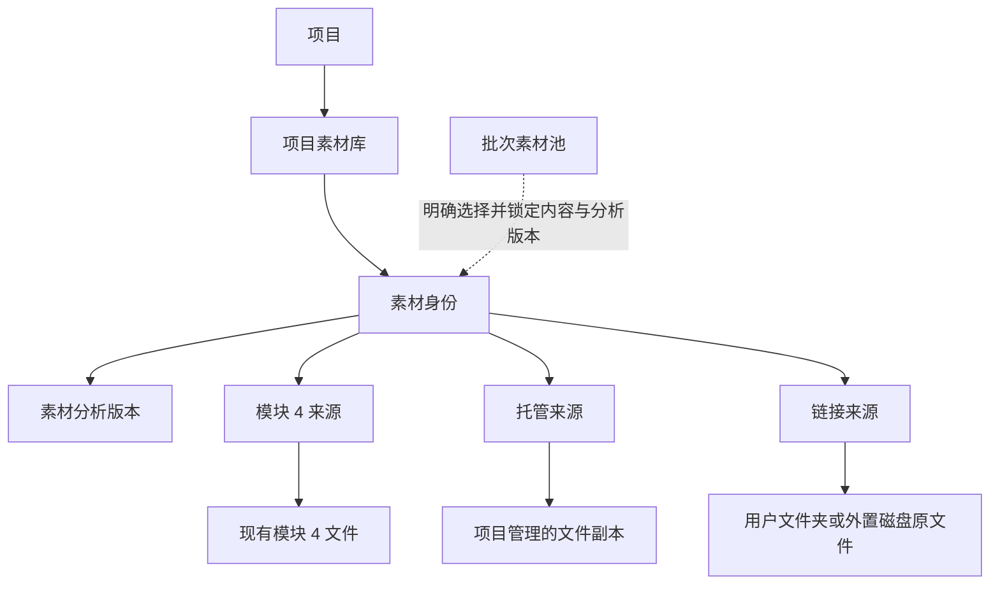

# 项目素材库与原文件引用设计

- 决定日期：2026-07-31
- 决定性质：素材目录、文件身份与来源管理设计，不代表数据库或业务代码已经实现
- 对应票据：[设计项目素材库与原文件引用](../04-设计项目素材库与原文件引用.md)
- 上游依据：[批量生产数据模型](./02-批量生产数据模型.md)

## 给非技术人员的结论

项目素材库不把“文件路径”当作“素材本身”。可以把它理解成通讯录：

- 素材身份像联系人，始终不变。
- 模块 4 视频、项目托管副本和相机原文件像这个联系人的不同联系方式。
- 一个联系方式失效，不代表联系人和历史记录被删除。
- 新路径只有在确认内容完全相同后，才能接回原素材。

所以相机文件改名、移动到另一块硬盘或暂时没插盘时，项目会显示离线并等待重新定位，不会丢掉分析结果和批次记录；同名但内容不同的文件也不会被误认成原片。

## 已验证的十个场景

本票先做了一个不接数据库、不读取真实视频的终端逻辑原型，用户确认以下行为符合预期：

1. 模块 4 成功视频可以登记为项目素材，不再复制视频。
2. 相机原文件可以只建立链接，不复制进项目。
3. 批次固定自己采用的素材与分析版本。
4. 外置盘移动后，素材记录、分析和批次引用继续存在。
5. 批量重新定位会排除同名但内容不同的文件。
6. 原路径被另一段视频覆盖时，不会偷换旧素材身份。
7. 同一内容后来增加托管副本时，只增加来源，不重复建素材。
8. 素材重新分析产生新版后，旧批次仍使用旧版分析。
9. 归档只影响新批次选择，不破坏旧批次。
10. 托管副本仍被批次引用时，空间清理必须被阻止；项目永不删除链接原文件。

原型已经完成验证并按抛弃式原型约定删除，本文件保留其决定。

## 核心关系

## 1. 项目素材库是一个深 Module

新增 `ProjectMediaCatalog` Module，放在项目级素材与所有调用者之间。它的 Interface 只表达少量业务动作：

- 登记用户已经明确选择的素材来源，并返回素材身份。
- 查询当前项目可选、离线和归档的素材。
- 核验来源健康状态，或重新定位既有来源。
- 归档、恢复以及判断托管副本能否清理。
- 为批次建立明确选择的素材快照。

完整指纹计算、路径安全、来源合并、状态推导、分析复用和引用检查都藏在 Module 的 Implementation 内，不能散落到页面、API route、批次调度器和渲染器中。调用者与测试以后都通过同一个 Interface 验证行为。

Module 内部存在三种真实 Adapter：

| Adapter | 如何取得文件 | 文件归谁管理 | 删除权限 |
|---|---|---|---|
| 模块 4 Adapter | 引用当前项目中已成功的视频任务产物 | 沿用模块 4 产物管理 | 项目素材库不借此删除模块 4 文件 |
| 托管 Adapter | 把用户选择的文件安全复制进项目数据根 | Creative Studio 管理副本 | 仅在无批次、任务和正式产物引用时进入单独清理 |
| 链接 Adapter | 通过桌面原生选择登记用户原文件的位置 | 用户管理原文件 | Creative Studio 永远没有删除原文件的权限 |

当前 `lib/final-edit/material-import.ts` 已具备扩展名／容器校验、完整 SHA-256、受控存储、缺失修复、引用检查和隔离删除能力。实现时应把这部分能力吸收到托管 Adapter，而不是复制一套校验逻辑。

## 2. 项目与单条模式仍然隔离

- 每份素材身份只属于一个项目；相同文件放进另一个项目时，仍建立另一个项目自己的素材记录。
- 项目素材库可以汇总当前项目的模块 4、托管和链接素材。
- 批量生产只能使用用户为该批次明确勾选的素材，不自动使用整个项目素材库。
- 现有单条精准混剪仍只读取自己的 `projectId + shotSetId` 素材，不会因为项目素材库出现而看到其他分镜组或外部素材。
- 如果以后要在单条精准混剪中使用项目素材，也必须由用户明确选择，并建立可追溯引用；不能暗中扩大原有查询范围。

## 3. 素材身份与多个来源

素材身份使用项目内稳定 ID。文件名、显示名称、当前路径和来源 ID 都不能代替这个身份。

同一项目中，完整内容指纹完全一致的文件合并到同一素材身份，可以拥有多个来源。例如：

- 相机原文件最初作为链接来源加入。
- 用户后来选择“保存项目副本”，增加托管来源。
- 即使外置盘离线，只要托管来源仍可核验，素材总体仍然可用。

来源合并只发生在完整内容完全一致时。画面看起来相同但编码、裁剪或色彩已经变化的视频是另一份内容，建立新的素材身份；它不会继承旧素材的分析版本。

## 4. 两级内容核验

几十条 4K 或相机素材如果每次打开项目都完整读取一遍，会造成不必要等待。因此采用两级核验：

### 快速筛选

登记时保存文件大小、媒体基本信息和若干固定位置采样形成的快速指纹。系统文件标识和修改时间可以作为检查提示，但不能作为素材身份。

快速指纹只负责缩小候选范围，允许极小概率碰撞；它永远不能单独让素材进入分析、混剪或最终导出。

### 完整确认

第一次登记新内容时，后台顺序读取完整文件并计算 SHA-256。只有完整指纹一致，才能认定为同一内容、复用素材身份和分析结果。

- 模块 4 和托管素材可以在登记或复制过程中同时计算。
- 链接素材首次加入时显示“正在核验”，详情中显示指纹进度。
- 未完成完整核验的素材可以出现在准备列表，但不能开始正式生产。
- 完整指纹只需在内容首次登记或健康检查发现异常时重新计算；路径改名本身不触发重复分析。

完整 SHA-256 是 V1 的正确性基准。以后若真实性能测试证明大文件登记过慢，可以优化读盘调度，但不能降低“正式生产前必须完整确认”的规则。

## 5. 来源健康与素材可用性

每个来源分别拥有健康状态：

| 来源状态 | 含义 | 处理 |
|---|---|---|
| 可用 | 路径存在且内容核验一致 | 可以作为读取来源 |
| 离线 | 路径不存在、磁盘未连接或暂时无法读取 | 保留来源并提示重新定位 |
| 内容已变化 | 路径仍存在，但内容与登记指纹不一致 | 禁止冒充旧素材；用户可重新定位旧内容或把当前内容新增为素材 |

素材整体状态由来源推导：

- 至少一个来源可用，素材就可以继续使用，同时在任务详情提示其他来源的问题。
- 所有来源均离线时，素材显示离线。
- 没有可用来源、但存在“内容已变化”来源时，优先明确提示内容已变化。
- 归档是用户对素材的管理选择，不是来源健康状态；归档素材即使文件在线，也不会进入新批次选择器。

系统在打开项目、开始分析、开始规划和真正读取素材前核验所需来源。它不持续扫描整块磁盘，以免空耗电脑资源。

## 6. 批量重新定位

用户点击“重新定位”或“批量重新定位”后，由桌面 main 打开原生文件或文件夹选择器。页面不能提交任意绝对路径让后端读取。

批量重新定位按以下顺序工作：

1. 只扫描用户本次明确选择的文件或文件夹，并遵守允许的视频扩展名和路径安全规则。
2. 先用大小和媒体属性排除明显不可能的文件。
3. 再用快速指纹缩小候选。
4. 最后计算完整 SHA-256，只接受内容完全一致的文件。
5. 一个精确匹配时自动接回；多个完全相同的副本时让用户选择希望保留的位置，不根据文件名猜测。
6. 同名但内容不同的文件只在任务详情说明“已排除”，不会改变素材身份。

重新定位只是更新一个来源的位置，不创建新素材、不触发重分析，也不形成新批次版本。若用户想使用内容已经变化的文件，则应把它新增为素材，并在既有批次启动后形成新的批次版本。

## 7. 分析复用与批次快照

- 素材分析版本属于素材身份与其完整内容指纹，不属于文件路径，也不属于某个批次。
- 同一素材从链接来源改为托管来源、移动位置或生成代理，都可以继续复用分析。
- 分析模型或分析规则升级时，追加新的素材分析版本，不覆盖旧版。
- 批次素材池固定保存素材身份、完整内容指纹和实际采用的分析版本。
- 任务实际读取时，项目素材库可以选择任意仍然在线且指纹一致的来源；任务尝试记录本次实际使用的来源，便于排查。
- 新分析版本不会改变已经开始的批次；用户明确选择升级后，整体生产形成新批次版本。

## 8. 归档、来源移除和文件清理

这三个动作必须分开：

| 动作 | 影响项目列表 | 影响历史批次 | 是否删除文件 |
|---|---|---|---|
| 归档素材 | 从新批次选择器隐藏，可恢复 | 不影响 | 否 |
| 移除链接来源 | 去掉一条定位记录；若是唯一可用来源则素材离线 | 保留素材身份和批次引用 | 永不删除用户原文件 |
| 清理托管副本 | 仅在引用检查通过后删除项目管理的副本 | 有引用时禁止 | 只删除受管副本，不碰原文件 |

模块 4 来源消失时，项目素材库只把它标记为离线，不借素材库操作越权删除或重建模块 4 任务。代理文件另属可重建缓存，由后续代理与 LUT 票设计集中清理。

## 9. 路径与桌面安全

- 所有托管文件继续基于 `dataRoot()` 写入受控项目目录。
- 托管 Adapter 必须保留真实路径、允许扩展名、容器类型、符号链接和根目录包含关系校验。
- 链接来源只能来自用户本次通过桌面原生对话框明确选择的文件或文件夹。
- renderer 只接触登记后的素材 ID 和安全元数据，不获得任意读取本机路径的通用能力。
- 日志不记录鉴权信息；路径相关错误只在本地任务详情中展示，不向外部 AI 供应商发送。

## 10. 与现有数据的兼容方式

本票不直接修改现有 `video_jobs`、`final_edit_external_assets` 或 `final_edit_asset_analysis`。正式迁移时遵守以下方向：

- 模块 4 成功视频通过 Adapter 登记来源，不移动现有文件。
- 现有单条精准混剪的外部托管素材先保持原表和分镜组隔离，不能直接改成项目全局可见。
- 只有用户明确把旧素材加入项目素材库，或兼容迁移经过验证后，才建立项目级素材身份。
- 现有按视频任务保存的分析结果，需要在内容指纹可核验时迁移为素材分析版本；无法核验的历史数据不猜测归属。
- 具体表、索引、迁移版本、回滚与数据库备份仍由 [设计兼容迁移与桌面打包](../10-设计兼容迁移与桌面打包.md) 决定。

## 必须通过的实现验收

1. 同一项目中同一完整内容通过三种来源加入，只有一份素材身份和一套可复用分析。
2. 两个项目登记同一文件，彼此看不到对方素材和批次。
3. 链接文件改名后可重新定位；旧分析和旧批次引用不变。
4. 同名、同大小且快速指纹碰撞，但完整指纹不同的文件不能接回旧素材。
5. 原路径被新内容覆盖时显示“内容已变化”，旧素材身份不变，新内容可以另行加入。
6. 一个链接来源离线但托管来源可用时，素材仍可生产。
7. 所有来源离线时，相关任务等待重新定位，不把整个批次误判为永久失败。
8. 新分析版本不改写旧批次采用的版本。
9. 归档素材后，新批次不再显示它，旧批次仍能说明所用内容和分析版本。
10. 有批次或正式产物引用的托管副本不能清理；任何素材库操作都不能删除链接原文件。
11. 项目素材库不会改变现有单条精准混剪的 `projectId + shotSetId` 查询结果。
12. renderer 无法构造任意绝对路径绕过桌面选择与路径校验。

## 本票明确不决定的内容

- 不决定 SQLite 表名、列名、迁移 SQL 和旧数据回填批次。
- 不决定快速指纹的采样块大小、并行读盘数量和真实性能阈值。
- 不决定后台任务状态机、自动资源升降档和异常退出恢复时序。
- 不决定代理编码参数、LUT 处理链、联合素材分配算法和批量工作区界面。
- 不改变现有单条精准混剪行为，也不代表项目素材库已经实现。
