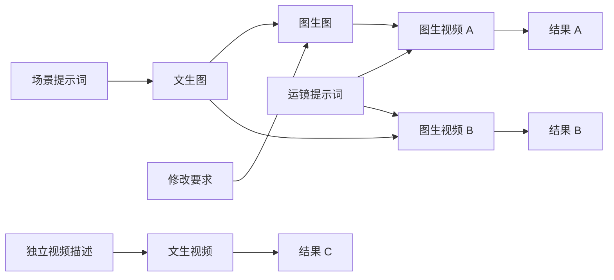

# 节点无限画布：个人内测评估与任务拆分

> 产品口径更新（2026-09-09）：当前范围与验收见[创作画布 PRD](../specs/2026-09-09-infinite-canvas-prd.md)。本文保留历史评估，不再作为历史版本、整图执行优先、多参后置或当前工期的决策依据。

日期：2026-09-07。状态：评估稿，尚未进入实现。

本次代码基线：本地 `feat/video-bulk-prompt`，提交 `1a52913885228b474d3aedef1bd784217bf3035f`。评估前工作区干净；未 fetch，因此不声称这是远端最新版本。本轮只新增本文，没有切换或创建分支、修改业务代码、启动服务、执行数据库迁移或提交供应商生成任务。

## 1. 结论与已经确认的需求

建议投入一个有明确范围的个人内测版本。已有供应商接入、图片交付、视频轮询下载和消耗统计可以降低开发成本；新的主要投入是图执行器、文生协议和画布状态管理。

用户已经明确选择：**连线节点式，像 ComfyUI 一样连接输入、模型和输出，执行整条流程。** 本方案按这个目标规划。

目标体验：打开一个画布，在同一处组织提示词、图片和生成节点；一次执行后，上游图片自动交给下游；可以分出多条生成分支，对比结果；流程、参数和历史产物保存在本机。创建画布时不要求完成产品项目或分镜配置，每次生成也不要求另建项目。

初期集中支持四种操作：文生图、图生图、文生视频、图生视频。已有公司额度和已跑通部分流程是用户提供的背景；本轮没有验证额度、公司模型在线状态或无图请求的可用性。

工作量粗估：一名熟悉本仓库的工程师连续投入，受限节点版达到可持续使用的个人内测水平，约 **20–35 个有效工作日，按全职约 4–7 周**。这是工程估算，不是交付承诺；前提是公司至少各有一个图片、视频模型可以覆盖对应的两种输入模式。接口验证后再收窄估算。AI 辅助可以缩短部分实现时间，无法消除供应商验证、恢复语义和人工体验验收。

带假数据的可连线界面明显更快，但不能用它判断真实内测已经完成。若范围包含任意节点插件、循环、复杂条件、多用户协作或 ComfyUI 工作流兼容，需要重新估算为数月级工作。

## 2. Repository Audit：现有能力和真实限制

以下为当前提交的静态代码证据，未把历史测试结果算成本轮通过。

| 范围 | 已核验的位置 | 对本任务的影响 |
| --- | --- | --- |
| 前端基础 | `package.json`；React 19、Next.js 16；没有 React Flow/tldraw 依赖 | 可以新增客户端画布入口，需要引入并验证画布库；现有视频预览中的 HTML Canvas 是画面合成用途，不是节点编辑器 |
| 图片协议 | `lib/providers/gateway-task-image.ts:22`、`:195`；`lib/providers/openai-compatible.ts` | 请求必带底图；网关适配器总是先把底图放入 `images`，OpenAI 兼容适配器调用 `/v1/images/edits`。当前调用链不具备纯文本输入模式 |
| 图片任务 | `lib/db.ts:120`；`lib/queue.ts:104`、`:223` | `jobs.projectId`、`inputImageId` 均必填，队列按项目运行并回写项目和分镜状态，不能直接当通用画布执行器 |
| 视频协议 | `lib/video-providers/types.ts:12`；`lib/video-providers/openai-video.ts`、`kling.ts`、`jimeng.ts` | 统一 Interface 强制首帧路径；直连可灵固定走 image2video；公司视频尺寸从首帧推导。文生视频需要独立的请求校验和显式比例/尺寸参数 |
| 视频任务 | `lib/db.ts:299`；`lib/video-queue.ts:161`、`:299`；`app/api/shot-sets/[id]/video-jobs/route.ts` | `video_jobs` 强制项目和首帧；现有创建入口还从分镜取图。自由视频入口仍依赖真实分镜组 |
| 已有可靠性 | `lib/video-queue.ts:315` 起；`lib/queue.ts` 的网关恢复分支 | 已有远端任务 ID 时续查、不重新提交的逻辑值得复用；但当前实现与旧任务表绑定，不能直接换调用方就全部获得 |
| 素材交付 | `lib/cos-media.ts`、`lib/gateway-media-url.ts`、`lib/image-output-normalize.ts`、`lib/company-gateway-size.ts` | COS、鉴权下载、尺寸吸附和原生像素交付可复用；新模式仍需验证请求字段，不能根据模型名称推断支持 |
| 消耗 | `lib/usage-ledger.ts:492`；`lib/usage-async-jobs.ts:96`、`:204` | 底层账本支持通用引用；旧异步任务快照函数直接读写 `jobs` / `video_jobs`，画布需要自己的适配，不能直接复用旧表包装函数 |
| 并发 | `lib/provider-concurrency.ts`、两条旧队列 | 当前图片并发函数主要规范请求数值；现有按项目队列不等于覆盖全部画布的供应商并发池，画布侧需明确自己的额度和限流范围 |
| 启停恢复 | `instrumentation.ts:27`；`lib/shutdown.ts` | 新 worker 必须接入启动恢复和统一停机；仅依赖浏览器轮询无法满足关页、重启后的恢复 |
| 内测数据根 | `lib/data-root.ts:10`；`scripts/start-litellm.sh`；`lib/company-provider-runtime.ts:148` | 支持独立数据根，但代理启动从代码根读配置，健康检查从数据根读配置。配置、状态文件和端口必须一起核对 |

因此，可以复用大量供应商与媒体基础，但**不能把已有工作台认定为已经完成了通用节点工作流后端**。也不能通过空白占位图片冒充文生功能。

## 3. 🧭 Product Decision：首版产品范围

### 决策 A：新增独立“创作画布”入口

- 选择：画布列表与画布编辑器独立于原有项目步骤；继续使用本机供应商配置。
- 原因：用户在同一画布做多轮实验，不需要把每个实验映射成产品项目或分镜。
- 取舍：第一版产物在画布中预览、下载；接入正式项目和混剪需要后续显式导入能力。
- Not now：重构原有五步工作台；让画布产物自动进入同事的项目和批量素材扫描。

### 决策 B：固定七类节点，支持有向无环流程

| 节点 | 输入 | 输出 / 行为 |
| --- | --- | --- |
| 提示词 | 手工填写文本 | 文本，可连接多个下游 |
| 图片输入 | 本地上传，或将画布中已有结果固定为输入 | 不可变图片引用 |
| 文生图 | 文本 | 一张生成图片 |
| 图生图 | 底图 + 文本 | 一张新图片，保留底图 |
| 文生视频 | 文本 | 一个视频，比例/尺寸显式配置 |
| 图生视频 | 首帧图片 + 文本 | 一个视频 |
| 结果预览 | 图片或视频 | 本地预览、查看参数、下载 |

模型选择、比例、尺寸、时长放在生成节点的参数中；暂不要求用户额外连接一堆配置节点。单个生成节点首版输出一个产物；同一上游连到多个生成节点即可比较不同方案。

支持分支，不支持环：一个图片输出可以交给两条下游，图生图也可以继续交给图生视频。文本端口、图片端口、视频端口有类型校验；单值端口不接受多个不明确的上游。一个节点的多个必需输入到齐后才能执行。



首版包括移动、缩放、框选、复制节点、删除节点/连线、基础撤销重做、自动保存、整图执行、执行状态、历史结果、失败后继续和停止后续执行。撤销重做只作用于编辑操作；撤销不会撤销已经发生的供应商任务。

Not now：循环、条件表达式、任意代码节点、插件市场、ComfyUI 工作流导入、模型权重管理、LoRA/ControlNet、复杂多参考图和首尾帧组合、批量参数扫描、多人协作、云同步、视频剪辑时间线、LLM 自动搭图。脚本/提示词优化模型节点可排到第二版；首版提示词节点仅保存文本。

### 决策 C：采用 React Flow 社区库作为画布候选

React Flow 允许把 React 组件作为自定义节点，并提供选择、拖动、连接等交互；官方也提供图数据保存/恢复示例。适合现有 React 应用中的媒体节点。[自定义节点文档](https://reactflow.dev/learn/customization/custom-nodes)、[保存与恢复示例](https://reactflow.dev/examples/interaction/save-and-restore)。

库采用 MIT 许可，Pro 提供付费示例和支持；本方案按社区能力自行实现，不依赖 Pro 模板。[官方说明](https://reactflow.dev/pro)。tldraw 官方目前把生产使用列入许可方案，本任务强调避免新增工具订阅，因此先不选它。[官方价格与许可说明](https://tldraw.dev/pricing)。本次核对日期为 2026-09-07，具体版本兼容性由技术验证阶段确认。

这个库处理编辑交互；供应商调用、节点调度、任务恢复、文件保存和费用记录仍由应用实现。React Flow 的序列化示例也不代表已有数据库持久化或运行恢复能力。

## 4. 📚 Learning Point：画布、流程定义与一次运行要分开

画布上的节点位置可以随时变化；已经提交的生成任务必须记住当时真正使用的参数。否则用户改了提示词之后，旧请求返回的结果会被误认为新提示词的结果。

建议新增一个 `lib/creative-canvas/` Module，通过少量 Interface 完成保存定义、校验执行计划、启动运行、读取运行和停止调度。浏览器负责编辑与展示，后端负责实际执行；从 Interface 做行为测试。

候选目录（均为待实现）：

```text
app/canvas/                         画布列表与编辑页面
app/api/canvas/                     定义、运行、状态、素材访问
components/creative-canvas/         七类节点、参数面板、状态与结果
lib/creative-canvas/                图校验、持久化、执行、恢复、素材归属
lib/creative-canvas/adapters/       画布运行与现有供应商/账本的衔接
```

概念上至少保留四类记录：

- 画布定义：`canvasId`、定义版本、节点与连线、视口；定义 JSON 带版本号。采用修订号防止自动保存互相覆盖。
- 流程运行：`runId`、冻结的定义与模型参数、启动时间、整体状态；每次明确的新运行有独立 ID。
- 节点运行：`nodeRunId`、已解析的输入产物引用、实际参数、供应商身份、远端任务 ID、提交/轮询/下载状态、消耗事件引用。
- 画布素材：`assetId`、所属画布、产物类型、文件位置、尺寸/时长、来源运行；不把二进制、临时签名 URL 或 API Key 塞进图 JSON。

这些概念可落成画布自己的命名空间表，迁移采用独立的追加式版本流及现有共享升级 gate。旧 `jobs` / `video_jobs` 的非空输入约束无需为画布重建。画布不伪造分镜组，也不靠文件名推断来源。媒体存储路径继续通过 `dataRoot()` 解析。

供应商部分优先扩展已有 Adapter 的明确输入模式，并保留旧图生调用合同；已成熟的提交、轮询、下载等能力在实际共享处复用。不要复制整条旧队列，也不在首版为所有供应商做一次总重构。第一批仅接入通过验证的公司图片、视频模型，其余能力在节点中标为未支持。

需要明确实现的运行规则：

1. **先校验，再发请求。** 无效连线、缺失输入、循环、模型不支持该模式、非法尺寸/时长在任何供应商提交之前报清楚。用户在运行前看到预计生成任务数；费用未知时显示未知。
2. **输出先保存成功，下游再启动。** 供应商成功不等于本地素材可用；下载或归一化失败时保留远端身份，重试下载，不重新生成上游。
3. **运行使用固定快照。** 运行中改图只产生下一版草稿；旧运行继续按旧快照执行。新结果按 `runId + nodeRunId` 回写，不能覆盖另一版节点结果。
4. **恢复和重新生成是两个操作。** 同一次运行恢复时复用已经成功的节点；持有远端 ID 的节点只续查/补下载。真正失败后的重新生成是新尝试，可能再次计费，需要明确操作入口。
5. **处理“提交结果不明”。** POST 已发送但没有拿到或保存远端 ID，不能凭本地超时断言远端没创建任务。没有供应商幂等保证时进入待核查，不自动重发，也不承诺绝对的远端 exactly-once。
6. **首版暂停后不自动新增付费提交。** 进程重启可恢复核查已有远端任务；未提交的下游等用户继续运行后再调度。恢复旧运行仍使用原参数和原输入，不能把新草稿混进去。
7. **分支失败规则固定。** 失败节点的后代停止等待并显示原因，其他独立分支可以完成；整图呈现部分完成。多个分支引用同一产物，不重复生成或搬运相同上游。
8. **停止的含义说清楚。** 停止未开始的下游；已交给供应商的任务若不支持远端取消，保留身份供稍后核查。关闭本地页面/HTTP 请求不能宣称已经停止远端生成或退款。
9. **重复点击不重复启动。** 启动幂等键、节点领取事务、租约和恢复规则覆盖双击、热重载、旧 worker 延迟回写；过期 worker 不能把结果写进新的尝试。
10. **费用与并发可追溯。** 画布内共享供应商限流，默认保守；按节点尝试记录请求数与估算消耗，同一结果重复回收不重复记账。账本异常可补记，不能触发再次付费生成；本实例限制不代表公司账号的全局额度控制。

首版不做自动跨运行缓存。明确的“重新执行整图”会产生新生成任务，运行前给出数量；满意的图片可以固定为输入节点减少再次生成。后续再考虑从选中节点运行、精确缓存和分支重算，避免首版把新旧输入拼成无法解释的结果。

删除节点仅删除画布中的引用；已有运行快照和被引用的文件保留。自动物理清理需等引用规则确定后再做。

## 5. Implementation Plan：阶段与验收关口

各阶段工作日为相对量级，合计约 18–30 日，加入接口和回归不确定性后按 20–35 日规划。阶段可以形成独立可回滚的提交，但本轮不创建提交。

| 阶段 | 预计投入 | 任务 | 必须交付的证据 |
| --- | --- | --- | --- |
| P0 内测隔离 | 2–3 日 | 建本地分支/独立 checkout，独立数据根，默认关闭的功能开关，配置与启停核验 | 仅内测实例显示画布入口；关闭开关后画布页面、API、调度都不启用；正式 DB、素材和代理进程不被接管 |
| P1 公司接口验证 | 2–4 日 | 每种模式建立能力矩阵，核对文本输入协议、图片/视频输出参数，最小契约样例 | 至少一个公司图片模型支持文生/图生，至少一个视频模型支持文生/图生；每项均区分文档、假上游与真实样本证据 |
| P2 画布与保存 | 3–5 日 | React Flow 接入、七类节点、中文参数面板、端口规则、基础撤销、自动保存、媒体展示 | 图与视口刷新后还在；复制节点不共用可变参数；错误连线被拒；可复用同一图片输入 |
| P3 假上游执行闭环 | 4–7 日 | 后端图计划、节点状态、分支调度、运行快照、领取租约、幂等、恢复与停止 | 假上游完整跑通三段链与分支；重复启动一次提交；刷新/中断后结果不会错写 |
| P4 四种真实生成模式 | 3–5 日 | 画布 Adapter、模式能力过滤、供应商身份与参数快照、下载/归一化、费用适配 | 四种模式各有成功的真实任务与本地产物；原有图生图/图生视频调用合同回归通过 |
| P5 持续使用验收 | 4–6 日 | 重启与故障恢复、历史结果、缩略图与视频按需加载、真实业务链、停机回归 | 能从同一画布连续多轮使用；核查路径不重复提交；旧工作台不受影响；交付明确的通过/失败/未跑记录 |

P1 优先于大规模画布开发：如果公司网关没有纯文本视频能力，先找公司额度下已允许且有证据支持的模型；若没有，明确该模式暂时无法实现，不能把“四模式完成”作为已验收。

真实调用前需形成具体的模型、提示词/素材、调用次数和额度上限计划，再依据用户授权执行；本轮的产品评估不包含真实探测授权。优先验证少量代表样本，不进行多模型、多尺寸扫测。不要预设调用次数等于最终计费次数。

### 关键验收用例

| 用例 | 预期 |
| --- | --- |
| 文本 → 文生图 → 图生图 → 图生视频 → 预览 | 同一画布自动传递素材，产物全在本地，输入和参数可追溯 |
| 文本 → 文生视频 → 预览 | 请求不包含伪造首帧，用户设置的时长和比例有验证证据 |
| 一张图 → 两个视频节点 | 上游只执行一次，两个结果各自对应模型参数，不互相覆盖 |
| 把视频连到图片输入端口，或连出循环 | 前后端校验均拒绝，供应商提交数为零 |
| POST 成功拿到远端 ID 后中断进程 | 恢复只查原任务；不新增供应商任务 |
| POST 发出但响应丢失 | 显示待核查，不自动重发；不能错误显示为安全可重试 |
| 供应商完成后本地下载失败 | 补下载原产物，成功后才运行下游 |
| 运行 A 期间修改提示词并形成草稿 B | A 的结果归属 A，B 保留修改；A 的旧回写不能冒充 B 的结果 |
| 同一运行失败后继续 | 已成功上游保持，未提交下游按旧运行快照执行 |
| 删除正在运行的节点、关闭画布 | 运行快照与素材引用仍完整；UI 删除不隐式删除远端任务 |
| 双击执行、热重载、过期 worker 回写 | 同一个逻辑节点尝试不重复领取，陈旧结果不能覆盖新尝试 |
| 停机、重新启动、继续运行 | 运行状态可恢复；未提交的付费下游等待明确继续操作 |
| 小型性能样本 | 在用户 Mac 上用 50 个总节点、含 20 个媒体预览的图验证拖拽缩放；最多一个活跃视频播放器，视口外不全量解码；这是验收样本规模，不是已测性能承诺 |

自动验证优先覆盖纯图校验、调度和恢复行为，使用临时数据库、本地假上游；不以源码字符串匹配代替执行验证。真实供应商只做受控集成验收。

改到已有 Module 时，按实际变更选跑 `gateway-task-image.test.ts`、`video-queue-resume.test.ts`、`gateway-media-url.test.ts`、`image-output-normalize.test.ts`、`company-gateway-size.test.ts`、消耗相关测试和 `graceful-shutdown.test.ts`，并完成 lint、生产构建及关键浏览器操作。旧测试通过不能代替新增画布测试。Electron 真机检查单独记录，不从 Web 构建成功推导。

## 6. 个人分支、运行与退出方案

- 建议分支名：`codex/infinite-canvas-beta`。进入实施时重新确认当前基线及未提交文件，从确认的提交分出，不默认为 main；本轮尚未创建分支。
- 建议独立 worktree/checkout 方便保留日常工作区，先以本机 Web 入口内测。不做安装包发布或覆盖 `/Applications`，不 push、不合并回同事使用的分支。
- 设置独立 `CREATIVE_STUDIO_DATA_ROOT`，隔离 DB、素材、日志、运行状态和迁移备份。优先新建内测库与小样本素材；不能对正在使用的 WAL 数据库只复制主文件。
- 功能开关建议 `CREATIVE_STUDIO_CANVAS_ENABLE=1`，默认关闭；名称为提案，目前不存在。前端入口、服务端 API、schema readiness 和 worker 启动均必须遵守开关。
- 独立 worktree 不自动带来 `.env.local`、`config.yaml` 和 `.venv-litellm`。进入实施后按本机实际位置配置；文档、图文件和 Git 里不包含这些秘密。
- LiteLLM 启动脚本从代码根读配置，运行检查从数据根读配置；P0 必须统一其实际可见路径，不能只设置数据根就声称公司供应商可用。
- 首版默认日常版与内测版轮流运行。若需要双开，作为额外验收项配置独立应用端口与 sidecar 归属，并同步供应商连接、健康检查和停止脚本；不能让内测关闭操作误停日常代理。应用与代理均仅绑定回环地址。
- 回滚代码通过停掉归属明确的内测实例、返回原日常工作区实现；Git 回退不能回退数据库。内测数据保留在独立根，已提交远端任务仍按记录核查收尾，不把停止本地进程当作远端取消。

## 7. 本轮完成与下一步

已完成：当前分支/提交与工作区核验，供应商 Interface、任务表、队列、费用、启停和配置路径的静态审阅，React Flow/tldraw 官方能力与费用模式核对，以及本评估和阶段划分。

未执行：界面原型、业务代码开发、依赖安装、数据库变更、测试/构建、真实供应商请求、额度查询、服务启停、分支创建、commit 或 push。

下一步应先确定本评估的首版范围，再实施 P0 与 P1；公司四种模式的真实可用性确认后，冻结首版模型清单与详细执行合同，再推进画布和执行器。
