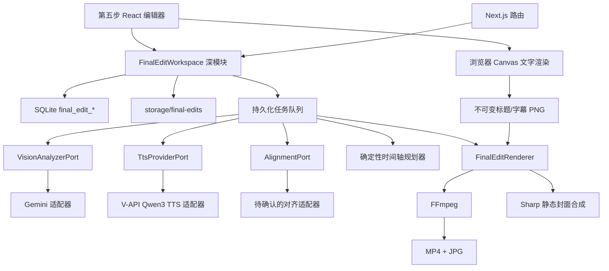
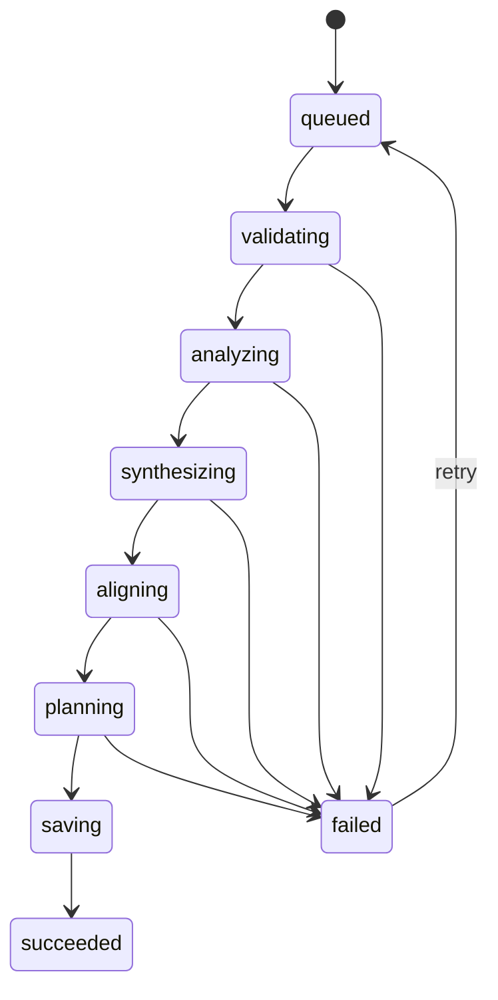
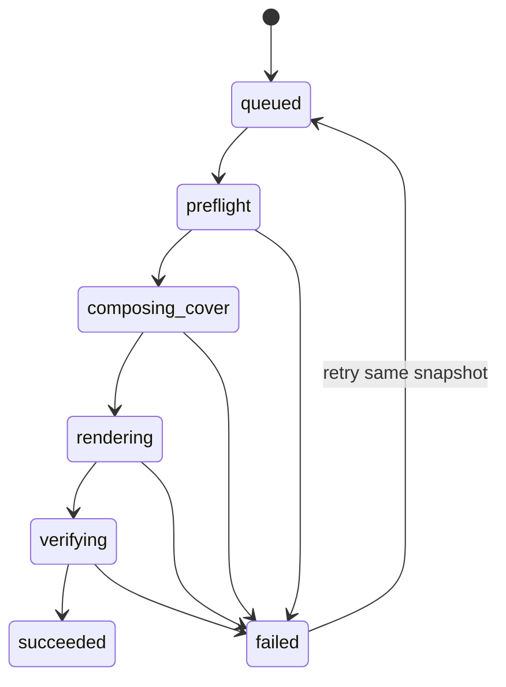

# 成片剪辑 V1 技术方案

> 日期：2026-07-16
> 状态：技术方案、V-API TTS 与编辑器交互基线已确认；生产 Alignment adapter 已实现，真实服务验收待执行
> 最近更新：2026-07-17（同步双段封面标题、自定义标题预设、时间轴字幕编辑和大卡片滚动素材池）
> 产品依据：`2026-07-15-final-video-editing-prd.md`
> TTS 依据：`2026-07-16-vapi-qwen3-tts-research.md`
> 实施状态：核心代码已落地并通过构建与真实 FFmpeg fixture；生产 Alignment/V-API 和双平台正式项目验收待执行

## 0. 文档效力

本文件把《成片剪辑 V1 PRD》转化为可实施的技术方案。

文档优先级固定为：

1. 产品行为、范围和验收以 PRD 为准。
2. 模块、数据、接口、状态机、渲染和测试以本技术方案为准。
3. `2026-07-15-final-video-editing-design.md` 只保留讨论过程和产品决策背景；其中与本文件冲突的技术内容，以本文件为准。
4. 2026-07-15 以前的旧 `final_video_*`、旧 draft workflow 和旧 narration provider 文档不再参与实现。

本方案不读取、不迁移、不删除真实数据库中残留的以下历史数据：

- `final_video_drafts`
- `final_video_jobs`
- `clip_visual_descriptions`
- `storage/final-video-drafts/`
- `storage/final-videos/`

新模块只使用 `final_edit_*` 命名和 `storage/final-edits/` 路径，避免与历史实现发生隐式兼容。

## 1. 当前代码基线

截至 2026-07-16，当前分支的真实状态是：

- 工作台只有 `scene`、`storyboard`、`script`、`video` 四个 Tab。
- 旧成片代码、路由和面板已经从代码中删除。
- `script_drafts.outputJson` 保存 `ScriptOutput v2`，其中 `shotSetId` 和 `segments[]` 是第五步脚本输入。
- `video_jobs` 保存完整视频素材，包含 `projectId`、`shotSetId`、`shotId`、生成提示词和本地视频路径。
- `script_providers` 已经拥有 `apiStyle`、运行时模型配置和 `supportsVision`，可复用为视频视觉分析配置源。
- Gemini 现有实现已经支持一次请求携带多张图片。
- 项目已经安装并使用 `better-sqlite3`、`ffmpeg-static`、`ffprobe-static`、`sharp` 和 `archiver`。
- `lib/ffmpeg.ts` 已经具备 FFmpeg/FFprobe 路径解析、运行、进度回调和时长探测能力。
- 视频文件路由已经支持 HTTP Range，可供浏览器 `<video>` 预览。
- 全局 BGM 目录 `storage/bgm/` 已存在，但当前没有新的索引和播放接口。
- 应用以 Next.js standalone Node 服务运行，并通过系统默认浏览器访问。

以上现有能力是新模块的输入和基础设施，不是旧成片模块兼容层。

## 2. 总体架构



架构分为五层：

1. React 编辑器负责交互、时间轴显示、本机字体访问和实时 Canvas 预览。
2. Next.js 路由只完成鉴权式归属校验、请求解析、错误映射和调用工作区接口。
3. `FinalEditWorkspace` 是业务外部唯一稳定 seam，集中执行所有领域规则。
4. 持久化任务队列执行视频分析、TTS、自动规划、AI 候选和正式渲染。
5. FFmpeg 与 Sharp 只消费不可变渲染快照，不查询最新草稿。

## 3. 深模块与 seam

### 3.1 外部主模块：FinalEditWorkspace

调用方和测试只通过 `FinalEditWorkspace` 的 interface 使用成片领域，不直接操作成片表或拼装时间轴 JSON。

```ts
export interface FinalEditWorkspace {
  preflight(input: PreflightInput): Promise<CapacityEstimate>;
  start(input: StartFinalEditInput): Promise<JobRef>;
  load(groupId: string): FinalEditGroupView;
  apply(command: FinalEditCommand): MutationResult;
  enqueueRender(input: EnqueueRenderInput): Promise<JobRef>;
}
```

这五个方法承担的行为：

- `preflight`：校验项目、脚本、分镜组、成功视频、使用上限、可用封面和 BGM，并估算完整草稿容量。
- `start`：创建或复用脚本成片组，写入持久化准备任务；不在 HTTP 请求内执行付费分析或 TTS。
- `load`：返回编辑器所需的完整 read model，包括共享组状态、草稿、素材池、问题、使用次数和任务状态。
- `apply`：通过显式 command 修改组或草稿，统一执行 revision、分镜组边界、时间轴、使用次数、封面唯一性和问题重算。
- `enqueueRender`：验证不可变文字图层、创建渲染快照并排队；存在阻断问题时拒绝创建任务。

路由不得提供“任意覆盖整个 timeline JSON”或“任意更新任意字段”的接口。

### 3.2 真实外部 seam

只有真正存在生产与测试两种适配器的外部依赖才定义 port。

#### VisionAnalyzerPort

```ts
export interface VisionAnalyzerPort {
  analyze(input: VideoAnalysisInput): Promise<VideoAnalysisResult>;
}
```

- 生产适配器：复用 `script_providers` 当前 Gemini/OpenAI-compatible 运行时配置。
- 测试适配器：固定返回结构化视频分析结果。
- port 不暴露 Gemini URL、请求 JSON 或模型响应原文给工作区。

#### TtsProviderPort

```ts
export interface TtsProviderPort {
  listVoices(): Promise<VoiceOption[]>;
  preview(input: VoicePreviewInput): Promise<AudioArtifact>;
  synthesize(input: NarrationInput): Promise<NarrationArtifact>;
}
```

- 首个生产适配器固定为 `vapi-qwen3-tts`，调用 V-API 的 Qwen TTS JSON-URL 协议；协议细节见第 10 节。
- V1 不把该接口冒充标准 OpenAI TTS：请求路径相似，但响应是包含临时 WAV URL 的 JSON，不是音频二进制。
- 测试适配器返回真实可播放的固定 WAV 和可选逐字时间戳。
- `NarrationArtifact` 必须返回音频、采样率、时长、供应商/模型信息和可选 word timings。

#### AlignmentPort

```ts
export interface AlignmentPort {
  align(input: AlignmentInput): Promise<WordTiming[]>;
}
```

- TTS 已返回可靠时间戳时不调用。
- TTS 无时间戳时必须使用生产对齐适配器。
- 不允许用“按字数平均分时长”冒充最终音频对齐；该方法只可用于加载占位预览，不能通过正式导出门禁。

#### SystemFontCatalogPort

```ts
export interface SystemFontCatalogPort {
  list(): Promise<SystemFontFace[]>;
}
```

- 生产适配器：macOS font catalog 和 Windows font catalog。
- 浏览器支持 Local Font Access 时以前端结果为优先；服务端 port 是不支持或拒绝该能力时的候选列表 fallback。
- 测试适配器：返回固定中文测试字体元数据。
- port 只返回字体名称和样式，不读取、保存或上传字体二进制。

### 3.3 不建立 port 的本地能力

以下能力只有一个真实实现，不创建假想 adapter：

- SQLite 存取。
- 本地文件存储。
- 时间轴求解和问题计算。
- 重合度计算。
- BGM 选择。
- Sharp 封面合成。
- FFmpeg 渲染。

这些能力可以拆成内部模块，但不会出现在 `FinalEditWorkspace` 的外部 interface 中。测试通过临时 SQLite、临时 data root 和真实 FFmpeg 穿过工作区 seam 验证。

## 4. 领域模型与不变量

### 4.1 所有权层级

```text
Project
└── ScriptDraft
    └── FinalEditGroup 1..N
        ├── ScriptSnapshot
        ├── NarrationArtifact
        ├── SubtitleState
        ├── CoverTitleState
        ├── TextStylesByPreset
        ├── CustomTitlePresets
        └── FinalEditVariant 1..N
            ├── OutputPreset
            ├── VideoTimeline
            ├── BgmSelection
            ├── CoverSelection
            ├── Issues
            └── RenderHistory
```

允许同一个 `scriptDraftId` 拥有多个 `FinalEditGroup`，原因是不同 TTS 音色、语速或供应商产生的音频时长不同，不能共享同一条时间轴。

这不是“生成批次”领域对象：

- UI 仍按 `scriptDraftId` 归档。
- 相同脚本、相同 narration hash 再次生成时复用同一组并新增草稿。
- 相同脚本但 narration hash 不同时建立新的配音版本组，不覆盖原组。
- 不新增 batch 表或 batch 层级。

### 4.2 核心不变量

1. `group.projectId`、脚本项目、分镜组项目必须一致。
2. `group.shotSetId` 必须等于脚本快照的 `shotSetId`。
3. 所有视频片段的 `videoJobId` 必须属于同一项目、同一 `shotSetId`，且本地文件存在。
4. 所有封面候选必须来自同一 `shotSetId`。
5. TTS 和脚本 `segments[]` 顺序不可在第五步修改；字幕 cue 保持文字顺序，但允许修改文字、增删/拆分 cue 及人工调整时间。
6. 视频片段不得重叠，也不得超出源视频真实时长。
7. 自动生成片段不得短于 1 秒；人工片段短于 0.5 秒只产生警告。
8. 缺口是合法草稿状态，但不是合法渲染状态。
9. 同一成片组内封面 `coverKey` 必须唯一。
10. 自动规划不得突破项目视频文件使用上限；人工命令可以突破并产生警告。
11. 所有写操作必须携带 `expectedRevision`。
12. 渲染任务只读取创建时快照。
13. 字幕 cue 必须位于 `[0, narrationDurationUs]`，不得互相重叠；允许留空白时间，也允许人工时间跨越原脚本 segment 边界。
14. 封面标题固定为 `primary` 和 `secondary` 两段独立文字状态；应用标题预设只复制样式和位置，不得覆盖两段文字。

### 4.3 时间基准

V1 固定输出 24fps，但音频时长不一定落在完整视频帧上，因此使用双时间基准：

- 视频编辑和切点：整数 `frame`。
- TTS、BGM 和字幕：整数 `timeUs`，单位微秒。

常量：

```text
outputFps = 24
introFrames = 20
introDurationUs = round(20 / 24 × 1,000,000) = 833333
bodyStartFrame = 20
```

正文视频所需帧数：

```text
bodyFrames = ceil(narrationDurationUs × 24 / 1,000,000)
```

最终音频时长严格使用 `introDurationUs + narrationDurationUs`。视频流因帧离散化允许最多多出一帧；最终 MP4 容器时长与理论时长误差必须小于或等于 `1 / 24` 秒。

## 5. 公共数据契约

### 5.1 输出预设

```ts
type OutputPresetId = '3x4' | '9x16' | '16x9';

const OUTPUT_PRESETS = {
  '3x4':  { width: 1080, height: 1440, fps: 24 },
  '9x16': { width: 1080, height: 1920, fps: 24 },
  '16x9': { width: 1920, height: 1080, fps: 24 },
} as const;
```

### 5.2 视频时间轴

```ts
interface VideoTimeline {
  fps: 24;
  introFrames: 20;
  bodyFrames: number;
  clips: TimelineClip[];
}

interface TimelineClip {
  id: string;
  videoJobId: string;
  sourceFingerprint: string;
  sourceInFrame: number;
  sourceOutFrame: number;
  timelineInFrame: number;
  timelineOutFrame: number;
  boundSegmentId: string | null;
  framing: FramingState;
  manualUseOverride: boolean;
}

interface FramingState {
  scale: number;
  offsetX: number; // -1..1 normalized
  offsetY: number; // -1..1 normalized
  subjectX?: number;
  subjectY?: number;
}
```

`timelineInFrame` 和 `timelineOutFrame` 相对于正文第 21 帧之后的 body 计时，不包含 20 帧片头。

缺口不单独持久化；它由 `[0, bodyFrames)` 与 clips 覆盖区间的差集确定，避免 clip 和 gap 两套状态失去同步。

### 5.3 字幕

```ts
interface SubtitleSegmentState {
  segmentId: string;
  narration: string;
  displayText: string;
  startUs: number;
  endUs: number;
  cues: SubtitleCue[];
}

interface SubtitleCue {
  id: string;
  segmentId: string; // 初始文本来源，仅作溯源，不是人工时间的硬边界
  text: string;
  startUs: number;
  endUs: number;
  textSource: 'script' | 'manual';
  timingSource: 'aligned' | 'manual';
}
```

字幕时间相对于正文开始，不包含 20 帧片头。渲染时统一增加 `introDurationUs`。`startUs/endUs` 以微秒持久化，时间轴拖动和渲染显示吸附到 24fps 帧边界；每条 cue 至少持续 1 帧。人工修改后将对应的 `textSource` 或 `timingSource` 标记为 `manual`，后续重新对齐、重新生成 overlay 或后台任务不得覆盖其人工文字和时间。

### 5.4 双段封面标题与文字样式

```ts
interface CoverTitleState {
  primary: CoverTitlePart;
  secondary: CoverTitlePart;
}

interface CoverTitlePart {
  id: 'primary' | 'secondary';
  text: string;
  textSource: 'script' | 'manual';
}

interface TextStyle {
  fontFamily: string;
  fontPostscriptName?: string;
  fontSizePx: number;
  x: number; // 0..1 normalized anchor
  y: number; // 0..1 normalized anchor
  scale: number;
  color: string;
  align: 'left' | 'center' | 'right';
  boxWidthPx: number;
  lineHeight: number;
  stroke: {
    enabled: boolean;
    color: string;
    widthPx: number;
  };
  shadow: {
    enabled: boolean;
    color: string;
    opacity: number;
    blurPx: number;
    distancePx: number;
    angleDeg: number;
  };
}

type TextStylesByPreset = Record<OutputPresetId, {
  coverPrimary: TextStyle;
  coverSecondary: TextStyle;
  subtitle: TextStyle;
}>;

interface CustomTitlePreset {
  id: string;
  name: string;
  stylesByPreset: Record<OutputPresetId, {
    coverPrimary: TextStyle;
    coverSecondary: TextStyle;
  }>;
  createdAt: string;
  updatedAt: string;
}
```

`primary`、`secondary` 和字幕分别拥有完整 `TextStyle`，任何一方的字体、字号、位置、缩放、颜色、对齐、描边或阴影变化都不能隐式覆盖另外两方。字体家族、颜色、描边和阴影风格可以复制到其他比例；字号、位置、框宽、描边像素、阴影距离和模糊像素按 preset 独立保存。

两段标题分别按单行文字层测量和绘制，不依赖 DOM 自动换行；字幕使用 `boxWidthPx` 作为单行安全宽度，`lineHeight` 不参与字幕布局。自定义标题预设只保存两段标题的 `TextStyle`，不保存 `CoverTitleState.text`，因此应用预设永远不会改写标题文案。

第三步脚本输出应新增可选结构化字段 `coverTitleParts: { primary: string; secondary: string }`。创建成片组时优先复制该字段；历史脚本只有单一标题时，按“最接近中点的中文标点/空格边界 → Unicode grapheme 中点”确定性拆成两段，并立即写入 `coverTitleJson` 快照。后续不得因第三步脚本变化或拆分算法升级重新拆分已有组。

### 5.5 封面候选

```ts
type CoverCandidate =
  | {
      kind: 'storyboard_image';
      coverKey: `image:${string}`;
      imageAssetId: string;
      filePath: string;
    }
  | {
      kind: 'video_keyframe';
      coverKey: `video:${string}:${number}`;
      videoJobId: string;
      frameUs: number;
      filePath: string;
    };
```

仅改变 crop、scale 或位置不会改变 `coverKey`。

## 6. SQLite 设计

### 6.1 迁移方式

新增 `lib/final-edit/schema.ts`，由 `getDb()` 初始化时调用 `initFinalEditSchema(db)`。

新模块不继续扩大当前“逐条 ALTER 并吞掉错误”的迁移方式，而是使用模块自己的版本表：

```text
final_edit_schema_migrations(version PRIMARY KEY, appliedAt)
```

每个版本在 SQLite transaction 中执行；失败必须阻止模块启动并保留明确错误，不能把真实 SQL 错误当成“字段已经存在”。

### 6.2 final_edit_groups

保存组级共享状态：

| 字段 | 用途 |
|---|---|
| `id` | UUID 主键 |
| `projectId` | 外键 projects |
| `scriptDraftId` | 外键 script_drafts |
| `shotSetId` | 外键 shot_sets |
| `scriptSnapshotJson` | 创建时的完整 ScriptOutput v2 |
| `narrationHash` | 脚本文字 + TTS provider/model/voice/speed 哈希 |
| `analysisProviderId` / `analysisModel` | 实际视觉分析配置 |
| `narrationConfigJson` | provider、model、voice、speed，不含密钥 |
| `narrationAudioPath` | storage 下相对路径 |
| `narrationDurationUs` | 真实音频时长 |
| `wordTimingsJson` | 对齐结果 |
| `subtitleStateJson` | 组级字幕文本与 cue |
| `coverTitleJson` | 组级 `primary` / `secondary` 两段封面标题文字及来源 |
| `textStylesJson` | `coverPrimary` / `coverSecondary` / `subtitle` 按 preset 的独立样式 |
| `status` / `phase` | 组状态和准备阶段 |
| `revision` | 组级乐观锁版本 |
| `createdAt` / `updatedAt` | 时间 |

约束与索引：

- `UNIQUE(projectId, scriptDraftId, narrationHash)`。
- 索引 `(projectId, scriptDraftId, createdAt)`。
- `shotSetId` 不允许为空。

### 6.3 final_edit_variants

| 字段 | 用途 |
|---|---|
| `id` | UUID 主键 |
| `groupId` | 外键 final_edit_groups |
| `indexNum` | 组内展示编号 |
| `outputPreset` | 3x4 / 9x16 / 16x9 |
| `timelineJson` | 当前视频时间轴 |
| `bgmJson` | track、gain、fade、loop |
| `coverJson` | candidate、crop、framing |
| `issuesJson` | 当前派生问题快照 |
| `overlapJson` | 与组内其他草稿的重合结果 |
| `revision` | 草稿级乐观锁版本 |
| `lastRenderedRevision` | 最近成功渲染 revision |
| `createdAt` / `updatedAt` | 时间 |

约束：`UNIQUE(groupId, indexNum)`。

### 6.4 final_edit_asset_analysis

每个 `videoJobId` 保存一条当前分析缓存：

- `videoJobId` 主键和外键。
- `shotSetId`、`fileFingerprint`。
- `providerId`、`model`、`analyzerVersion`。
- `status`：pending / succeeded / failed。
- `mediaJson`：真实时长、尺寸、fps、local quality probe。
- `generatedJson`：AI 摘要、标签、卖点、可用区间、主体位置、质量问题和关键帧候选。
- `manualOverrideJson`：用户修正字段。
- `autoUseDisabled`。
- `errorCode`、`errorMessage`、`analyzedAt`、`updatedAt`。

重新分析只能替换 `generatedJson`，不能清空 `manualOverrideJson` 或 `autoUseDisabled`。

### 6.5 final_edit_jobs

统一保存准备、AI 候选和渲染任务，但它只是基础设施任务，不是产品“生成批次”。

| 字段 | 用途 |
|---|---|
| `id` | UUID |
| `projectId` / `groupId` / `variantId` | 归属 |
| `kind` | prepare / proposal / render |
| `status` | queued / running / succeeded / failed / canceled |
| `phase` | 当前细分阶段 |
| `progress` | 0..1 |
| `requestKey` | 防双击幂等键 |
| `inputSnapshotJson` | 不可变任务输入 |
| `outputJson` | 任务结果和产物相对路径 |
| `errorCode` / `errorMessage` | 结构化错误 |
| `attempt` | 重试次数 |
| `startedAt` / `finishedAt` / `createdAt` | 时间 |

渲染任务的 `inputSnapshotJson` 必须包含完整组 revision、草稿 revision、时间轴、字幕、样式 hash、文字图层 bundle、素材 fingerprint、BGM 和 cover，不得在 worker 中回查最新草稿数据。

### 6.6 final_edit_revisions

保存可撤销的组级或草稿级完整状态：

- `scopeKind`：group / variant。
- `scopeId`。
- `revision`。
- `stateJson`。
- `commandJson`。
- `createdAt`。

`UNIQUE(scopeKind, scopeId, revision)`。

撤销或重做不会把当前 revision 数值倒退；系统读取历史快照后写入一个新的 revision，避免旧请求重新获得写权限。

### 6.7 final_edit_proposals

AI 补缺口和整条重排先写 proposal：

- `variantId`
- `baseRevision`
- `kind`：fill_gap / fill_all_gaps / reduce_overlap / replan
- `proposalJson`
- `issuesJson`
- `status`：pending / ready / applied / discarded / stale / failed
- `createdAt` / `appliedAt`

应用时若当前草稿 revision 不等于 `baseRevision`，proposal 变成 stale，不允许静默覆盖。

### 6.8 final_edit_usage

使用账本采用规范化行，不从 timeline JSON 临时猜测：

| 字段 | 用途 |
|---|---|
| `scopeKind` | draft / render |
| `scopeId` | `variantId:revision` 或 renderJobId |
| `projectId` / `shotSetId` / `groupId` / `variantId` | 归属 |
| `assetKind` | video / cover / bgm |
| `assetKey` | 视频 fingerprint、coverKey 或 BGM fingerprint |
| `createdAt` | 时间 |

约束：`UNIQUE(scopeKind, scopeId, assetKind, assetKey)`。

规则：

- 草稿修改时 transaction 内替换当前 draft reservation。
- 未导出草稿删除时释放 draft reservation。
- 渲染成功后将该 revision 的 draft reservation 转为 render usage。
- 草稿在已导出 revision 基础上继续修改时，创建新的 draft reservation，历史 render usage 保留。
- 自动规划统计项目内所有有效 reservation，排除正在重新规划的当前 scope。

### 6.9 final_edit_bgm_tracks

扫描 `storage/bgm/` 后保存技术索引，不提供新的分类管理 UI：

- `id`
- `relativePath`
- `fileFingerprint`
- `durationUs`
- `format`
- `loudnessJson`
- `status` / `errorMessage`
- `scannedAt`

允许扩展名：`.mp3`、`.wav`、`.m4a`、`.aac`、`.flac`、`.ogg`。

### 6.10 final_edit_overlay_bundles

保存浏览器生成的不可变文字图层：

- `id`、`groupId`、`outputPreset`
- `groupRevision`
- `specHash`
- `manifestJson`
- `relativeDir`
- `status`
- `createdAt`

唯一键：`UNIQUE(groupId, outputPreset, specHash)`。

### 6.11 final_edit_title_presets

保存本机用户自定义的双段封面标题预设，不提供任何 seed 或系统内置记录：

| 字段 | 用途 |
|---|---|
| `id` | UUID 主键 |
| `name` | 用户可编辑名称 |
| `stylesByPresetJson` | 三个输出比例下的 `coverPrimary` 与 `coverSecondary` 完整样式和位置 |
| `createdAt` / `updatedAt` | 时间 |

规则：

- 预设是本机全局资源，可跨项目使用；当前单机应用不增加用户或团队归属层级。
- `stylesByPresetJson` 严格拒绝 `text`、`title` 或其他文案字段，服务端写入和读取都使用 schema 过滤。
- 应用预设时只向当前组写入两段标题的样式副本，并递增组 revision；后续编辑不反向修改预设。
- 重命名和删除预设不修改已经应用该预设的成片组。
- V1 不创建内置预设、不从旧模板表迁移，也不使用浏览器 `localStorage` 作为正式持久化权威。

### 6.12 final_edit_tts_providers

TTS 配置沿用当前设置页供应商模式，但不复活旧 `narration_providers` 表。新建独立的 `final_edit_tts_providers` 表：

| 字段 | 用途 |
|---|---|
| `id` | 稳定供应商 ID，首条为 `vapi-qwen3-tts` |
| `name` | 展示名称，默认 `V-API Qwen3 TTS Flash` |
| `type` | 首版固定 `vapi-qwen-json-url` |
| `baseUrl` | 默认 `https://api.v3.cm`，只保存 origin 或至多 `/v1` |
| `apiKey` | 本机设置页保存的密钥；列表和 read model 永不返回明文 |
| `keyEnv` | 可选环境变量名，内置值 `VAPI_TTS_API_KEY` |
| `model` | 首版固定 `qwen3-tts-flash` |
| `enabled` / `isBuiltin` | 启用状态和内置标记 |
| `createdAt` / `updatedAt` | 时间 |

运行时解析优先级为“设置页非空 `apiKey` → `keyEnv`”，组的 `narrationConfigJson` 只保存 provider ID、base URL 指纹、模型、音色、语速和 adapter 版本，不复制密钥。

设置页新增 `口播配音` 分类。V1 只展示和编辑这一条内置供应商，不提供任意协议创建器；可编辑字段为启用状态、Base URL 和 API Key，模型以只读值展示。这样保留表结构扩展能力，但不把尚未验证的其他 TTS 协议暴露给用户。

## 7. 本地文件布局

所有新路径都相对 `dataRoot()/storage/` 保存到数据库：

```text
storage/final-edits/
├── analysis/
│   └── <videoJobId>/<fileFingerprint>/
│       ├── frames/*.jpg
│       └── probe.json
├── groups/
│   └── <groupId>/
│       ├── narration/<narrationHash>.wav
│       └── overlays/<preset>/<specHash>/
│           ├── title.png
│           ├── subtitle-<cueId>.png
│           └── manifest.json
├── cover-frames/
│   └── <videoJobId>/<fileFingerprint>/<timeUs>.jpg
└── jobs/
    └── <jobId>/
        ├── snapshot.json
        ├── filter-complex.txt
        ├── cover.png
        ├── cover.jpg
        ├── final.mp4
        ├── ffmpeg.log
        └── tmp/
```

规则：

- 所有路径先通过 `FinalEditFileStore` 解析和校验，禁止 `..` 和绝对路径写入业务表。
- 写文件先写 `.tmp`，完成后原子 rename。
- 分析缓存按视频 fingerprint 复用，不随某个成片组删除。
- 未成功的 job 临时目录可在启动恢复时清理。
- 成功导出产物随 render job 保留，直到用户明确删除该成片或项目。

## 8. 持久化任务状态机

### 8.1 准备任务



阶段行为：

1. `validating`：读取脚本快照，验证项目和分镜组，探测成功视频真实文件。
2. `analyzing`：只分析缓存失效的视频；单条失败记录后继续。
3. `synthesizing`：生成或复用 narration hash 对应的 TTS。
4. `aligning`：获得可靠 word timings，生成组级字幕段落和 cues。
5. `planning`：评估容量，顺序生成 N 条草稿并写使用 reservation。
6. `saving`：分配 BGM 和不同封面、计算 issues 和 overlap。

如果部分视频失败或素材不足，但 TTS 与组状态可用，任务仍以 `succeeded` 完成，group 状态为 `partial`，草稿带明确问题。只有脚本、TTS、字幕对齐或所有视频读取均失败时，group 状态为 `failed`。

### 8.2 AI proposal 任务

proposal 只产生候选，不修改草稿：

```text
queued → analyzing_current_state → proposing → validating → ready
```

用户点击应用后才通过 `FinalEditWorkspace.apply()` 写入新 revision。

### 8.3 渲染任务



V1 使用一个全局 final-edit 重任务 worker，所有 prepare、proposal 和 render job 顺序执行。这样比并行分析与 FFmpeg 渲染更慢，但能避免本地电脑 CPU、磁盘和内存竞争；同时天然满足正式渲染单并发。

后续若拆分 prepare lane 和 render lane，只改 worker 实现，不改领域表或工作区 interface。

### 8.4 进程恢复

- worker 状态以 SQLite 为准，不以内存 Map 为准。
- Node 服务启动或首次访问第五步时，把遗留 `running` job 标记回 `queued` 并记录 `recovered_after_restart`。
- prepare 各阶段依赖 fingerprint 和 hash 保持幂等。
- render 重试删除当前 job 的临时文件，但复用原 snapshot 和文字 overlay bundle。
- API 创建 job 后调用 `wakeFinalEditWorker()`；双击由 `requestKey` 唯一约束阻止。

## 9. 视频分析方案

### 9.1 素材池查询

工作区使用一次固定 SQL join 查询：

- `video_jobs.projectId = group.projectId`
- `video_jobs.shotSetId = group.shotSetId`
- `video_jobs.status = 'succeeded'`
- `localVideoPath IS NOT NULL`
- 文件存在且位于 storage root 内

不能接受前端传入任意视频 ID 作为素材池。

### 9.2 文件指纹和真实媒体信息

- 视频 fingerprint 使用完整文件 SHA-256。
- 读取文件字节数和修改时间只用于快速判断是否需要重算 SHA-256，不能单独作为最终身份。
- FFprobe/FFmpeg 探测真实 duration、width、height、fps、codec；不依赖 `video_jobs.durationSec`。
- 本地质量探针运行 `blackdetect`，可用时运行 `freezedetect`，结果作为 AI 的辅助证据。

### 9.3 多帧抽取

大部分素材约 5 秒，抽帧采用自适应规则：

```text
sampleCount = clamp(ceil(durationSec), 4, 8)
```

抽样点均匀覆盖完整时长，避开精确的 0 秒和结尾边界；另外可以从本地异常检测附近补充帧，但总数不超过 8。

每帧：

- JPEG，长边最多 1280px。
- 质量 82。
- 文件名包含 `timeUs`。
- 作为多张 image part 一次发送给 Gemini，不拼成低分辨率联系表。

### 9.4 AI 输出

AI 必须返回严格 JSON：

- `summary`
- `subjects[]`
- `sellingPoints[]`
- `shotScale`
- `cameraMotion`
- `sceneMood`
- `semanticTags[]`
- `subjectTrajectory[]`
- `usableRanges[]`，包含 startUs、endUs、description、qualityScore
- `qualityIssues[]`
- `coverFrameTimesUs[]`

该缓存必须保持“只描述视频本身”：分析 prompt 不携带某个脚本的 segment ID、口播文字或脚本版本。第三步的 rationale、卖点和 narration 只在后续 planner 匹配阶段使用，避免同一视频被脚本 A 分析后污染脚本 B 的缓存。

服务端必须验证：

- 所有时间在真实视频范围内。
- range start < end。
- qualityScore 在 0..1。
- 不认识的枚举值被归一化为 `unknown`，而不是让任务崩溃。
- AI 返回的 videoJobId、shotSetId 等身份字段全部忽略，以服务端上下文为准。

### 9.5 人工修正合并

编辑器读取 `effectiveAnalysis = generatedJson merged with manualOverrideJson`。

合并规则：

- 用户明确填写的 summary、tags、qualityIssues、usableRanges 覆盖 AI 对应字段。
- 未人工填写的字段继续使用 AI 数据。
- `autoUseDisabled` 单独保存，不受重新分析影响。
- 分析失败的视频可由用户填写最少 summary + usableRange 后手动使用，但仍标记 `analysis_failed_manual_use` 警告。

## 10. TTS 和字幕对齐

### 10.1 首个生产适配器

首个生产适配器为 `vapi-qwen3-tts`：

```text
Base URL: https://api.v3.cm
Method:   POST
Path:     /v1/audio/speech
Auth:     Authorization: Bearer <API_KEY>
Model:    qwen3-tts-flash
```

V-API 的公开节点列表同时包含 `https://api.gpt.ge` 和 `https://api.v3.cm`。其 OpenAPI 示例使用前者，用户选择后者；adapter 不做自动节点轮换，只使用设置页保存的 Base URL。端点规范化规则为：Base URL 已以 `/v1` 结尾时追加 `/audio/speech`，否则追加 `/v1/audio/speech`。

只发送供应商 OpenAPI 明确声明的三个字段，不发送未声明的 `speed` 或 `response_format`：

```json
{
  "model": "qwen3-tts-flash",
  "input": "要合成的脚本文字",
  "voice": "Cherry"
}
```

单次 `input` 最多 600 个字符。响应是 JSON，不是音频文件：

```json
{
  "output": {
    "audio": {
      "data": "",
      "expires_at": 1759160443,
      "id": "audio_...",
      "url": "http://dashscope-result-....aliyuncs.com/...wav"
    },
    "finish_reason": "stop"
  },
  "usage": { "characters": 47 },
  "request_id": "..."
}
```

adapter 必须在合成响应成功后立即下载 `output.audio.url` 并落到受管临时目录，不能把临时 URL 当作持久化音频。下载规则：

- 使用 `URL` 解析器，只接受 `http:` / `https:`；文档返回 `http:` 时优先升级为 `https:`。
- 生产实现仅允许预期的阿里云 DashScope OSS 主机；不得无条件服务端请求任意返回 URL。
- 同时兼容非空 `output.audio.data` 的 base64 fallback。
- 下载后立即用 FFprobe 取得真实时长，再转为 48kHz 标准 WAV。
- 日志记录 V-API `request_id` 和 `usage.characters`，不记录 API Key 或完整签名 URL。

### 10.2 音色、试听和语速

V-API 没有音色发现接口，`listVoices()` 返回随 adapter 版本固定的 17 项目录。ID 严格遵循供应商 OpenAPI 的大小写；南京音色是小写 `li`，不能自动改成阿里云文档中的 `Li`：

| Voice ID | 展示名 | Voice ID | 展示名 |
|---|---|---|---|
| `Cherry` | 芊悦 | `Ethan` | 晨煦 |
| `Nofish` | 不吃鱼 | `Jennifer` | 詹妮弗 |
| `Ryan` | 甜茶 | `Katerina` | 卡捷琳娜 |
| `Elias` | 墨讲师 | `Jada` | 上海-阿珍 |
| `Dylan` | 北京-晓东 | `Sunny` | 四川-晴儿 |
| `li` | 南京-老李 | `Marcus` | 陕西-秦川 |
| `Roy` | 闽南-阿杰 | `Peter` | 天津-李彼得 |
| `Rocky` | 粤语-阿强 | `Kiki` | 粤语-阿清 |
| `Eric` | 四川-程川 |  |  |

旧 narration 设计里 48 项音色目录不参与 V1；以后只有在 V-API 自己的 OpenAPI 更新并完成实际 smoke test 后，才升级 adapter 目录版本。

固定试听句为：`你好，我是产品素材工作台语音助手，这是当前音色和语速的试听效果。` 试听调用同一 adapter，下载后转为浏览器可播放的 AAC/M4A，并按 `providerId + model + voice + speed + previewTextVersion` 缓存。

供应商请求没有声明语速参数。`StartForm` 的语速范围固定为 `0.75x..1.50x`、步长 `0.05x`、默认 `1.00x`，由本地 FFmpeg `atempo` 在音频下载后执行；试听和正式合成使用相同处理链。最终时长、hash 和字幕对齐一律基于变速后的音频，绝不假设供应商会处理额外的 `speed` 字段。

### 10.3 narration hash

```text
narrationHash = SHA-256(
  scriptDraftId
  + ordered segment narration
  + providerId
  + provider model
  + voiceId
  + speed
  + ttsAdapterVersion
)
```

相同 hash 复用音频，避免重复收费。试听固定示例句使用独立 preview cache，不进入成片组 narration hash。

### 10.4 合成策略

工作区把有序 `segments[].narration` 和段落字符范围交给 TTS adapter。V-API adapter 按脚本 segment 合成，每次调用都必须小于等于 600 字符；单个 segment 超限时只允许在标点边界继续拆分。每段下载后先完成本地语速处理和格式标准化，再按脚本顺序无重叠拼接。

逐 segment 合成的价值是：即使供应商不返回时间戳，系统也能用每个实际音频文件的 FFprobe 时长建立可靠的 segment 起止边界。adapter 返回工作区时必须是：

- 一份连续音频。
- 精确 `durationUs`。
- 每个脚本 segment 的字符范围。
- 每个脚本 segment 的精确起止时间。
- 可选 word timings。

adapter 内部若继续拆分超长 segment，段间静音和拼接必须记录在 segment timings 中，不能由工作区猜测。任一 segment 合成失败时整组 narration 失败；已成功的同 hash 分段产物可复用，避免重试时重复收费。

### 10.5 对齐

V-API Qwen3 TTS 的成功响应没有 word timings，因此其生产路径固定进入 `AlignmentPort`：

1. 以每个 segment 的变速后音频和对应 `segment.narration` 分别强制对齐。
2. 将 segment 内的 word timings 加上该 segment 的累计起点，合并为组级单调时间线。
3. 对齐结果不得越过 adapter 已测量的 segment 边界。
4. 对齐覆盖率低于 95%、时间倒退或超出音频时长：group 阻断，不能进入正式 ready。

生产 `AlignmentPort` 的具体模型/实现仍需单独确认；在它落地前，V-API TTS 可完成试听和音频生成，但不能把按字数平均分配的字幕当作正式可导出结果。

### 10.6 字幕 cue 生成

- `segment.subtitle` 是唯一初始显示文本。
- `AlignmentPort` 先为原始 narration 生成 word timings；自动切分再结合标点、语义停顿、word timing 和当前字幕样式的真实 Canvas 测量结果。4～10 个中文字只是切分目标，不是硬限制。
- 每个 cue 只渲染一行。系统禁止自动换行、自动缩字和自动删字；字幕文本、描边和阴影的实际像素包围盒超出当前 preset 的 `boxWidthPx` 或安全区时，生成阻断问题 `subtitle_single_line_overflow`。
- subtitle 与 narration 不完全相同时，初始 cue 在对应 segment 时间范围内按可匹配字符和长度比例分配；这只是初始建议，不是人工编辑后的硬边界。
- 用户可修改文字、插入、删除或拆分 cue，并可拖动整条 cue、拖动左右边缘，或精确输入开始、结束、时长。上述操作不修改 TTS，也不反向覆盖第三步脚本。
- 人工 cue 可以跨越原 segment 边界，但必须位于正文 TTS 时长内、保持 cue 文字顺序且不得与相邻 cue 重叠；cue 之间允许留空白时间，字幕编辑不做 ripple。
- 人工修改写入组级 `SubtitleState` 并同步组内所有 variant：改字、插入、拆分或删除将相关 cue 的 `textSource` 标为 `manual`，移动或裁剪时间将 `timingSource` 标为 `manual`。后续自动对齐结果只能填充未人工修改的字段，不能静默覆盖人工文字或时间。
- cue 短于 0.5 秒时生成 `subtitle_too_short` warning；时间越界或重叠分别生成阻断问题 `subtitle_out_of_range`、`subtitle_overlap`。
- 新增较窄输出比例、修改字幕字号/缩放/描边或缩小安全宽度后必须重新测量全部 cue；任一比例溢出都阻止该比例的 overlay bundle 和正式导出。

## 11. 自动剪辑规划器

### 11.1 输入

- 不可变脚本快照。
- narration segment timings。
- 当前组全部有效视频的 effective analysis。
- 视频真实媒体信息。
- 项目使用上限和 usage ledger。
- 已经生成的同组 variants，用于多样性惩罚。
- 输出 preset 和请求数量。

### 11.2 AI 责任

Gemini 只负责语义层：

- 每个口播段落适合哪些视频和可用区间。
- 候选的相关性和理由。
- 推荐景别变化和视觉节奏。
- 推荐 BGM mood 文字，不直接选择文件路径。
- 推荐封面候选排序。

AI 不负责：

- 计算最终 frame。
- 验证 source range。
- 突破使用次数。
- 计算缺口。
- 计算重合度。
- 直接写数据库。

### 11.3 确定性求解

规划器顺序生成 variants：

1. 将 TTS segment 时间转换成 body frame 区间。
2. 对 AI 候选做身份、范围、质量和自动使用次数过滤。
3. 优先脚本直接引用 `shotId` 的视频，再考虑同组其他视频。
4. 在 1.5～3.5 秒目标范围内选择切点，吸附字幕 cue 或 segment 边界。
5. 一条完整视频可取多个区间，但同一成片内 source ranges 不得重叠。
6. 生成一条 variant 后立即写 draft reservation，再生成下一条。
7. 后续 variant 对已经出现的文件、顺序和区间增加多样性惩罚。
8. 找不到达到相关性下限的候选时留下 gap。

AI 返回非法方案时先进行一次带验证错误的修复请求；再次失败后，使用有效分析数据做确定性部分规划并保留 gap，不跨组、不循环、不定格、不变速。

### 11.4 容量预估

`preflight` 在正式分析前提供保守估算：

```text
可分配总时长 = 所有未超自动上限视频的真实可用时长总和
单条所需正文时长 = 已有 TTS 时取 TTS；否则取脚本 targetDurationSec
预计完整条数 = floor(可分配总时长 / 单条所需正文时长)
```

没有分析缓存时使用真实视频时长乘以 0.7 的安全系数。准备任务完成分析后再产生精确容量结果，但无论估算多少，都按用户请求数量创建草稿，缺少部分以 gap 表示。

## 12. 使用次数和重合度

### 12.1 视频使用次数

- 身份使用 `sourceFingerprint`，不是剪辑区间。
- 同一成片使用同一文件多个区间只计一次。
- 默认自动上限 2，项目设置范围 1～10。
- 手动突破时 clip 保存 `manualUseOverride = true` 并生成警告。

### 12.2 重合度公式

两条成片 A、B：

```text
videoOverlap =
  sum(min(A[file].usedDuration, B[file].usedDuration))
  / sum(max(A[file].usedDuration, B[file].usedDuration))

orderSimilarity =
  LCS(collapsedFileSequenceA, collapsedFileSequenceB)
  / max(sequenceLengthA, sequenceLengthB)

score = videoOverlap * 0.70
      + orderSimilarity * 0.20
      + sameBgm * 0.05
      + sameCover * 0.05
```

- 连续来自同一文件的多个 clip 在 order sequence 中折叠成一个 ID。
- `sameBgm` 和 `sameCover` 是 0 或 1。
- 每条卡片显示它与同组成片的最大 pairwise score 和对应成片编号。
- 达到 0.70 产生 warning，不阻断渲染。
- 编辑命令提交后同步重算，不调用 AI。

## 13. BGM 技术方案

### 13.1 索引

点击第五步或刷新音乐库时递归扫描 `storage/bgm/`：

- 新文件按 fingerprint 新增。
- 文件内容变化后重新 probe 和 loudness analyze。
- 删除文件标记 missing，不立即删除历史引用。
- UI 不增加分类管理，只展示已选择曲目和换一首操作。

### 13.2 选择

- AI 只返回脚本 mood 文本。
- 本地选择器用现有相对目录和文件名 token 与 mood 做轻量匹配。
- 没有匹配信息时在全部可用曲目中选择。
- 候选内使用 `groupId + variantIndex + bgmSelectorVersion` 作为 seed 的伪随机数选择，保证重试幂等但多条结果不同。
- 优先 usage 较少且同组未使用的曲目。

### 13.3 响度和混音

- TTS 和 BGM 各自使用两遍 `loudnorm`，目标基线为 `-16 LUFS`、true peak `-1.5 dBTP`、LRA 11。
- BGM 在标准化后再应用用户增益，默认 `-16 dB`。
- 滑动条范围 `-40..0 dB`，步长 `0.5 dB`，数值输入使用同一范围。
- 不做 sidechain 或 ducking。
- BGM 短于 narration 时无缝循环，长于 narration 时裁剪。
- fade out 默认 0.8 秒；若 narration 很短，取 `min(0.8s, narrationDuration / 4)`。
- 最终混音增加 true peak limiter 防止削波，但不改变 TTS/BGM 相对增益逻辑。

## 14. 封面和文字渲染

### 14.1 为什么不用浏览器排版 + Sharp 再排一次

PRD 要求依赖系统字体和字由等字体工具，并要求预览与最终导出一致。浏览器和 Sharp/libvips 使用不同文字栅格化链路，即使输入同一 SVG，也可能在字体发现、换行、字距、描边和阴影上产生偏差。

因此本方案使用一条权威文字栅格化链路：浏览器 Canvas。

### 14.2 本地字体能力阶梯

1. 支持 `window.queryLocalFonts()` 时，用户点击“刷新字体”触发权限请求，读取 family、fullName、postscriptName 和字体 Blob。
2. 使用 FontData Blob 在当前页面注册临时 `FontFace`，仅存在浏览器内存中。
3. 不支持或用户拒绝 Local Font Access 时，服务端通过 macOS/Windows 平台 font catalog adapter 返回候选名称，浏览器通过 `FontFace(..., local(...)).load()` 验证。
4. 字体无法加载时立即标记 missing，禁止生成 overlay bundle 和正式导出。

Local Font Access 目前是需要用户授权的 secure-context 能力，并非所有默认浏览器都支持，因此必须保留上述降级路径：

- [Local Font Access 规范](https://wicg.github.io/local-font-access/)
- [Chrome Local Font Access 说明](https://developer.chrome.com/docs/capabilities/web-apis/local-fonts)
- [MDN queryLocalFonts 兼容性说明](https://developer.mozilla.org/en-US/docs/Web/API/Window/queryLocalFonts)

字体二进制不得上传到远程服务、写入数据库、放入项目 ZIP 或随成片打包。

### 14.3 Canvas 权威渲染

新增客户端 `TextCanvasRenderer`：

```ts
interface TextCanvasRenderer {
  draw(canvas: HTMLCanvasElement, input: TextLayerInput): void;
  toPng(input: TextLayerInput): Promise<Blob>;
}
```

规则：

- Canvas 物理尺寸始终等于输出 preset 分辨率，页面只通过 CSS 缩放显示。
- 实时预览和导出 PNG 调用同一 `draw()`。
- 描边使用 `strokeText`，阴影 offset 由 distance + angle 转为 X/Y。
- 封面标题的 `primary` 和 `secondary` 分别使用各自 `TextStyle` 在固定 `boxWidthPx` 内测量和绘制；两段都是独立单行文字层，不依赖 DOM 自动换行，也不共享位置或效果参数。
- 字幕严格调用一次 `strokeText`/`fillText` 绘制单行，不执行换行。Canvas `measureText()` 与描边、阴影扩展共同计算实际像素包围盒；超出 `boxWidthPx` 或 preset 安全区时拒绝生成有效 bundle。
- 两段标题在同一权威 Canvas 上合成为一张透明 `title.png`；每条字幕 cue 分别生成透明 PNG。
- 文字 PNG 只上传到本机 `127.0.0.1` 服务，不包含字体文件。

### 14.4 overlay bundle

组级 title/subtitle 文本、样式或 preset 改变时，计算：

```text
specHash = SHA-256(
  groupRevision
  + preset
  + coverTitle.primary.text
  + coverTitle.secondary.text
  + subtitle cues
  + coverPrimary style
  + coverSecondary style
  + subtitle style
  + textRendererVersion
)
```

导出前客户端生成：

- `title.png`
- 每个 cue 对应的透明 PNG
- `manifest.json`，包含尺寸、cueId、时间、SHA-256 和 specHash

服务端使用 Sharp 校验：

- PNG 尺寸必须等于 preset。
- cue 数量和 ID 必须与当前 group revision 一致。
- manifest 中每条 cue 的 `startUs/endUs`、单行测量结果和 overflow 状态必须与当前 group revision 一致。
- 单文件最大 20MB，总 bundle 最大 250MB。
- specHash 必须由服务端用当前状态重算一致。

同组同 preset 的所有 variants 复用相同 bundle。重试渲染也复用该不可变 bundle。

### 14.5 封面底图

候选顺序：

1. 当前分镜组 `shots.latestGeneratedImageId` 对应的高清图。
2. 当前分镜组视频分析给出的优质关键帧。

明确不使用 `shots.sourceImageId` 作为封面 fallback。

视频关键帧候选在分析阶段通过 FFmpeg 抽取。候选的 `coverKey` 固定；裁切变化不产生新 key。

正式导出时 Sharp 使用 cover 取景参数生成全尺寸底图，再叠加包含两段标题的 `title.png`，输出：

- 无损 `cover.png`，供视频前 20 帧使用。
- JPEG `cover.jpg`，quality 92，供独立封面下载。

同一个 `cover.png` 同时驱动片头和 JPG，避免两份封面不一致。

### 14.6 自定义标题预设和安全区

- V1 不提供系统内置标题预设，也不保留代码内静态模板数组。
- “我的标题预设”来自 `final_edit_title_presets`，保存三个输出比例下两段标题的全部 `TextStyle`，包括字体、字号、X/Y、缩放、颜色、对齐、框宽、描边和阴影。
- 预设不保存两段标题文字；应用预设只把样式副本写入当前组，不能覆盖 `coverTitleJson`。
- 用户可以新建、应用、重命名和删除自己的预设；删除预设不影响已经复制到成片组的样式。
- 三个输出比例的安全区仍由代码内版本化 `OUTPUT_PRESETS` 配置提供，不依赖标题预设，也不开放可视化安全区编辑器。
- 每段标题单独测量。任一段超出自己的 `boxWidthPx` 或 preset 安全区时生成 `title_part_overflow` warning，不自动换行、合并、缩字或删字。
- 字幕实际像素包围盒超出安全区时生成 warning；单行宽度溢出仍按 `subtitle_single_line_overflow` 阻止导出。
- V1 不提供复杂模板制作器、图层树、动画关键帧或字体上传。

## 15. 浏览器实时预览

新增客户端深模块 `FinalEditPreviewEngine`：

```ts
interface FinalEditPreviewEngine {
  load(view: VariantPlaybackView): Promise<void>;
  play(): void;
  pause(): void;
  seek(timeUs: number): void;
  dispose(): void;
}
```

实现规则：

- Web Audio `AudioContext` 作为播放主时钟。
- 片头 20 帧期间只绘制当前 cover，TTS/BGM 不启动。
- 第 21 帧开始调度 TTS 与 BGM；BGM gain、loop、fade 与渲染规则一致。
- 两个预加载 `<video muted>` 元素交替显示，当前 clip 结束时硬切到下一 clip。
- 视频元素始终静音，按音频主时钟做 seek 和小幅 drift correction。
- gap 区间显示明确占位画面和对应字幕/口播提示。
- 字幕和标题直接绘制权威 Canvas，不使用另一套 CSS 文本布局。
- 拖动文字或 slider 时只重绘 Canvas，不调用服务器或 FFmpeg。

浏览器预览不模拟 H.264 压缩，但必须准确复现 frame 区间、取景、文字像素、音频起点和 BGM 增益。

## 16. 编辑命令与自动保存

### 16.1 command 类型

组级 command：

- `set_cover_title_part_text`
- `set_subtitle_cue_text`
- `insert_subtitle_cue`
- `split_subtitle_cue`
- `delete_subtitle_cue`
- `move_subtitle_cue`
- `trim_subtitle_cue`
- `set_text_style`（target 固定为 `cover_primary` / `cover_secondary` / `subtitle`）
- `reset_text_style`
- `apply_title_preset`

草稿级 command：

- `insert_clip`
- `move_clip`
- `trim_clip`
- `replace_clip`
- `delete_clip`
- `swap_clips`
- `bind_clip`
- `unbind_clip`
- `set_framing`
- `set_bgm`
- `set_bgm_gain`
- `set_cover`
- `set_cover_framing`
- `apply_proposal`
- `restore_revision`

### 16.2 单次 transaction

每条 command 在同一个 SQLite transaction 中：

1. 校验 `expectedRevision`。
2. 读取当前状态。
3. 执行 command。
4. 校验所有领域不变量；字幕时间命令额外校验 TTS 范围、最少一帧、文字顺序和相邻 cue 不重叠。
5. 重新派生 gaps、issues、overlap 和 usage reservation。
6. 写入新 revision 快照。
7. 更新当前行和 `updatedAt`。

revision 冲突返回 HTTP 409：

```json
{
  "error": "revision_conflict",
  "expectedRevision": 12,
  "currentRevision": 13,
  "currentView": {}
}
```

前端不能用旧本地状态强行覆盖；必须加载新状态后让用户重做该操作。

### 16.3 高频交互

- 拖动播放头、文字、clip 边缘、字幕 cue 整体或字幕 cue 边缘时只更新前端临时状态。
- pointer up 或键盘操作完成后提交一条 command。
- 普通文字输入框及样式数值框使用 300ms debounce。
- 字幕开始、结束和时长不提供数字输入框；时间修改只能由字幕轨的整体拖动、左右边缘拖动或对应键盘微调产生 `move_subtitle_cue` / `trim_subtitle_cue`。
- 字幕移动和裁剪不 ripple；当前 cue 与相邻 cue 之间的空白时间保留。
- 保存失败显示“未保存”，不能继续假装已保存。

## 17. FFmpeg 正式渲染

### 17.1 渲染前 preflight

`enqueueRender()` 必须验证：

- group 和 variant revision 与客户端一致。
- overlay bundle specHash 与 group revision 一致。
- timeline 无 gap、无 overlap、无越界。
- 所有字幕 cue 均为单行、位于正文 TTS 时长内、互不重叠，且不存在 `subtitle_single_line_overflow`。
- 所有 source fingerprint 仍匹配文件。
- TTS、BGM、cover candidate 和所有 overlay PNG 存在。
- coverKey 与组内其他逻辑 variant 的当前/最近成功封面不重复；同一 variant 重试或重导当前版本不算新增成片，可以继续使用自己的封面。
- 所有路径位于允许的 storage root。

通过后才创建 render job snapshot。

### 17.2 单次渲染图

每个 source clip 在 filter graph 中执行：

1. trim 到 sourceIn/sourceOut。
2. `setpts=PTS-STARTPTS`。
3. 转 24fps、统一像素格式和 SAR。
4. 按 preset 和 framing 做 scale/crop/pad。
5. 16:9 时生成模糊放大背景并叠加完整前景。

所有 clip 规范化后使用 concat 硬拼；不创建 transition。

正文之前插入 `cover.png` 的 20 帧静态视频。

字幕 overlay 的生效时间：

```text
start = introDurationUs + cue.startUs
end   = introDurationUs + cue.endUs
```

FFmpeg graph 通过 job 目录下的 `filter-complex.txt` 传入，避免大量字幕 input 和 filter 造成命令行长度问题。所有参数使用 `spawn` args 数组，不通过 shell 拼接。

### 17.3 音频图

1. 生成精确 `20/24` 秒的 48kHz 静音。
2. 对 narration 做已测量参数的 loudnorm。
3. 对 BGM 做 loudnorm、loop/trim、用户 gain 和 fade out。
4. narration 与 BGM 使用 `amix duration=first`，无 ducking。
5. 将片头静音与正文混音 concat。
6. 最终 limiter 防止 true peak 削波。

不映射任何 source video audio stream。

### 17.4 输出编码

- H.264 `libx264`
- `yuv420p`
- 24fps
- AAC 48kHz
- `-movflags +faststart`
- 输出时长以 `intro + narration` 为准

文件先写 `final.mp4.tmp`，通过验证后 rename 为 `final.mp4`。

### 17.5 产物验证

成功前必须验证：

- MP4 和 JPG 存在且非空。
- 分辨率、fps、视频/音频流符合 preset。
- 总时长误差不超过一帧。
- 前 20 帧可以解码。
- 第 21 帧之后存在正文画面。
- 音频流存在，source audio 未被映射。
- JPG 尺寸与 preset 一致。

验证失败时 job 为 failed，不发布半成品路径。

## 18. HTTP 路由设计

路由只调用 `FinalEditWorkspace` 或读取任务/artifact read model。

### 18.1 项目与启动

| Method | Route | 用途 |
|---|---|---|
| GET | `/api/projects/[id]/final-edit/bootstrap` | 脚本草稿、现有组、视觉/TTS 供应商、17 项音色、preset、项目使用上限 |
| POST | `/api/projects/[id]/final-edit/preflight` | 容量估算，不调用付费模型 |
| POST | `/api/projects/[id]/final-edit/groups` | 创建/复用组并返回 prepare job 202 |
| GET | `/api/projects/[id]/final-edit/groups` | 按脚本归档的组概览 |
| POST | `/api/projects/[id]/final-edit/voice-preview` | 只接收 providerId、voice、speed；服务端固定示例句并返回缓存音频 |

### 18.2 组与草稿

| Method | Route | 用途 |
|---|---|---|
| GET | `/api/final-edit-groups/[id]` | 完整编辑器 read model |
| PATCH | `/api/final-edit-groups/[id]` | 提交组级 command |
| POST | `/api/final-edit-groups/[id]/variants` | 在现有 narration 下新增 1～5 条指定 preset 草稿 |
| PATCH | `/api/final-edit-variants/[id]` | 提交草稿级 command |
| DELETE | `/api/final-edit-variants/[id]` | 删除未导出草稿并释放 reservation |

### 18.3 分析与 AI 候选

| Method | Route | 用途 |
|---|---|---|
| PATCH | `/api/final-edit-assets/[videoJobId]/analysis` | 人工修正、禁止自动使用 |
| POST | `/api/final-edit-assets/[videoJobId]/reanalyze` | 单条重新分析 |
| POST | `/api/final-edit-variants/[id]/proposals` | 补缺口或重排候选 |
| GET | `/api/final-edit-proposals/[id]` | 候选状态和 diff |
| POST | `/api/final-edit-proposals/[id]/apply` | expectedRevision 下应用候选 |

### 18.4 TTS 设置

| Method | Route | 用途 |
|---|---|---|
| GET | `/api/providers/tts` | 返回已脱敏的内置 TTS 配置与 17 项固定音色 |
| PUT | `/api/providers/tts/[id]` | 保存 enabled、baseUrl 和可选 API Key；占位 key 不覆盖已有密钥 |

V1 不开放 POST/DELETE；首个供应商由 schema seed 创建。API 响应只返回 `hasApiKey`、`configured` 和 `missing`，不返回密钥明文。

### 18.5 字体和文字图层

| Method | Route | 用途 |
|---|---|---|
| GET | `/api/system-fonts` | 浏览器无 Local Font Access 时的 macOS/Windows 候选列表 |
| GET | `/api/final-edit/title-presets` | 读取本机用户自定义标题预设 |
| POST | `/api/final-edit/title-presets` | 新建只含双段样式和位置的标题预设 |
| PATCH | `/api/final-edit/title-presets/[id]` | 重命名或更新自定义标题预设 |
| DELETE | `/api/final-edit/title-presets/[id]` | 删除预设，不影响已应用的组样式 |
| POST | `/api/final-edit-groups/[id]/overlay-bundles/[preset]` | 上传并验证本地 Canvas 文字 PNG |

标题预设路由必须用 schema 拒绝任何标题文案字段，不能接受或返回 `primary.text` / `secondary.text`。

### 18.6 音频、预览与产物

文件接口全部按业务 ID 解析，前端不传绝对路径：

| Method | Route | 用途 |
|---|---|---|
| GET | `/api/final-edit-groups/[id]/narration` | 支持 Range 的 TTS 音频 |
| GET | `/api/final-edit-bgm/[id]/file` | 支持 Range 的 BGM 音频 |
| GET | `/api/final-edit-groups/[id]/cover-candidates/[coverKey]` | 在当前组候选集合内解析封面图片 |
| POST | `/api/final-edit-variants/[id]/render` | 创建不可变 render job |
| GET | `/api/final-edit-jobs/[id]` | prepare/proposal/render 状态 |
| POST | `/api/final-edit-jobs/[id]/retry` | 原 snapshot 重试 |
| GET | `/api/final-edit-jobs/[id]/video` | 成功 MP4 |
| GET | `/api/final-edit-jobs/[id]/cover` | 成功 JPG |
| GET | `/api/final-edit-groups/[id]/download` | 最新成功成片整组 ZIP |

所有媒体路由复用一个安全的 Range response 内部模块，并按业务 ID 查相对路径；禁止提供任意 `path` query。

## 19. 前端信息架构

### 19.1 接入工作台

- `WorkbenchTabId` 增加 `final-edit`。
- Tab 文案为 `成片剪辑`。
- 工作台网格从四列调整为响应式五项。
- 项目页按 `activeTab === 'final-edit'` 渲染 `FinalEditPanel`。

### 19.2 FinalEditPanel

页面内部状态：

```text
无成片组
└── StartForm

有成片组
├── ScriptGroupSidebar / Group selector
├── GroupOverview
└── VariantEditor
    ├── PreviewPlayer
    ├── AssetPool
    ├── Timeline
    ├── Inspector
    └── IssuesPanel
```

`VariantEditor` 是桌面生产工具，不为窄窗口切换另一套上下堆叠信息架构。编辑画布最小宽度为 1240px；可视窗口不足时由画布外层提供横向滚动，内部始终保持左侧素材池、中间预览、右侧属性面板三栏，时间轴位于三栏下方。

### 19.3 组件职责

- `StartForm`：音色、语速、试听、脚本、数量、比例、预估和启动。
- `GroupOverview`：2～5 条卡片，显示封面、比例、时长、BGM、重合度、问题和渲染状态。
- `VariantEditor`：一次只加载一条草稿。
- `PreviewPlayer`：封装 `FinalEditPreviewEngine`。
- `Timeline`：显示视频轨最前面的 20 帧封面区、正文视频轨、锁定 TTS 轨、可编辑字幕 cue 轨和 BGM 轨；字幕块支持整体拖动及左右边缘裁剪，时间修改入口只存在于该轨道。
- `AssetPool`：只读取当前分镜组，提供推荐、全部、使用中、分析失败、禁止自动使用；桌面宽度 420～460px，卡片两列排列，单卡宽度不低于 180px。
- `AssetPool` 内部结构固定为 `header/filter/meta + scrollViewport + tip`；只有 `scrollViewport` 使用 `overflow-y: auto`，目标高度 420px。10 条或更多素材只增加 `scrollHeight`，不能增加 `VariantEditor`、播放器或时间轴高度。
- `AssetCard`：显示 4:3 缩略图、素材名称、累计使用次数和选中态；点击切换预览，拖入时间轴插入片段。
- `Inspector`：根据选择显示 clip/framing、cover、双段 title style、subtitle text/style 或 BGM 控件。字幕 Inspector 只编辑当前 cue 的文字和视觉样式，不显示开始、结束或时长数字输入。
- `TitleStyleEditor`：在 `primary` / `secondary` 间切换，两段分别维护完整 `TextStyle`；同时提供“我的标题预设”的保存、应用、重命名和删除入口。
- `IssuesPanel`：区分 blocking 与 warning，提供定位和修复动作。

编辑器视觉直接复用项目白色、浅灰、系统字体、细描边、圆角和 Apple Blue 交互色，不创建黑绿主题 token。

### 19.4 编辑状态

- 服务器 read model 是持久化权威。
- 播放头、正在拖动的位置和临时 slider 数值是本地 UI 状态。
- 素材框 `scrollTop`、当前筛选和横向画布滚动位置是非领域 UI 状态，不写入 revision，也不触发自动保存。
- 每次 command 成功后以服务端返回的新 view 更新缓存。
- job 使用 1～2 秒轮询；准备或渲染完成后重新拉取 group。
- V1 不增加 WebSocket 或 SSE。

## 20. 文件与模块落点

### 20.1 业务模块

```text
lib/final-edit/
├── types.ts                 # 公共领域契约
├── workspace.ts             # 唯一外部深模块 interface
├── schema.ts                # 模块迁移
├── store.ts                 # SQLite implementation
├── file-store.ts            # storage 相对路径和原子文件
├── commands.ts              # group/variant command engine
├── revisions.ts             # revision/undo/redo
├── issues.ts                # blocking/warning 派生
├── capacity.ts              # 容量预估
├── analysis.ts              # 抽帧、缓存、人工合并
├── planner.ts               # AI 语义计划 + 确定性求解
├── overlap.ts               # 重合度纯函数
├── usage.ts                 # reservation ledger
├── subtitles.ts             # 对齐与 cue
├── bgm.ts                   # 扫描、响度、选择
├── cover.ts                 # 候选和 Sharp 封面
├── title-presets.ts         # 用户自定义双段标题预设和静态输出安全区
├── overlay-bundle.ts        # Canvas PNG manifest 校验
├── render-snapshot.ts       # 不可变快照
├── renderer.ts              # FFmpeg/Sharp 正式渲染
├── render-graph.ts          # filter graph 生成
├── worker.ts                # DB 持久化单 worker
└── adapters/
    ├── gemini-vision.ts
    ├── vapi-qwen-tts.ts     # JSON 临时 URL、音频下载、atempo、分段拼接
    ├── alignment.ts         # 生产实现待单独确认
    ├── mac-font-catalog.ts
    └── windows-font-catalog.ts
```

内部文件数量不等于外部 interface 数量；调用方只学习 `FinalEditWorkspace` 和 read model/command 类型。

### 20.2 前端

```text
components/final-edit/
├── FinalEditPanel.tsx
├── StartForm.tsx
├── GroupOverview.tsx
├── VariantEditor.tsx
├── PreviewPlayer.tsx
├── Timeline.tsx
├── AssetPool.tsx
├── AssetCard.tsx
├── Inspector.tsx
├── TextStyleEditor.tsx
├── TitlePresetPicker.tsx
├── IssuesPanel.tsx
├── text-canvas-renderer.ts
├── local-font-catalog.ts
└── preview-engine.ts
```

若某个文件只做 props 转发，应合并回上层，避免重建旧模块的浅层文件堆。

### 20.3 现有文件修改

- `lib/db.ts`：只增加一次 `initFinalEditSchema(db)` 调用。
- `components/ProjectWorkbenchTabs.tsx`：增加第五步。
- `app/projects/[id]/page.tsx`：解析和渲染 `final-edit`。
- `lib/ffmpeg.ts`：补充媒体 probe、filter 支持和可取消进程能力；不放业务 graph。
- `lib/zip-download.ts`：若需要，扩展 JPG/MP4 组合 ZIP 的安全入口。
- `package.json`：增加开发依赖 `@playwright/test` 用于 Chromium Canvas 视觉测试，不增加视频运行时框架，也不把测试浏览器打入安装包。

## 21. 错误、日志与安全

### 21.1 结构化错误

核心错误码：

- `script_not_found`
- `script_invalid_v2`
- `shot_set_mismatch`
- `no_succeeded_videos`
- `video_file_missing`
- `vision_provider_unavailable`
- `analysis_failed`
- `tts_provider_unavailable`
- `tts_failed`
- `alignment_failed`
- `revision_conflict`
- `subtitle_single_line_overflow`
- `subtitle_overlap`
- `subtitle_out_of_range`
- `subtitle_too_short`
- `timeline_gap`
- `timeline_overlap`
- `source_out_of_range`
- `cover_duplicate`
- `font_missing`
- `overlay_bundle_stale`
- `render_failed`
- `artifact_verification_failed`

### 21.2 日志

- job phase、progress、duration 和 error code 写入 DB。
- 详细 FFmpeg stderr 尾部写 job 目录日志。
- API Key、Authorization、供应商完整原始响应不得写日志或 snapshot。
- UI 显示可行动的中文错误，不直接显示数千字 stderr。

### 21.3 文件安全

- 所有用户可引用文件必须由业务 ID 查库得到。
- path resolve 后必须仍位于对应 storage allow root。
- FFmpeg 使用 `spawn(binary, args)`，不使用 shell。
- AI JSON、timeline command 和 overlay manifest 全部严格 parse/validate。
- ZIP 文件名继续经过 path segment 清理。

## 22. 测试方案

### 22.1 最高测试 seam

主要测试只穿过 `FinalEditWorkspace`：

```text
临时 SQLite + 临时 data root
        ↓
种入 project / 两个 shotSet / scriptDraft / videoJobs
        ↓
Fake Vision + Fake TTS + Fake Alignment
        ↓
FinalEditWorkspace start/load/apply/enqueueRender
        ↓
断言 read model、DB、真实 MP4/JPG
```

测试不直接调用 store、usage 或 planner 的内部 SQL helper。纯函数如 overlap 和 render graph 可以有少量针对数学不变量的测试，但不能替代工作区测试。

### 22.2 必测场景

1. 两个 shotSet 存在时，从分析到 render snapshot 永远只出现脚本组素材。
2. target 15 秒、TTS 18.5 秒时，总时长误差不超过一帧。
3. 前 20 帧静音封面，第 21 帧开始 TTS/BGM/字幕/正文。
4. 默认生成 2 条、最大生成 5 条。
5. 素材不足仍创建请求数量，并以 gap 阻断导出。
6. 删除 clip 不 ripple，后续 frame 不变。
7. unbind/rebind 不改变 TTS 和字幕时间。
8. 同一 source 多区间不重叠且 usage 只计一次。
9. 自动上限阻止 AI，手动 override 只 warning。
10. 同组 coverKey 重复阻止导出。
11. 自动生成的每条字幕 cue 在所有已选比例中均为单行；文本溢出明确阻止对应比例导出，不自动换行、缩字或删字。
12. 字幕文字、插入、拆分、删除、时间轴整体移动和左右裁剪同步组内草稿，不改变 narration；UI 合同确认不存在独立字幕列表和开始/结束/时长数字输入。
13. 人工字幕可跨原 segment 边界并允许留白，但重叠、越出 TTS 时长或短于一帧的命令被拒绝；短于 0.5 秒只 warning。
14. 人工字幕文字和时间不会被重新对齐或后台任务覆盖。
15. `coverPrimary`、`coverSecondary` 和 `subtitle` 三套样式的所有描边和阴影字段往返不丢失，修改其中一套不改变另外两套。
16. revision conflict 返回 409，旧写入不覆盖。
17. proposal 在 base revision 变化后变 stale。
18. render snapshot 后继续编辑不改变正在渲染产物。
19. 单 worker 中一条 render 失败后继续下一条。
20. 服务重启后 queued/running job 可恢复。
21. 3:4、9:16、16:9 的尺寸、fps、取景策略正确。
22. source audio 未进入输出。
23. 不输出 SRT。
24. 保存、刷新、应用、重命名和删除自定义标题预设均有效；预设请求或响应不包含两段标题文字，应用后文字保持不变。
25. 当前分镜组种入至少 10 条视频时，素材池仍为两列大卡片，只有内部 `scrollViewport` 产生纵向滚动，编辑器、播放器和时间轴高度保持不变。
26. 低于 1240px 的可视窗口保持三栏 DOM 和列宽，只在画布外层产生横向滚动，不切换上下单列布局。

### 22.3 Canvas 视觉测试

浏览器 Canvas 是正式渲染输入，不能只靠源码字符串测试。增加 Chromium 浏览器测试：

- 使用测试专用固定字体，不依赖开发机系统字体。
- 对双段标题和字幕生成权威 PNG。
- 覆盖颜色、字号、位置、缩放、描边、阴影透明度、模糊、距离和角度。
- 分别修改 `primary` 和 `secondary` 的样式并验证另一段像素和状态不变。
- 验证字幕只执行单行绘制，并以包含描边和阴影的实际像素包围盒判断 overflow。
- 将生成图与小尺寸 golden image 做像素差异测试。
- 验证实际 preview canvas 导出的 PNG 与上传 bundle 内容一致。

Local Font Access 的权限和字由字体需要 Mac/Windows 人工 smoke test，不能用 CI 固定字体冒充。

### 22.4 真实 FFmpeg 验证

使用短小 fixture 运行真实 FFmpeg：

- ffprobe 验证流、尺寸、fps、duration。
- 抽取第 1、20、21 帧做图像检查。
- 对音频前 20 帧时段运行静音检测。
- 验证第 21 帧之后有 TTS/BGM 波形。
- 对输入带原声的视频确认输出中不存在该原声音轨。

### 22.5 最终门禁

实施完成前至少运行：

```text
npm run lint
npx tsc --noEmit
所有 final-edit 测试
scripts/script-workflow.test.ts
scripts/db-migrations.test.ts
scripts/ffmpeg-resolve.test.ts
npm run build
Mac/Windows 至少各一次正式路径 smoke test
```

最终验收不能只看测试；必须使用真实项目生成一组 2 条成片，检查数据库、时间轴、MP4、JPG 和整组 ZIP。

## 23. 实施顺序和阶段门禁

本文件不是逐提交 implementation plan，但技术依赖顺序固定：

### Phase A：领域和持久化

- schema、types、store、workspace、revision、usage、issues。
- 使用 fake adapters 完成同组硬边界和 command 测试。
- 门禁：不需要 UI 或真实 AI 即可通过核心领域测试。

### Phase B：分析和规划

- 抽帧、Gemini vision adapter、analysis cache、planner、capacity、BGM index、cover candidates。
- 门禁：两个 shotSet 测试中零跨组；可生成 2～5 条或明确 gap。

### Phase C：TTS 与字幕对齐

- 实现 `final_edit_tts_providers`、设置页内置供应商、17 项固定 voice、preview cache 和 `vapi-qwen3-tts` adapter。
- 确认并实现生产 `AlignmentPort`；TTS 本身不再待选型。
- 门禁：真实 V-API smoke 能从 `api.v3.cm` 下载并落盘 WAV；15 秒脚本生成 18.5 秒测试音频并获得可靠 segment/word timings。

### Phase D：编辑器和 Canvas

- 第五步 UI、稳定三栏桌面画布、大卡片滚动素材池、preview engine、timeline commands、双段 title style、自定义标题预设、font access、overlay bundle。
- 门禁：用户可完成所有人工编辑；至少 10 条素材只在素材框内部滚动且不改变播放器/时间轴高度；字幕 UI 不出现独立列表或时间数字输入；Canvas golden 测试通过。

### Phase E：正式渲染

- cover、render snapshot、FFmpeg graph、worker、artifact routes、ZIP。
- 门禁：三种比例真实产物通过 ffprobe/frame/audio 验证。

### Phase F：恢复与正式路径

- crash recovery、失败重试、安装包字体/FFmpeg/BGM smoke、真实项目验收。
- 门禁：Mac/Windows 正式安装版本均能完成 2 条成片。

任何 Phase 未通过门禁，不得宣称第五步完成。

## 24. PRD 追踪矩阵

| PRD 范围 | 主要技术实现 | 主要验收 |
|---|---|---|
| 同组硬边界 | Workspace invariants + 固定素材池 SQL | 双 shotSet 端到端测试 |
| 1～5 条多成片 | planner + variants + usage | 默认 2、最大 5、容量不足 |
| TTS 实际时长 | TTS/Alignment ports + 双时间基准 | 15→18.5 秒案例 |
| 第 1～20 / 第 21 帧 | preview engine + FFmpeg intro | 帧与音频抽检 |
| 自动剪辑和人工修正 | planner + command engine | move/trim/delete/unbind/rebind |
| 不覆盖 | revision + proposals + render snapshot | 409/stale/immutable 测试 |
| 素材复用 | usage ledger | 自动上限/人工 warning |
| 重合度 | deterministic overlap | 编辑后即时重算 |
| BGM | index + seeded choice + loudnorm | -16 dB、无 ducking、fade/loop |
| 字幕 | alignment + 单行 cue + 组级 command + Canvas overlay | 自动初始对齐、右侧改字、仅时间轴调时、无独立列表/时间数字输入、无重叠、可留白、无 SRT |
| 独立封面 | coverKey + Sharp cover | 不同底图、JPG/前20帧一致 |
| 完整文字控制 | 三套独立 TextStyle + Canvas | 两段标题和字幕分别验证描边/阴影/字体/位置/缩放 |
| 双段标题与自定义预设 | CoverTitleState + title preset store + Canvas | 两段独立样式/位置、预设不覆盖文案、无内置模板 |
| 编辑器素材池 | 固定三栏 + AssetPool scrollViewport | 两列大卡片、10+ 条框内滚动、编辑器高度不变、窄窗口横向滚动 |
| 系统字体 | Local Font Access + platform fallback | 缺字体阻断、字由 smoke |
| 三种比例 | preset + framing + render graph | 1080×1440 / 1080×1920 / 1920×1080 |
| 单并发渲染 | persistent worker | 失败不阻断后续任务 |

## 25. 尚未闭合的唯一技术阻塞

TTS 供应商、协议、设置字段、模型、17 项音色、试听句、语速处理和成功响应解析均已确认，`vapi-qwen3-tts` 生产 adapter 可以进入实施。

唯一未闭合项是生产 `AlignmentPort` 的具体实现。V-API 成功响应不含 word timings，因此在以下内容确认并通过真实音频 smoke 前，不能宣称字幕对齐和正式导出闭环：

1. 选择本地或远端强制对齐实现。
2. 确认中文、英文、方言和中英混排的覆盖率行为。
3. 验证对变速后分段 WAV 的 word timing 精度、失败重试和离线可用性。

本轮已经提供 OpenAI-compatible transcription 的可配置 Alignment adapter，但在真实服务地址、密钥和模型完成验收前，仍按生产阻塞处理；界面会在调用付费 TTS 前停止，避免生成无法正式导出的音频。

## 26. 2026-07-17 实施记录

本轮已经落地：

- 全新的 `final_edit_*` schema、版本迁移、组/草稿/revision/usage/job/overlay/title preset/TTS provider 表。
- `FinalEditWorkspace` 的 preflight、start、load、显式 command、revision conflict、不可变 render snapshot 和阻断问题门禁。
- 同分镜组素材查询、多帧视觉分析、fingerprint 缓存，以及消费 usable ranges、脚本 shotId 优先、人工禁用和自动使用上限的语义 planner。
- V-API 17 音色、本地语速处理、供应商 adapter registry、任务成本快照，以及 OpenAI-compatible 强制对齐 adapter；对齐结果执行 95% 文本覆盖率、单调和音频边界门禁。
- 真实第五步入口、设置页口播配音、两列固定高度素材池、三栏编辑器、按时间轴同步封面/视频/TTS/BGM 的预览、字幕和视频块拖动/双边裁剪、插入/替换/删除/绑定、封面和 BGM 选择、文字样式与本机标题预设。
- 浏览器 Canvas 权威预览与 PNG、服务端文字测量/透明像素边界复核、overlay bundle 校验、逐片段 framing 的 FFmpeg graph、串行 worker、MP4/JPG/ZIP、失败重试和重启恢复。
- final-edit 领域、UI 合同、V-API 契约和真实 FFmpeg fixture 测试；`npx tsc --noEmit`、定向 ESLint 和 `npm run build` 已通过。

仍需在正式验收环境执行，不能用 fixture 冒充完成：

- 配置 `FINAL_EDIT_ALIGNMENT_BASE_URL`、`FINAL_EDIT_ALIGNMENT_API_KEY` 和 `FINAL_EDIT_ALIGNMENT_MODEL`，用真实中文/方言/中英混排音频确认 95% 覆盖率。
- 使用真实 V-API Key 对 17 个音色、600 字边界、临时 OSS 下载和变速后时间戳做 smoke test。
- 在真实项目生成 2 条成片，人工检查数据库、时间轴、MP4、JPG 和 ZIP；再分别完成 Mac/Windows 安装版 smoke。
