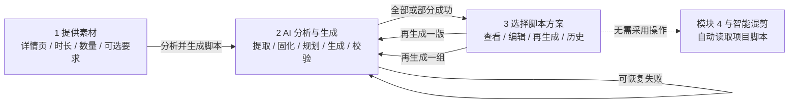

# 详情页智能脚本生成 PRD

> 首稿日期：2026-08-27  
> 校准合并：2026-08-29  
> 状态：PRD v1.1；产品主流程已确认，代码阻塞与剩余技术门禁已合并  
> 产品位置：Creative Studio 第三步「脚本生成」  
> 交互基线：`outputs/script-generator-detail-page-prototype.html`  
> 关联文档：`docs/superpowers/specs/2026-08-20-detail-page-selling-point-extraction-design.md`、`docs/superpowers/specs/2026-07-27-script-generation-v3-prd.md`  
> 校准输入：`docs/superpowers/specs/2026-08-27-detail-page-intelligent-script-generation-校准回复.md`

## 0. 文档目的与效力

本 PRD 定义一条新的详情页驱动脚本生成流程：用户只提供详情页图片、目标时长、生成数量，以及可选的创作要求；系统自动完成详情页理解、卖点提取、卖点资产固化、创意规划、模板选择、脚本生成和结果校验。

本文件已合并交互原型、仓库代码复核、2026-08-21 单样本真机探针和跨模型校准回复。为避免把“已验证代码事实”与“仍需技术设计”混在一起，文中使用三种决策标签：

- **已确认**：来自本轮交互原型和用户反馈，后续设计不得擅自改回旧流程。
- **已验证事实**：已在当前代码或真机探针中确认，实施方案必须正面处理。
- **待技术闭环**：产品结果已确定，但具体证据门禁、迁移或兼容方式必须在技术方案中落定并验证。

本 PRD 与既有文档的关系如下：

1. 它继承脚本生成 V3 已确认的时长约束、主副标题、口播与字幕分层，以及“脚本阶段不绑定具体视频素材”的职责边界。
2. 它复用旧详情页卖点提取设计中已经验证的“保留原始资产、使用独立长图切片管线、按页调用、证据引用、去重和风险标记”机制；不把“读取原图”误解为把原生超长图片直接发送给模型。
3. 它替代旧详情页设计中的三项交互口径：页面不再写死“上传 1～2 张”、卖点提取后不再强制停下来逐条确认、提取完成后不再返回旧的人工配置流程。
4. 它以 `CONTEXT.md` 已定义的“项目脚本、项目脚本版本、批次脚本、脚本快照”为权威词汇，不另造同义领域名词。
5. 它不授权调用真实供应商或改写现有业务数据；这些动作需在技术设计与实施阶段按外部调用边界另行执行。

## 1. Problem Statement

### 1.1 当前流程存在大量人工搬运与选择摩擦

现有脚本生成流程要求编导先在工作台外部阅读商品详情页，再人工完成：

1. 提炼和复制卖点；
2. 手工填写目标人群；
3. 将卖点粘贴到脚本生成入口；
4. 选择和排列卖点；
5. 选择脚本模板；
6. 选择目标时长；
7. 再交给 AI 生成脚本。

用户真正想要的是“从详情页得到可用脚本”，而当前流程把中间步骤全部暴露给用户，既耗时，也容易因复制、遗漏和不同人员理解差异造成结果不一致。

### 1.2 详情页图片目前位于工作台流程之外

详情页是卖点事实的主要来源，但目前还没有成为脚本生成模块的一等输入。用户必须先在外部工具处理图片和文字，再把结果搬回工作台。这导致：

- 原图、卖点和最终脚本之间没有可追溯关系；
- 同一商品每次生成都可能被重新理解；
- 卖点无法沉淀为可复用的项目资产；
- 工作台无法判断某句话是否真的来自详情页证据。

### 1.3 图片、卖点与具体画面匹配耦合，导致失败和等待

现有生成链路容易被“图片是否匹配某条卖点、某句话应该配哪张画面”卡住。该判断既增加模型负担和调用时长，又与后续智能混剪对真实视频素材的分析重复。

脚本生成阶段应该决定“说什么、采用什么表达结构”，后续智能混剪才决定“用哪段真实素材来表现”。如果第三步继续提前绑定具体图片，失败率、等待时间和职责重复都无法根治。

### 1.4 当前数据结构无法表达“方案 + 版本”

用户需要同时保留多条满意的脚本，也需要针对某一条继续生成 V2、V3。当前生产实现并不存在“采用版本”单选状态，真实缺口是：

- 每次生成只新增一条彼此独立的草稿行，草稿之间没有稳定方案身份、父子关系或当前版本指针；
- 草稿列表接口只返回最近 10 条，旧稿仍在数据库中，但会从当前用户入口消失；
- 用户侧只有“分镜组 · 脚本 N”的查看标签，没有“方案”和“版本”的正式语义；
- 批量生产侧已经存在脚本目录和快照投影，但它以单条草稿 ID 为来源，不能替代核心的项目脚本版本历史。

早期交互原型曾探索“采用版本”按钮，用户已经明确否决。正确产品语义是：一组生成得到多个并列项目脚本；每个项目脚本各自拥有项目脚本版本历史；当前显示版本就是该项目脚本的当前版本，不存在全局唯一“采用”状态。

### 1.5 慢任务缺少可信、可恢复的过程反馈

详情页长图需要拆分、识别和合并，首次提取可能明显慢于普通纯文本生成。若页面只有一个长时间旋转的加载状态，用户会误以为失败并重复提交。

用户需要看到系统目前处于哪个阶段、提取到了什么、为什么选择某种脚本结构，以及校验是否通过；这不等于系统必须重建、完整保存或依赖模型隐藏思维链。供应商主动提供的可展示推理增量可以作为可选增强。

### 1.6 现有主入口与目标流程不兼容

当前第三步要求用户选择分镜组、手工输入卖点、选择模板和视觉模型，并在生成时读取分镜图片。新流程不再要求这些输入，也不应继续让分镜图片承担卖点与画面匹配职责。

如果新旧两套主入口并排存在，用户仍要判断应该走哪一套，产品摩擦不会真正消失。因此本 PRD 明确：**新详情页流程替换旧的第三步主入口；历史分析和历史脚本继续兼容读取，但旧人工配置流程不再作为并行主入口展示。**

## 2. Solution

### 2.1 一句话方案

将脚本生成模块改造成一条“详情页进，成套脚本出”的三页式智能流程：用户只负责输入商品详情页和创作约束，AI 负责事实提取、资产固化、创意规划、模板匹配、脚本生成与校验。

### 2.2 用户最短路径

用户在第 1 页完成四项输入：

1. 添加同一商品的一张或多张详情页图片；
2. 选择目标时长，默认 15 秒；
3. 选择需要生成的脚本数量；
4. 可选填写自然语言创作要求。

用户点击一次「分析并生成脚本」后：

1. 页面立即进入第 2 页「AI 分析与生成」；
2. 系统读取详情页、提取并固化卖点、规划不同方向、自动匹配模板、生成脚本并完成校验；
3. 任务完成后自动进入第 3 页「选择脚本方案」；
4. 用户可以查看、复制、编辑、再生成单个方案或切换历史版本；
5. 每个方案的当前版本自动成为下游可读取的项目脚本，无需点击“采用版本”，也不需要额外的“进入智能混剪”按钮。

新入口上线后替换旧的第三步人工配置主界面。旧草稿、旧分析和已经创建的下游快照继续读取，不做静默迁移或覆盖；视觉供应商不可用时显示配置错误，不自动退回旧流程。

### 2.3 三页状态流

### 2.4 首次生成与复用生成

首次生成需要执行完整链路：

`读取详情页 → 提取卖点 → 保存卖点库 → 规划方向 → 选择模板 → 生成脚本 → 校验`

在详情页素材未变化的前提下，再生成只执行：

`复用卖点库 → 重新规划方向 → 选择模板 → 生成脚本 → 校验`

修改目标时长、生成数量或创作要求不得触发重复识图。只有新增、移除或替换详情页来源时，才创建新的卖点库修订并重新执行视觉提取。

## 3. 产品目标与成功指标

### 3.1 核心目标

1. 将详情页从外部人工处理材料升级为脚本生成模块的一等输入。
2. 将人工复制卖点、填写基础人群、排序卖点和选择模板收敛为一次 AI 编排。
3. 让首次提取结果成为可长期复用、可追溯、可修订的项目资产。
4. 降低由图片、卖点和具体画面提前匹配造成的生成失败与等待。
5. 支持一次得到多条并列方案，并让每条方案拥有独立版本历史。
6. 让慢任务可观察、可恢复、可区分部分成功与全部失败。
7. 让新脚本无需二次确认即可被后续视频生成与智能混剪读取，同时保护已经开始的下游任务不被上游版本变化静默改写。

### 3.2 上线验收指标

- 100% 首次成功任务生成一个带来源修订号的产品卖点库。
- 100% 被写入卖点库的事实型卖点保留详情页证据摘录、来源页/切片提示、置信度和风险标记；模型返回的切片编号不作为精确坐标承诺。
- 详情页未变化时，100% 的“再生成一版”和“再生成一组”不发起新的图片理解调用。
- 100% 生成任务在刷新页面后仍可恢复到真实状态，不因前端页面离开而丢失。
- 100% 终态任务明确显示为成功、部分成功、失败或已取消，不允许无限停留在“生成中”。
- 100% 新脚本包含主标题、副标题、目标时长、预计时长、模板标识和来源卖点库修订号。
- 100% 新脚本不包含自动生成的具体视频素材或具体 `shotId` 绑定。
- 100% 当前脚本修订可被下游查询；下游已创建的任务继续使用创建时快照。
- 100% 项目脚本和项目脚本版本可通过分页或按方案查询完整取回，不受固定“最近 10 条”截断。
- 用户从输入完成到发起任务只需一个主操作，不增加卖点确认、模板选择或“采用版本”步骤。
- 首个结构化进度状态在提交成功后 1 秒内可见；完整生成时长暂不设绝对 SLA，先在试运行中记录按图片数量、切片数和供应商划分的 P50/P95。

### 3.3 观察指标

- 有效输入下的首次生成完成率与复用生成完成率；
- 首次生成和复用生成的 P50/P95 耗时；
- 每次首次提取的图片数、切片数、模型调用次数与 token 消耗；
- 自动校验重试率、部分成功率和最终失败原因分布；
- 用户对单个方案执行“再生成一版”的比例；
- 用户从历史版本切回旧稿的比例；
- 脚本进入模块 4 或智能混剪的使用率。

## 4. 核心产品原则

1. **输入最少化**：默认只要求详情页、时长和数量；创作要求是可选增强项。
2. **事实与创意分层**：卖点库负责保存有证据的商品事实；脚本版本负责创意表达，不反向篡改事实。
3. **文案与画面解耦**：详情页只用于理解商品，脚本不提前替智能混剪选择真实视频素材。
4. **首次理解、持续复用**：相同详情页不重复 OCR 和视觉理解，避免慢、贵和结果漂移。
5. **结构化反馈是主契约**：始终展示阶段、输入摘要、中间产物和选择结果；供应商主动提供且允许展示的推理增量只作为可选增强，不是流程成立的前提。
6. **结果默认可用**：当前显示版本就是当前版本；不设置额外采用门槛。
7. **并列方案互不排斥**：方案一和方案二可以同时满意、同时供下游选择。
8. **历史不可静默覆盖**：新提取、新生成和人工编辑都保留修订来源；下游执行使用快照。
9. **部分成功优于全部丢失**：生成 N 条时，只要有合格结果就先展示，不因其中一条失败而丢弃其余结果。
10. **错误必须可行动**：区分图片不可读、无可靠卖点、供应商超时、结构校验失败和时长不合格，并给出对应下一步。
11. **模型自信不等于事实可信**：模型自报置信度只用于排序和提示，不得单独决定卖点能否进入脚本。
12. **校对不阻断主流程**：卖点库提供回看和编辑，但不恢复为生成前必须逐条确认的步骤。

## 5. 详细产品需求

### 5.0 新旧入口关系

- 新详情页智能流程是第三步唯一主入口，不与“选分镜组 → 手填卖点 → 选模板 → 生成”的旧流程并排展示。
- 历史脚本、历史卖点分析和已经创建的智能混剪/批量生产快照继续兼容读取。
- 旧草稿不批量改写为新项目脚本版本；只有用户在新流程中明确生成、编辑或切换时才产生新数据。
- 新入口不再要求 `shotSetId`、分镜图片、手工卖点、目标人群、模板或模型选择。
- 视觉供应商不可用、详情页无法读取或安全门禁无可用卖点时，显示对应错误，不静默回退到旧人工流程。

> **🧭 Product Decision — 新旧入口**  
> 选项包括完全替换、长期并存、默认新流程但保留旧入口。本期决定完全替换用户可见主入口，同时保留历史数据兼容读取。代价是失去手工旧流程作为即时兜底，但换来更清晰的一条主路径。**Not now：** 不做两套入口切换器，也不新增“高级模式”藏回旧流程。

### 5.1 页面框架与步骤导航

**已确认：**

- 模块内部由三个独立页面状态组成，而不是把全部内容堆在同一长页。
- 顶部只显示紧凑的数字步骤 `1 · 2 · 3`，避免与项目工作台原有五个主 Tab 重复。
- 数字分别代表「提供素材」「AI 分析与生成」「选择脚本方案」。完整名称通过页面标题、悬停提示和无障碍标签表达。
- 未解锁的后续步骤不可点击；已进入过的步骤可以返回查看。
- 点击生成后立即切到第 2 页；任务达到可展示终态后自动切到第 3 页。
- 返回第 1 页或离开当前模块不得自动取消正在运行的任务。

### 5.2 第 1 页：提供素材

#### 5.2.1 详情页上传

- 上传区沿用工作台既有素材卡片样式，以缩略图卡片加一个“添加详情页”卡片组成图库。
- 支持点击选择和拖拽添加 JPG、JPEG、PNG。
- 页面不得写死“只传一张或两张”；同一轮可以放入一张或多张同一商品详情页。
- 用户可以删除、替换和继续添加图片，并能看到当前已添加数量和单张上传状态。
- 前端不宣传“无限上传”。后端必须根据单文件大小、总像素、总切片数和模型预算设置可配置资源上限，并在达到上限时给出具体可处理范围和解决办法。
- 已验证的供应商硬限制是单次请求最多 50 张图片；服务端按详情页逐页请求，不把多页切片拼成一次调用。
- `60M` 源像素和约 `150MB` 解码缓冲只作为首轮试运行保护值，不作为已普遍验证的产品上限；技术方案必须允许配置并记录触发情况。
- 至少一张有效详情页才允许首次生成。若当前项目已有有效卖点库且详情页来源未失效，可直接复用，不要求用户再次上传。
- 一轮来源默认代表同一商品。检测到明显不同的商品名称、品类或品牌时，任务应暂停在可行动错误，不得把多个商品的卖点合并写入同一库。

#### 5.2.2 目标时长

- 默认 15 秒。
- 基线选项为 15、20、30、45、60 秒。
- 该时长继续沿用脚本生成 V3 语义：代表最终成片目标总时长，包含封面；脚本正文预算由系统自动扣除封面时长后计算。
- 用户不需要额外选择语速、字符数或模板。

#### 5.2.3 生成数量

- 用户可以选择本轮需要的并列脚本方案数量。
- 当前原型基线为 1、2、3、5 条，默认 3 条。
- “生成 3 条”表示创建 3 个独立脚本方案，不表示同一个脚本的 V1、V2、V3。

#### 5.2.4 创作要求

- 提供一个可选的自然语言输入框。
- 用户可以描述目标人群、平台、语气、禁用表达、前三秒要求、需要强调或避免的内容。
- 不填写时，AI 根据详情页商品信息推断基础人群和表达方式。
- 创作要求只能控制表达和取舍，不能把详情页没有证据的功效声明提升为商品事实。

#### 5.2.5 主操作

- 主按钮文案为「分析并生成脚本」。
- 点击后立刻锁定本次输入快照并创建异步任务，防止用户连续点击造成重复计费和重复脚本。
- 成功受理后立即进入第 2 页，不等待首次模型响应。

### 5.3 第 2 页：AI 分析与生成

#### 5.3.1 可观察阶段

首次生成至少展示以下结构化阶段：

1. 整理输入与资源检查；
2. 读取详情页图片；
3. 提取、归并并筛选卖点；
4. 保存产品卖点库；
5. 规划不同脚本方向；
6. 为各方案选择内置模板并生成；
7. 执行时长、结构、事实和重复度检查。

复用生成至少展示：

1. 读取已有卖点库；
2. 理解本次创作要求；
3. 规划新方向；
4. 匹配模板并生成；
5. 执行校验。

#### 5.3.2 用户可看到的内容

页面可以实时展示：

- 当前阶段与已经完成的阶段；
- 已识别的商品名称、品类和图片数量；
- 去重后的有效卖点数量；
- 每条卖点的简短证据摘要、置信度和风险状态；
- 各方案的切入角度；
- AI 选择的模板名称及简短用途说明；
- 时长检查、结构检查、事实检查和方案差异检查结果；
- 阶段开始时间、耗时和最终错误原因。
- 当供应商主动提供可展示的推理增量时，显示经过截断的“思考片段”；该区域默认折叠、只保留近期内容、不持久化为业务结果。

页面不得展示：

- 系统试图推断或重建的隐藏思维链，以及未截断的完整推理记录；
- 系统提示词和内部安全规则；
- 完整供应商请求、鉴权信息或图片 base64；
- 为了看起来持续工作而伪造的百分比和虚假日志。

当前 Luna 路径已验证不会返回 reasoning delta，因此详情页视觉提取阶段主要依靠服务端编排阶段、已用时长和结构化中间产物提供稳定反馈。任何流程都不得依赖“思考片段”才能成立。

#### 5.3.3 产品卖点库

- 卖点提取成功后，系统自动保存一个产品卖点库修订，不增加强制人工确认步骤。
- 卖点至少包含：标准化标题、事实描述、类型、证据摘录、来源页/切片提示、模型置信度、风险标记、证据门禁状态和可用状态。
- 相同或近义表达在服务端归并，保留所有有效证据来源。
- 价格、限时优惠、赠品、销量排名等时效性促销信息默认不作为长期产品卖点。
- 模型自报置信度只用于排序和 UI 提示，不能单独决定卖点是否进入脚本。
- 结构门禁至少检查标题/证据非空、来源片号存在、类型合法、无促销项和无已识别高风险声明；当前探针只验证了这些轻量规则，不能把它们描述成“证据逐字核真”。
- 普通低风险的外观、结构和使用场景类卖点可以在结构与风险门禁通过后自动使用；数字、材质、认证、功效和绝对化声明必须通过额外证据核验，无法核验时排除而不是阻断其余脚本生成。
- 额外证据核验必须有真实可对照的文本或图像证据接缝；如果技术方案没有独立 OCR/二次核验结果，就不得声称完成了“逐字精确匹配”。
- 模型自报低置信的候选应在过程页提示，并继续接受实际证据门禁；不能仅凭 `low` 标签排除。高风险或证据门禁未通过的候选显示为“未自动采用”，但不阻塞其余可靠卖点继续生成。
- 如果没有任何可安全使用的卖点，任务失败并提示用户补充更清晰的详情页或修改来源，系统不得凭空生成商品功效。
- 卖点库与来源图片建立内容指纹。只改变时长、数量或创作要求时复用当前修订；改变来源图片时创建新修订。
- 来源变化后，MVP 采用全量重新提取并生成新修订，不做增量合并；同输入实测存在召回和措辞抖动，旧修订必须保留。
- 新修订不得静默覆盖旧修订。历史脚本继续记录其生成时使用的卖点库修订。
- 过程页和结果页都提供卖点库回看入口；用户可以修正或停用卖点，保存后形成新的卖点库修订，但该入口不阻断首次一键生成。
- 模型返回的 `tileRefs` 只作定位提示。回看时展示目标切片及相邻切片，不能承诺其为精确原图坐标。

> **🧭 Product Decision — 卖点校对**  
> 选项包括生成前强制确认、生成后可选回看、完全不提供人工入口。本期选择生成后可选回看：主流程保持一次点击，错误仍可纠正。代价是首次结果仍需依赖自动门禁。**Not now：** 不恢复逐条勾选后才能生成的强制确认页。

> **📚 Learning Point**  
> 模型写出的 `confidence=high` 仍是模型对自己的判断，不是独立证据。真正的事实门禁必须来自可验证图片文本、局部二次核验或其他独立来源；“字段齐全”只能证明结构合法，不能证明商品事实为真。

#### 5.3.4 创意规划与模板选择

- 模板选择不再作为用户必填项，系统根据卖点组合、目标时长、创作要求和方案差异自动选择内置模板。
- 同一轮多条方案应尽量采用不同切入角度、开场和卖点组合，不允许只替换少量同义词后当作不同方案。
- 每个方案保存模板 ID、模板版本和选择说明，便于结果页展示和后续追溯。
- 内置模板必须新增显式整数版本；修改叙事结构、写作规则或目标受众反应时必须递增版本，只改展示文案时可以不递增。
- 模板选择说明是面向用户的结果摘要，不是隐藏思维链。
- 模型或模板选择器不得重新决定详情页事实；其输入只能引用已通过卖点库门禁的内容。

#### 5.3.5 生成与校验

每条脚本至少通过：

- 输出结构校验；
- 主标题和副标题校验；
- 目标时长与内容预算校验；
- 卖点事实引用校验；
- 禁用表达和风险声明校验；
- 同一轮方案重复度校验；
- 不含具体视频素材绑定的职责边界校验。

供应商返回不合格时，系统可在统一上限内自动纠正。重试不得重新读取未变化的详情页，也不得无限循环。

#### 5.3.6 完成、部分成功与失败

- 请求数量全部通过时，任务状态为“成功”，自动进入第 3 页。
- 至少一条通过但未达到请求数量时，任务状态为“部分成功”，自动进入第 3 页并明确显示缺少数量和原因。
- 零条通过时，停留在第 2 页显示失败原因和可行动入口。
- 部分成功结果不得被丢弃。用户可以只重试缺失条目，也可以重新生成一组。
- “重试缺失条目”补入原生成批次，使用独立子任务/尝试记录，并在结果卡上标记“补跑”；它不创建一个难以理解的新方案组。
- 页面刷新、应用重启或用户离开后，任务状态必须可恢复；不能依赖单一渲染进程内存保存唯一真相。

### 5.4 第 3 页：选择脚本方案

#### 5.4.1 结果区

- 页面顶部显示本组生成数量、使用的卖点库修订、目标时长和任务状态。
- 多个方案并列展示，结果卡版式继续参照现有脚本结果卡，不重新发明完全不同的内容结构。
- 每张卡至少包含：方案名、模板标签、当前版本号、主标题、副标题、简要方向、使用卖点、完整脚本、目标时长、预计时长、内容字符数和校验状态。
- 完整脚本可以展开和收起。
- 页面明确提示“当前显示版本会自动供后续流程读取，无需再次确认”。
- 页面提供本轮卖点库的回看和编辑入口，但不要求用户先确认卖点才能使用脚本。

#### 5.4.2 每个方案的操作

每个方案提供：

- 完整脚本；
- 复制；
- 编辑；
- 再生成一版；
- 版本历史。

页面不提供：

- “采用版本”或“取消采用”；
- 方案间互斥的单选状态；
- 强迫用户跳转的“进入智能混剪”按钮。

#### 5.4.3 再生成

- 「再生成一版」只针对当前方案，在同一个项目脚本下创建新项目脚本版本，并立即显示为当前版本。
- 「再生成一组」创建一批新的并列项目脚本；旧方案组继续保留，不被覆盖。
- 两种再生成都默认复用当前卖点库，不重新读取详情页。
- 若用户已经修改详情页来源，应先完成新的卖点库修订，再基于该修订生成。

### 5.5 版本与当前状态语义

| 用户动作 | 数据效果 | 当前状态 | 下游效果 |
|---|---|---|---|
| 首次生成 N 条 | 创建 N 个独立项目脚本，每个含 V1 | 每个脚本的 V1 都是各自当前版本 | N 个脚本都可被下游查询 |
| 再生成一版 | 在同一项目脚本下新增 V2/V3… | 新版本立即成为该脚本当前版本 | 新建下游任务默认读新版本 |
| 编辑并保存 | 在同一项目脚本下新增人工编辑版本 | 新版本立即成为当前版本 | 新建下游任务默认读编辑版 |
| 从历史切换 | 只更新该脚本的当前版本指针 | 被切换版本立即成为当前版本 | 不影响其他脚本，不改写已建任务 |
| 再生成一组 | 创建新的生成批次和一组新项目脚本 | 新旧方案组都保留 | 所有未归档脚本都可供下游选择 |
| 复制或展开 | 不产生持久化变化 | 当前版本不变 | 无影响 |

版本规则：

1. 不存在项目级唯一“采用脚本”。
2. 每个项目脚本只维护自己的 `currentRevisionId`（当前版本指针）。
3. 历史版本不可被编辑覆盖；人工编辑保存应产生新项目脚本版本。
4. 切换历史版本不复制内容、不创建重复版本，只改变当前版本指针并记录操作时间。
5. 下游尚未创建的任务读取当前版本；已创建的批次、视频任务或混剪工作区使用创建时的脚本快照，不随上游切换自动改变。
6. 项目脚本和版本历史必须分页或按稳定方案查询；禁止用固定最近 10 条列表充当完整历史。

### 5.6 与后续视频流程的关系

- 脚本结果生成成功后即成为项目级可查询资产，不要求用户在结果页执行额外确认。
- 模块 4 和智能混剪通过项目脚本列表读取每个脚本的当前版本。
- 当前详情页生成入口不要求用户选择分镜组，项目脚本在创建时可以不绑定 `shotSetId`。
- 当某个下游流程实际使用脚本时，再将脚本当前版本快照绑定到目标 `projectId + shotSetId` 或批次上下文。
- 既有已经绑定 `shotSetId` 的历史脚本继续按原隔离规则读取。
- **已验证阻塞：** 当前共享可用性检查、智能混剪上下文、批量脚本目录和成片 bootstrap 都会过滤空 `shotSetId`。技术方案必须同时改造并统一这四类读取闸门；只修改其中一个入口不能通过验收。
- 新闸门语义固定为：空 `shotSetId` 表示项目级脚本，可在同一 `projectId` 下被列出；非空 `shotSetId` 的历史脚本继续保持原有更窄可见范围；实际使用时才创建绑定目标分镜组的快照。
- 脚本只提供口播、字幕、主副标题、使用卖点、抽象画面意图和匹配关键词；不提前绑定真实视频、静态分镜或具体 `shotId`。
- 智能混剪继续根据真实视频理解、真实 TTS 时间和素材状态决定画面，不受详情页图片顺序影响。

## 6. 领域与数据语义

### 6.1 核心领域对象

| 对象 | 作用 | 关键语义 |
|---|---|---|
| 详情页来源集 | 保存一次商品事实来源 | 同一商品；包含原始图片资产与内容指纹 |
| 产品卖点库 | 项目内稳定、可复用的事实资产 | 有稳定身份，不因再生成脚本而重建 |
| 卖点库修订 | 某次来源变化后的不可变提取结果 | 保留证据、置信度、风险和来源指纹 |
| 脚本生成任务 | 一次异步编排 | 保存输入快照、阶段、耗时、错误和生成结果 |
| 项目脚本 | 一个稳定的并列脚本方案 | 有独立身份和当前版本指针 |
| 项目脚本版本（Project Script Revision） | 某方案的一次 AI 生成或人工编辑版本 | 不可变；记录卖点库修订和模板版本 |
| 批次脚本 | 被用户选入某个批次的项目脚本或外部文案 | 是批次侧选择，不是项目脚本的来源真相 |
| 脚本快照 | 下游任务创建时冻结的内容 | 上游后续切换版本不改写该快照 |

### 6.2 范围边界

- MVP 不新增跨项目“商品中心”。详情页来源集和卖点库先按项目保存。
- 同一项目默认对应同一商品事实上下文；多商品混合生成不在本期范围。
- “无限复用”在产品语义上指：只要项目和卖点库存在，就可以反复生成脚本而不重复识图；它不代表绕过存储、配额、归档或数据删除规则。
- 现有批量生产脚本目录是以草稿为来源的同步投影，并保留批次快照能力；它不是完整的项目脚本版本库，不能直接作为本期核心来源真相。

### 6.3 建议的关键字段

产品卖点库修订至少记录：

- 稳定卖点库 ID 与修订号；
- 项目 ID；
- 来源图片资产 ID 与内容指纹；
- 商品名称、品类和可选品牌；
- 标准化卖点列表；
- 每条卖点的证据摘录、来源页/切片提示、证据门禁状态、模型置信度、风险标记和可用状态；
- 提取供应商、模型、提示词契约版本和创建时间。

项目脚本至少记录：

- 稳定项目脚本 ID；
- 项目 ID 和可空的来源 `shotSetId`；
- `currentRevisionId`（当前版本指针）；
- 创建时间、更新时间和归档状态。

项目脚本版本至少记录：

- 稳定项目脚本 ID 与版本号；
- 来源生成任务 ID 与卖点库修订 ID；
- 模板 ID、模板版本和选择说明；
- 目标总时长、预计口播时长和时长状态；
- 主标题、副标题、带标点口播、展示字幕、分段、使用卖点和抽象画面意图；
- 生成来源（AI 生成、AI 再生成、人工编辑）；
- 创建时间。

## 7. User Stories

1. 作为内容制作人员，我希望直接上传商品详情页，以便不用先在外部手工抄写卖点。
2. 作为内容制作人员，我希望上传区像现有素材卡片一样支持继续添加，以便不必预先判断详情页应该是一张还是两张。
3. 作为内容制作人员，我希望页面不写死图片数量，以便长详情页被拆成多张时仍能自然使用。
4. 作为内容制作人员，我希望系统在资源超限时告诉我具体是哪张图或多少切片超限，以便我能采取行动。
5. 作为内容制作人员，我希望时长默认是 15 秒，以便大多数短视频无需额外设置。
6. 作为内容制作人员，我希望一次选择生成几条脚本，以便快速获得多个可比较方向。
7. 作为内容制作人员，我希望创作要求可以直接用自然语言描述，以便补充人群、口吻和禁用表达。
8. 作为内容制作人员，我希望不填写创作要求也能生成，以便最短路径始终可用。
9. 作为内容制作人员，我希望只点击一次“分析并生成脚本”，以便不再经历卖点复制、排序和模板点选。
10. 作为内容制作人员，我希望点击后立即进入过程页，以便确认任务已经成功开始。
11. 作为内容制作人员，我希望看到 AI 正在读取图片、提炼卖点还是生成脚本，以便慢任务不会像卡死。
12. 作为内容制作人员，我希望看到提取出的卖点和证据摘要，以便知道脚本事实来自哪里。
13. 作为内容制作人员，我希望看到 AI 为每个方案选择了什么模板以及简短原因，以便理解结果差异。
14. 作为内容制作人员，我希望系统始终展示结构化过程，并在供应商支持时补充可折叠的思考片段，以便过程可感知又不依赖某个模型特性。
15. 作为内容制作人员，我希望首次提取的卖点被固定保存，以便以后生成脚本不必重新看图。
16. 作为内容制作人员，我希望卖点库保留来源和置信度，以便出现错字或夸大表达时能够追查。
17. 作为内容制作人员，我希望补充或替换详情页时生成新的卖点库修订，以便旧脚本的事实来源不被静默改写。
18. 作为内容制作人员，我希望促销价格和限时活动默认不被当作长期卖点，以便日后复用不会产生过期内容。
19. 作为内容制作人员，我希望没有可靠卖点时系统明确失败，而不是编造商品功效。
20. 作为内容制作人员，我希望可以在生成后回看和修正卖点库，以便不增加生成前摩擦也能纠正 OCR 或事实错误。
21. 作为内容制作人员，我希望 AI 自动规划不同的开场和切入角度，以便多条方案不是同一篇稿子的换词版本。
22. 作为内容制作人员，我希望模板由 AI 自动选择，以便省掉一个低价值的手动步骤。
23. 作为内容制作人员，我希望每份脚本仍满足目标时长、主副标题和字幕规则，以便能直接进入后续视频流程。
24. 作为内容制作人员，我希望脚本阶段不绑定具体视频画面，以便智能混剪可以根据真实素材重新判断。
25. 作为内容制作人员，我希望生成完成后自动看到脚本方案页，以便不需要手动切换步骤。
26. 作为内容制作人员，我希望多条脚本都能同时保留，以便方案一和方案二都满意时不必二选一。
27. 作为内容制作人员，我希望当前展示版本默认就是当前使用版本，以便不需要再点一次“采用”。
28. 作为内容制作人员，我希望针对某一方案再生成一版，以便保留方向但尝试新的表达。
29. 作为内容制作人员，我希望旧稿继续存在于版本历史，以便新稿不满意时随时切回。
30. 作为内容制作人员，我希望历史切换只影响当前方案，以便不会取消其他满意方案。
31. 作为内容制作人员，我希望编辑保存也进入版本历史，以便人工修改不会破坏原始 AI 稿。
32. 作为内容制作人员，我希望再生成一组时跳过详情页识别，以便等待更短、卖点事实更稳定。
33. 作为内容制作人员，我希望生成五条时其中四条成功就先看到四条，以便单条失败不会浪费整轮结果。
34. 作为内容制作人员，我希望补跑失败条目时仍留在原生成批次，以便结果不会被拆成难以理解的两组。
35. 作为内容制作人员，我希望刷新页面后仍能看到真实进度和结果，以便长任务不依赖当前浏览器页面存活。
36. 作为内容制作人员，我希望结果生成后自动成为模块 4 和智能混剪可选脚本，以便不需要额外跳转按钮。
37. 作为内容制作人员，我希望下游已经开始的任务保留原脚本快照，以便上游切换版本不会让正在制作的内容突然变化。
38. 作为老项目用户，我希望历史脚本和现有 `shotSetId` 隔离继续有效，以便升级不破坏旧流程。
39. 作为老项目用户，我希望新入口替换旧主流程后仍能查看和使用历史脚本，以便升级不丢失已有成果。
40. 作为系统维护者，我希望重复点击和网络重试不会创建重复付费任务，以便异步任务具有幂等性。
41. 作为系统维护者，我希望失败按阶段、供应商和验证原因结构化记录，以便判断到底是 Luna、图片质量还是业务校验问题。
42. 作为系统维护者，我希望日志不包含 API Key、完整鉴权地址和图片 base64，以便本地数据与公司网关保持安全。
43. 作为产品负责人，我希望首次生成与复用生成分别统计耗时和成功率，以便确认新流程是否真的解决慢和失败问题。

## 8. 建议接口与任务契约

本节只定义产品所需能力，不锁定最终路由名称。

### 8.1 创建或更新详情页来源集

输入：

- 项目 ID；
- 原始图片资产 ID 列表；
- 客户端请求键。

输出：

- 来源集 ID；
- 内容指纹；
- 是否与当前卖点库来源一致；
- 资源预检结果。

### 8.2 创建脚本生成任务

输入：

- 项目 ID；
- 来源集 ID，或明确复用的卖点库修订 ID；
- 目标总时长；
- 请求方案数量；
- 可选创作要求；
- 客户端幂等键。

输出：

- 任务 ID；
- 是否进入首次提取或复用模式；
- 初始状态和当前阶段；
- 输入快照摘要。

### 8.3 查询任务快照

至少返回：

- 任务状态、阶段和阶段时间；
- 已完成阶段；
- 面向用户的结构化中间产物；
- 卖点库修订 ID；
- 请求数量、成功数量和失败数量；
- 可行动错误；
- 生成的项目脚本 ID。

### 8.4 项目脚本与版本操作

需要支持：

- 按项目分页列出所有项目脚本及其当前版本；
- 读取单个脚本及其当前版本；
- 分页列出项目脚本版本历史；
- 针对单个脚本再生成一版；
- 保存人工编辑为新项目脚本版本；
- 将某个历史修订设为当前；
- 创建新的脚本生成批次；
- 为下游创建不可变脚本快照。

## 9. Implementation Decisions

### 9.1 图片读取与长图处理

- 详情页以未经过分镜预处理阶梯的原始资产作为切片来源；这不代表把原生超长图片直接发送给模型。
- 详情页走独立切片管线：宽度上限 1024、基础片高 1024、垂直重叠 12%、JPEG q88；不得复用会把超长详情页缩成窄条的分镜图片压缩阶梯。
- 上游单请求 50 张图片是已验证硬限制。MVP 按详情页逐页请求，服务端合并候选；单页超过 50 片时增大切片高度并明确提示清晰度降级。
- 每页提取 `maxTokens` 初始值不得低于 8000；最终值由试运行 token 分布校准。
- `60M` 源像素与约 `150MB` 解码缓冲作为可配置试运行保护值，不得写死为已普遍验证的供应商能力。
- 切片是可重算衍生物。原始资产、证据摘录和来源页是长期依据；模型返回片号只用于打开目标及相邻切片，不作为精确坐标。
- 现有真机数据仅来自一个商品的两张详情页。它证明该管线可行，也暴露了少量 OCR 误读和 2～4 片引用偏移，但不能替代多品类验收。

### 9.2 供应商与模型

- MVP 视觉提取采用当前唯一完成真机验证的公司 Luna 视觉模型；产品契约仍按视觉能力适配器设计，不把长期能力写死为 Luna。
- 视觉提取和纯文本脚本生成是两个能力阶段，可以由同一供应商完成，也可以通过配置选择不同适配器。
- 当前公司 `GPT-5-6-Luna-*` 路径继续遵守 `temperature=1` 的硬约束。
- 用户默认不需要选择模型；系统使用管理员配置的可用模型和回退策略。
- 如果没有可用视觉模型，应在提交前给出配置错误，不得进入一个必然失败的长任务。
- 每次视觉和文本调用都必须落入用量记录。用量匹配不得因为公司供应商使用了非种子行 ID 而静默漏记；具体身份兼容规则在技术方案中统一解决。
- 真实供应商调用涉及外部传输、成本与潜在日志，正式验收前必须获得明确授权。

### 9.3 结构化提取与安全门禁

- 视觉模型返回严格结构化候选；服务端负责解析、标准化、证据检查、近义去重、风险分类和最终可用状态。
- 模型自由文本不能直接成为卖点库唯一真相。
- 自动生成只使用通过门禁的卖点；模型自报置信度只用于排序和 UI，不是准入条件。
- 服务端轻量门禁检查字段、片号、类型、促销和已知风险；数字、材质、认证、功效和绝对化声明必须走额外证据核验，核验实现是技术方案的阻塞接缝。
- 若额外核验依赖 OCR 文本，必须验证该文本真实由图片产生；不能拿同一次模型返回的 `evidence` 与自身比较后声称独立核真。
- 校验失败使用有上限的定向重试，不重新发送与错误无关的全部图片。
- 来源图片发生变化时执行全量重新提取并新增卖点库修订；MVP 不做增量合并。
- 所有项目脚本版本记录实际使用的卖点 ID，支持从脚本追溯到详情页来源。

### 9.4 持久化异步任务

- 详情页首次提取可能接近分钟级，任务状态不能只保存在进程内存。
- 脚本生成任务、阶段、输入快照、部分结果、错误和终态应持久化到本地 SQLite。
- 前端通过轮询或本地流式通道读取同一任务快照；页面刷新后继续订阅。
- 应用意外退出后，处于运行中的任务必须被恢复为可重试状态，或由明确的租约机制继续，不能永久卡在 running。
- 创建任务、自动重试和网络重放必须有幂等键，避免重复调用供应商。

### 9.5 进度展示

- 进度以真实阶段状态为主，不要求模型提供推理增量。
- 供应商若主动提供可展示的正文或 reasoning delta，可以经过截断后进入现有过程视图；完整推理不落业务库，缺失时不报错。
- Luna 视觉链路不透传 reasoning，必须用阶段、已用时长和中间产物覆盖沉默期。
- 中间产物必须经过面向用户的结构化和脱敏处理后再展示。
- 每个阶段保存开始时间、结束时间和失败代码，便于后续定位慢点。

### 9.6 脚本生成与现有 V3 契约

- 新入口沿用 V3 的主副标题、目标总时长、带标点口播、无多余展示标点字幕和抽象画面意图。
- 新入口改变的是输入编排和资产沉淀，不回退到具体分镜图片绑定。
- 模板由系统内部选择，但仍使用版本化模板库；提示词具体措辞不是产品合同。
- 时长、标题、事实引用和重复度由共享标准化层校验，不能分别散落在各供应商适配器。

### 9.7 项目脚本与不可变版本

- 继续使用 `CONTEXT.md` 的既有词汇：项目脚本、项目脚本版本、批次脚本和脚本快照。
- 当前独立草稿行只能表达一次生成结果，无法表达稳定项目脚本、多个项目脚本版本和当前版本指针；核心领域层必须补齐这三个概念。
- 项目脚本是稳定身份；项目脚本版本是不可变内容；人工编辑和 AI 再生成都追加版本。
- 当前批量生产脚本目录可以作为迁移参考和批次侧投影，但其稳定身份绑定单条草稿来源，且会原地更新内容，不能直接充当核心项目脚本版本库。
- 批次脚本继续表示“被选入批次的项目脚本或外部文案”，批次开始后继续冻结脚本快照。
- 卖点库修订与项目脚本版本都采用追加式迁移和追加式历史，不修改已发布迁移条目。
- 对历史脚本提供兼容读取；不批量回写、不静默创建新版本。

> **📚 Learning Point**  
> “已有一张叫项目脚本的表”不等于已经拥有项目脚本领域模型。来源真相必须能表达稳定身份、追加版本和当前版本指针；批次目录可以投影这些数据，但不能反过来替核心层决定版本历史。

### 9.8 下游兼容

- 当前代码已确认在共享草稿可用性、智能混剪上下文、批量脚本目录和成片 bootstrap 四类读取路径中强制要求非空 `shotSetId`；这是上线阻塞，不是假设风险。
- 四类读取路径必须收敛到同一语义：先按 `projectId` 获取项目脚本，允许空 `shotSetId` 的项目级脚本；用户或任务实际使用时再创建带目标 `shotSetId` 的脚本快照。
- 历史带 `shotSetId` 的脚本保持原有更窄隔离，不扩大其可见范围。
- 技术方案应消除重复内联判断，避免只修共享检查却遗漏独立 bootstrap 过滤。
- 任何兼容改造都不得让不同项目或不同已绑定素材组发生串用。

### 9.9 本地数据与安全

- 所有文件路径继续基于 `dataRoot()`；不得硬编码 `data/` 或 `storage/`。
- API Key 只保存在既有本地安全位置，前端只读取“是否已配置”。
- 日志不得保存完整详情页 base64、请求头、密钥或带签名参数的完整 URL。
- 本机服务和 LiteLLM 不得暴露到公网；需要公网媒体交付时继续遵守现有 COS 安全边界。

## 10. Testing Decisions

### 10.1 最高层主接缝

本功能的最高价值测试不是单独测试提示词，而是一条使用临时 SQLite 与可控假供应商的完整编排接缝：

`上传详情页资产 → 按页长图切片 → 提取候选 → 证据/风险门禁 → 保存卖点库修订 → 生成 N 个项目脚本 → 校验并入库 → 单方案生成新项目脚本版本 → 切换当前版本 → 进程恢复 → 四类下游读取并创建快照`

该接缝必须验证最终持久化结果、供应商调用次数和下游可读性。提示词原文、DOM 内部实现和随机生成措辞不作为脆弱断言。

### 10.2 图片与卖点提取测试

- 一张长图、多张长图和普通尺寸图都能形成正确来源集。
- 超大图片、损坏图片、错误格式和资源预算超限返回可行动错误。
- 50 张单请求硬上限被提交前预检和按页请求共同保护；单页超限触发有提示的清晰度降级。
- 切片保持顺序和重叠；证据回看展示目标片及相邻片，不断言模型片号是精确原图坐标。
- OCR 错字、重复卖点、无标题候选和错误证据引用被标准化层处理。
- 促销信息和高风险功效不自动进入脚本事实池；单独改变模型自报置信度不会改变准入结论。
- 数字、材质、认证、功效和绝对化声明没有通过额外证据核验时被排除；测试必须证明核验不是同一次模型输出的自我比较。
- 不同商品混入同一来源集时被识别并阻断。
- 图片内容指纹不变时再生成不调用视觉供应商。
- 来源变化时全量重新提取并创建新卖点库修订，旧修订保持可读。
- 用户编辑或停用卖点后新增卖点库修订，已经生成的项目脚本版本仍指向原修订。

### 10.3 脚本生成测试

- 请求 1、2、3、5 条时分别创建对应数量的独立项目脚本。
- 每条脚本包含主副标题、目标时长、预计时长、模板版本和卖点库修订。
- 脚本只引用通过门禁的卖点，并能追溯到证据。
- 多方案在开场、结构或卖点组合上达到配置的差异阈值。
- 超长脚本触发有限重写；达到重试上限后返回明确错误。
- 生成 N 条时单条失败产生部分成功，不丢弃其余合格脚本。
- 不产生具体 `shotId`、图片顺序或真实视频绑定。

### 10.4 版本测试

- 首次生成的每个方案都拥有独立 V1 和独立当前指针。
- 方案一再生成 V2 不影响方案二的当前版本。
- 人工编辑保存创建新项目脚本版本，不覆盖原稿。
- 历史切换只更新当前指针，不创建重复修订。
- “再生成一组”保留上一组所有脚本和版本。
- 数据层不存在会导致方案互斥的“项目唯一采用脚本”约束。
- 下游新任务读取当前版本，已创建任务保持原快照。
- 创建超过 10 条脚本和版本后，全部历史仍可通过分页或稳定方案入口取回。
- 空 `shotSetId` 的项目脚本同时通过共享可用性、智能混剪上下文、批量脚本目录和成片 bootstrap 四类读取；历史非空 `shotSetId` 的可见范围不扩大。

### 10.5 异步与失败恢复测试

- 双击提交和网络重放只创建一个供应商任务。
- 页面刷新后恢复同一任务阶段和已产生的中间结果。
- 应用在读取、提取、生成和校验阶段退出后都能恢复为明确状态。
- 供应商超时、无效 JSON、限流和部分响应分别得到准确错误分类。
- 有上限重试不会重复识图或重复保存相同脚本。
- 所有任务最终进入成功、部分成功、失败或取消之一。

### 10.6 浏览器验收

- 上传区以素材卡片和添加卡呈现，不显示“限传 1～2 张”。
- 默认时长为 15 秒，生成数量和可选创作要求可用。
- 点击一次后立即从数字 1 进入数字 2。
- 过程页始终展示真实阶段、中间产物和错误；供应商有可展示推理增量时显示截断思考片段，Luna 无推理增量时自然降级。
- 完成后自动进入数字 3；已解锁数字可返回查看。
- 结果页可以同时展示多个并列方案。
- 每个方案都有完整脚本、复制、编辑、再生成一版和版本历史。
- 页面不存在“采用版本”“取消采用”与“进入智能混剪”按钮。
- 两个方案分别再生成和切换历史时互不影响。
- 再生成一组时明确提示复用卖点库，并且页面不再次展示识图阶段。
- 卖点库可以回看和编辑，但不会在生成前强制用户逐条确认。
- 第三步不再并排显示旧的分镜组、手填卖点和模板选择入口；历史脚本仍可查看。

### 10.7 真实供应商验收

真实 Luna 调用只在用户明确授权外部调用和成本后执行。现有单商品探针只作为回归样本，试运行至少覆盖 6 个商品、3 个品类，并同时包含参数密集、材质/认证和生活场景型详情页。验收至少记录：

- 图片数、切片数、请求次数、模型与总耗时；
- 提取卖点与原图证据的人工抽查结果；
- OCR 误读、证据偏移和风险声明漏检情况；
- 首次生成和复用生成的耗时差；
- 目标数量成功率、自动重试次数和错误分类；
- 15、30、60 秒脚本的预计时长与真实 TTS 时长偏差。
- 试运行阶段人工复核 100% 自动采用卖点和脚本事实；数字、材质、认证、功效及绝对化声明的错误自动采用必须为 0。

## 11. 验收标准

### 11.1 主流程

1. 新项目用户上传至少一张有效详情页，选择 15 秒和 3 条，不填写创作要求，也能通过一次点击完成生成。
2. 点击后立刻进入过程页，能看到读取、提取、固化、规划、模板、生成和校验状态。
3. 任务完成后自动进入结果页，展示 3 个独立方案及各自 V1。
4. 卖点库已持久化，刷新页面后仍可查看和复用。
5. 用户对方案一“再生成一版”后得到 V2；方案二仍保持自己的 V1。
6. 用户切换方案一历史 V1 后，V1 成为方案一当前版本，但方案二不受影响。
7. 用户点击“再生成一组”时不重复调用图片理解，并保留上一组方案。
8. 所有当前方案都能被下游项目脚本查询读取，不需要采用按钮。
9. 用户可以在生成后回看并编辑卖点库，保存后形成新修订，不影响已有脚本来源记录。
10. 创建超过 10 条脚本后，早期方案和版本仍可通过分页完整访问。
11. 空 `shotSetId` 的项目脚本能进入模块 4、智能混剪和成片 bootstrap；历史分镜组脚本仍保持原隔离。
12. 旧人工配置主入口不再并排展示，但历史分析、草稿和下游快照仍可读取。

### 11.2 失败流程

1. 图片不可读时在视觉调用前失败，并指出具体文件。
2. 来源疑似包含多个商品时阻断合并，提示拆分处理。
3. 没有可靠卖点时不生成虚构脚本。
4. 请求 5 条但只有 4 条通过时显示 4 条和缺失原因。
5. 用户重试缺失的 1 条后，新结果补入原批次并标记为补跑，不创建第二个方案组。
6. 供应商超时或返回不合格内容时，经过有限重试后进入明确终态。
7. 页面刷新和应用重启不会让任务永久显示生成中。
8. 下游已创建快照不因上游版本切换而改变。

## 12. 风险与缓解

| 风险 | 影响 | 缓解方式 |
|---|---|---|
| 空 `shotSetId` 被现有四类下游闸门过滤 | 新项目脚本生成成功但模块 4/智能混剪完全不可见 | 将项目级可见与使用时快照绑定写成统一契约，四类读取路径共同验收 |
| 详情页长图导致调用时间过长 | 用户误判卡死、重复提交 | 持久化任务、真实阶段反馈、切片预算、幂等提交 |
| Luna OCR 或片号定位误差 | 脚本写入错误卖点或打开错误切片 | 证据摘录优先、目标片连同相邻片回看、额外证据核验、人工试运行抽查 |
| 取消强制确认后自动采用错误卖点 | 事实风险和品牌风险 | 置信度不作准入；风险分层；高风险事实额外核验；生成后可回看编辑 |
| 多条方案高度重复 | 用户认为生成数量无价值 | 生成前规划差异方向，生成后做重复度门禁和定向重试 |
| 复用旧卖点导致新详情页未生效 | 内容过期 | 来源内容指纹、明确库修订、来源变化强制新提取 |
| 进程内任务丢失 | 刷新或重启后卡死 | SQLite 持久化任务、租约或恢复策略、明确终态 |
| 当前版本动态变化影响制作中任务 | 下游结果不可复现 | 下游创建时冻结脚本快照，不做动态引用 |
| 图片数量不写死导致成本失控 | 超时、超模型限制、费用上升 | 可配置的字节/像素/切片/调用预算和提交前预检 |
| 单商品探针被误当成通用结论 | 新品类上线后 OCR、成本或时长失控 | 试运行覆盖至少 6 个商品/3 个品类，保护值保持可配置 |
| 批量脚本目录被误当成核心版本库 | 方案身份和版本历史继续混乱 | 核心项目脚本为来源真相，批次目录只作选择投影，单独技术迁移设计 |
| 推理片段被误认为流程必需或完整真相 | Luna 沉默、不同供应商体验不一致 | 结构化阶段是主契约；推理片段可选、截断、不落业务库 |

## 13. Out of Scope

本期明确不包含：

- 推断或重建供应商未主动提供的隐藏思维链，或持久化完整推理记录；
- 让脚本生成模型选择、排序或绑定具体真实视频素材；
- 重写智能混剪的视频分析、场景检测、语义矩阵和全局匹配算法；
- 在结果页增加强制“采用版本”或强制跳转智能混剪；
- 模板市场、模板编辑器或让普通用户选择底层模板版本；
- 供应商配置页、模型市场或新的鉴权体系；
- PDF、网页 URL、视频或直播详情页作为输入；
- 一轮同时处理多个不同商品；
- 跨项目商品中心和企业级卖点知识库；
- 自动发布脚本到外部平台；
- 删除、合并或批量归档项目脚本的完整管理后台；
- 静默迁移或重写历史脚本、历史混剪工作区和已创建下游快照；
- 未经用户授权调用真实供应商或产生外部费用。

## 14. Further Notes

### 14.1 已确认产品决策

1. 输入是详情页图片、目标时长、生成数量和可选创作要求。
2. 上传区不再写死一张或两张，使用可继续添加的素材卡片形态。
3. 目标时长默认 15 秒。
4. 三个阶段是三个页面状态，用紧凑数字 1、2、3 表示，不使用大 Tab。
5. 点击生成后自动进入 AI 过程页，完成后自动进入脚本方案页。
6. 过程页始终展示结构化进度和中间产物；供应商主动提供时可补充截断思考片段，Luna 缺失时自然降级。
7. 卖点首次提取后持久化并可反复复用。
8. 卖点排序、目标人群基础推断和模板选择由 AI 完成。
9. 一次可以生成多个并列脚本方案。
10. 每个方案有独立版本历史，当前显示版本就是当前版本。
11. 不设置“采用版本”，方案之间不互斥。
12. 结果页不设置“进入智能混剪”按钮；下游自动读取项目脚本。
13. 结果卡继续沿用现有脚本结果的内容组织和操作习惯。
14. 新详情页流程替换旧第三步主入口；历史数据继续兼容读取。
15. 卖点确认不恢复为强制步骤，但卖点库提供生成后回看和编辑。
16. 部分成功补跑写回原生成批次，并保留独立任务记录。

### 14.2 已合并实现决策

1. 以项目级卖点库和不可变修订实现“固定并复用”。
2. 使用既有领域词汇，以稳定项目脚本和不可变项目脚本版本区分“方案”和“版本”。
3. 使用图片内容指纹判断是否需要重新识图。
4. 使用持久化异步任务替代进程内唯一状态。
5. 新脚本允许暂不绑定 `shotSetId`，在下游实际使用时创建绑定快照。
6. 多条生成采用部分成功语义。
7. 人工编辑保存为新项目脚本版本，而不是覆盖当前历史内容。
8. 来源变化采用全量重新提取并新增卖点库修订，MVP 不做增量合并。
9. 详情页按页调用 Luna，单请求遵守 50 张硬上限；切片与内存预算保持可配置。
10. 内置模板增加显式版本，叙事结构和写作规则变化时递增。
11. 批量脚本目录继续作为批次侧投影和快照来源，不直接充当核心项目脚本版本库。

### 14.3 已验证代码与探针事实

1. 当前项目脚本下游存在四类非空 `shotSetId` 闸门，必须作为上线阻塞统一改造。
2. 当前草稿只有独立新增，没有稳定方案父子关系、当前版本指针或编辑更新；列表接口另有最近 10 条截断。
3. 当前脚本生成任务只存在进程内注册表，刷新可恢复，进程重启会丢。
4. 当前唯一完成真机验证的视觉提取路径是公司 Luna，且只接受 `temperature=1`、不透传 reasoning delta。
5. Luna 单请求图片硬上限是 50；一套两页样本按页调用约 51 秒、47 秒，复跑约 64 秒。
6. 1024 宽、1024 基础片高、12% 重叠、JPEG q88 在现有单样本上成立；原生 1200 宽多消耗约 35% token，未消除随机 OCR 误读。
7. 同输入重复提取存在措辞和召回抖动，支持“全量重提取 + 保留旧修订”，不支持 MVP 增量合并。
8. 模型 `tileRefs` 存在约 2～4 片偏移，不能作为精确证据坐标。
9. 当前探针只校验字段非空、片号合法和标题去重，没有独立 OCR 文本，因此自动证据核真尚未完成。
10. `CONTEXT.md` 已定义项目脚本、项目脚本版本、批次脚本和脚本快照；批量生产已有目录/快照投影，但不是完整核心版本库。
11. 当前批量脚本目录以单条草稿 ID 作为稳定来源，`sourceVersion` 保存脚本契约版本，内容哈希另存；它不能表达同一项目脚本的 V1/V2 历史。
12. 当前结果页没有脚本编辑能力，因此“编辑保存为新项目脚本版本”是新增能力，不存在旧编辑行为兼容负担。
13. 当前内置模板没有显式版本字段，实施时必须补充版本和递增规则。

### 14.4 技术方案必须闭环的问题

以下问题不改变产品交互，但在开始实施前必须写进技术方案并给出测试接缝：

1. **高风险证据核验**：用独立 OCR、局部二次视觉核验或其他真实证据源完成数字、材质、认证和功效核真；禁止同一模型输出自证。
2. **核心脚本迁移**：定义项目脚本与项目脚本版本的权威表/接口，以及现有草稿和批量脚本投影如何兼容读取；不批量改写历史。
3. **下游闸门收敛**：统一四类 `shotSetId` 读取语义，并证明项目级脚本可见、历史分镜组脚本不串组。
4. **持久化任务恢复**：沿用现有快照和错误白名单语义，定义租约、重启恢复、取消和幂等边界。
5. **资源保护值校准**：在多品类试运行后确认源像素、内存、单页降级和异常耗时阈值；当前 `60M/150MB` 只作初始值。
6. **用量身份兼容**：保证规范种子供应商和用户配置的公司供应商行都能正确记账，不允许调用成功但指标为空。

### 14.5 原型说明

`outputs/script-generator-detail-page-prototype.html` 是本 PRD 的交互证据，用于确认页面结构、自动跳转、过程反馈、结果卡、版本历史和无“采用版本”逻辑。它使用本地演示数据，不代表正式接口、持久化和供应商能力已经实现。
