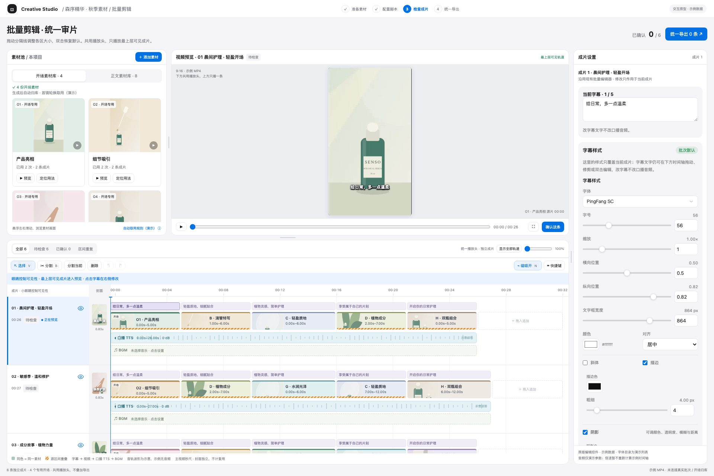
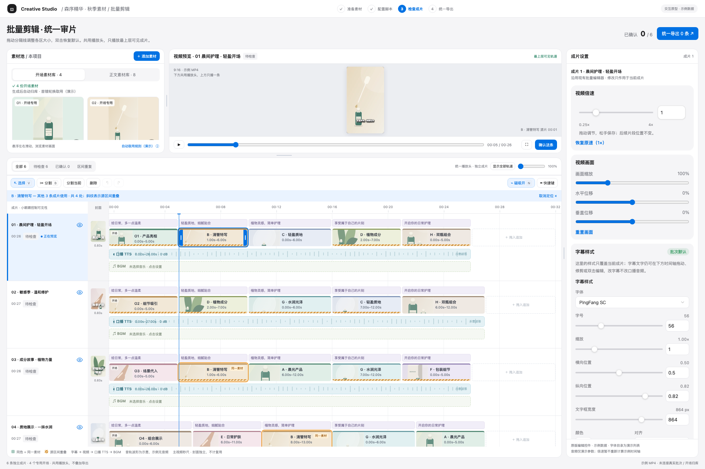
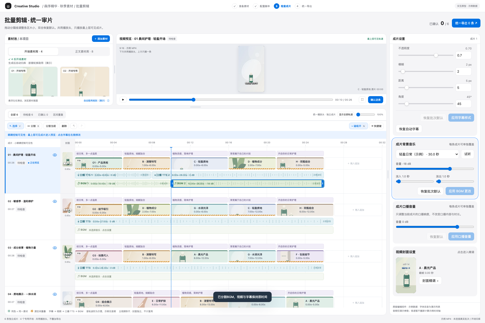

# 批量统一审片 PRD

- 状态：**交互方案已确认；生产实现待执行**。
- 确认日期：2026-09-25。交互基线：v14；对应本次对话最后确认的工作台。
- 本文规定产品行为；[执行文档](../plans/2026-09-25-批量统一审片-执行文档.md)规定实施顺序、技术约束与验收。
- [基线清单](../../design-assets/2026-09-25-batch-timeline-v14/manifest.json)包含冻结 HTML、截图说明、校验值及演示限制。在线 `http://127.0.0.1:8766/?v=14` 仅便于当前机器查看；查询参数不是版本存储，后续一律以冻结文件为准。

## 1. 目标与范围

将批量生产的“检查成片”从逐张成片卡片、逐条打开编辑器，改为**素材池、视频预览、原版完整属性、全部成片时间轴同屏联动**。用户能横向比较不同成片的用料，发现重复，直接修改，逐条确认后统一导出。

本次范围是批量生产的检查与编辑体验，以及为此必需的开场素材归库、当前编辑可用素材、音轨编辑和正式导出闭环。每一条成片仍是独立输出，多个成片行不是合成为同一视频的叠加轨。

实现复用现有批量生产领域与编辑能力。单条精准混剪、图片/脚本生成流程、公司供应商、桌面打包不是本次重做范围；共用模块的必要兼容改动必须回归既有调用方。

## 2. 证据与解释优先级

1. 本文中的最终规则与本次对话后续明确修订。
2. 冻结 v14 原型：视觉结构、操作反馈与手感参照。
3. 执行文档中的工程实现方案。
4. 旧设计与旧页面：仅作能力复用参考。

原型中的示例数量、素材名称、字体假目录、无声音轨、内存存储、JSON 清单导出，不是正式产品要求。原型中的 bug、硬编码和 DOM 实现方式也不构成实现规范。产品规则有冲突时先定位对应需求 ID；工程实现可调整，已确认交互不可自行简化或改回旧方案。

### 最终决策，取代早期版本

| 决策 | 最终状态 |
| --- | --- |
| 页面结构 | 左素材池、中视频预览、右完整属性；下方统一时间轴 |
| 编辑属性 | 沿用原版完整能力，不用简化版替代 |
| 面板大小 | 用户拖动分隔线调整，素材池随之自适应 |
| 素材操作 | 添加素材 + 拖入时间轴；已移除“先选素材，再替换/插入”大操作栏和卡片“选择素材”按钮 |
| 音轨 | 每条成片有独立口播 TTS、BGM，均能分割/修剪/移动 |
| 重复定位 | 点击视频片段联动高亮其他成片的同一素材 |
| 普通素材可见性 | 选中片段后普通素材保持正常显示，不通过降低透明度衬托重复素材 |
| 片段切换 | 消除解码换源闪黑；真实时间轴空位仍呈现黑场/静音 |
| 眼睛与导出 | 眼睛只控制预览可见性，导出选择独立处理 |

## 3. 页面结构与工作流

### W-01 同屏结构

- 2026-09-26 用户修订：准备素材、脚本与口播、检查成片、导出成片四步均使用同一顶部步骤导航；切换时保持工作区宽度、高度及导航锚点一致。批次概览保留独立展开入口，检查成片仍默认收起。

- 2026-09-25 用户截图修订：检查成片工作台向视口左右扩展，仅保留小边距；四个批量步骤横向移入工作台顶栏，取消左侧步骤占位。批次概览仍可从顶栏展开，默认收起时不占正文宽度。
- 上方左侧：素材池。上方中间：单个视频预览窗口。右侧：原版完整属性区，纵向覆盖上、下两部分。
- 下方时间轴横跨素材池与预览区域，集中展示当前批次全部成片；成片行标题、独立封面列、时间标尺和播放头清楚可辨。
- 页面顶部保留确认数量与统一导出入口。时间轴区域有全部、待检查、已确认、区间重复入口，数量从真实状态计算。
- 时间轴固定在工作台内滚动，具有纵向滚动条；横向放大后可水平滚动。素材池、右侧属性各自滚动。
- 大批次可虚拟化渲染，但数据、重复统计、选择状态和播放目标覆盖全批次，不能只算屏幕中的几行。

### W-02 面板调整

- 拖动素材池/预览之间、预览/属性之间、上区/时间轴之间的分隔线，实时调整大小；双击恢复默认。
- 分隔线支持键盘调整与明确鼠标光标；各区域有最小尺寸，不能拖到内容无法操作。窄窗口提供可用降级，不能把轨道或按钮挤没。
- 2026-09-26 用户修订：素材池、预览、属性及上下时间轴分隔线应能充分利用当前窗口，不能被固定的 480px/500px 或过大的区域保底值提前卡住；上限由相邻区域最小可用尺寸决定，双击恢复默认。
- v14 的具体像素为参考，验收重点是相对布局、最小可用尺寸和拖动后的行为。本期不要求跨设备同步面板偏好。

### W-03 典型流程

生成开场并归库 → 批量生成后进入统一审片 → 用眼睛切换预览成片 → 观察重复素材 → 拖入替换/插入，修剪视频、音频，修改字幕/封面 → 逐条确认 → 在统一导出入口选择合格成片 → 渲染并发布各自的正式视频与封面。

## 4. 素材池与开场库

### M-01 素材池展示

- 有“开场素材库”“正文素材库”页签，展示当前项目/上下文内的素材，数量动态变化。
- 卡片显示可辨认缩略画面、素材名称、视频轨道使用次数、涉及成片数；可预览、定位用法。
- 面板变宽时卡片宽度及网格列数自适应，能看到更多素材；高度增加时显示更多行。不能始终只保留两张巨大的卡片，也不能裁掉名称与操作。
- 在缩略画面内悬浮并左右移动鼠标，按横向位置浏览素材时间；显示进度，离开恢复缩略图。悬浮预览静音，不改变主播放头，不启动一池播放器。
- 卡片的显式预览可在中间窗口查看素材；有返回成片入口，轨道可见性保持。

### M-02 添加与拖入

- 素材池保留“添加素材”。导入归入当前开场/正文分类；状态与失败原因真实可见，失败素材不能假装可用。
- 拖到现有视频片段主体：替换该片段，保留该片段时间轴长度及现有画面/变速设置，取用新素材从合法源位置开始；源素材不足以覆盖时明确拒绝，不能越界或偷偷变速。
- 拖到片段间的插入落点：插入视频片段；拖到末尾追加区：追加。默认插入取 3 秒，源素材不足 3 秒时取合法长度，仍满足最短片段约束。
- 插入优先利用空位，空间不足只顺延本成片后续视频片段。字幕、TTS、BGM 不跟随视频自动移位。
- 拖动时显示目标成片、替换/插入/追加类型和落点；取消拖动不落数据，不产生撤销步骤。只操作落点成片，不改其他成片。
- 已移除的大操作栏和“选择素材”按钮不再作为主流程恢复。撤销入口位于时间轴工具栏。

### M-03 开场自动归库与取用

- 用户自定义生成的开场视频，在生成成功、文件可用后，自动进入该项目的开场素材库/受控开场目录；下一次批量生成首镜自动从该库取用，不再要求重复手工导入。
- 用户当前示例是 4 个开场，正式能力支持动态数量，不硬编码为 4。开场与正文分开识别；仅成功、可用的素材参与自动分配。
- 开场可复用；新批次首镜优先从开场库中分配并分散复用。v14 的 4 条轮换是示例分配，不要求复制固定 O1/O2 顺序。
- 项目、分镜上下文和素材来源要有明确归属。产品中的“文件夹”代表受管理的项目素材集合，不能靠文件名猜所属项目或把任意目录所有视频当开场。
- 归库幂等，重试或刷新不会重复注册；添加或重新生成开场仅影响后续取用及用户显式修改，不悄悄重排已生成成片。
- 开场库为空或素材暂不可用时提示并提供添加/生成入口；保持既有合法普通分配流程，不把正文素材伪标为“已使用专用开场”。

### M-04 当前编辑可用素材

导入后的素材应能用于当前正在编辑的成片，不要求用户重做全部成片才能替换一段。项目素材库、冻结批次输入和当前编辑新增引用是不同层次；实现必须同时满足可编辑和历史版本不被改写。具体登记机制由执行文档阶段 P1/P2 落实。

## 5. 时间轴、重复识别与预览目标

### T-01 成片行与时间坐标

- 每条成片行内部自上而下：**字幕 → 视频 → 口播 TTS → BGM**。独立封面位于左侧封面列。
- 全部成片共享横向标尺、缩放比例与播放头；每条成片仍有自己的片段、时长和审核状态。
- 主轨道标尺以正文 0 秒为起点；独立封面继续遵守现有 24 fps / 20 帧片头契约，不计入视频素材复用。正式时长、预览与导出在片头转换处只能偏移一次。
- 2026-09-26 用户补充：字幕条两端可伸缩；B 工具点击、“分割当前”和 ⌘/Ctrl+B 均可分割字幕。沿用原字幕编辑器的一帧最短长度与文字拆分规则，保留空位，不联动视频或口播；支持保存、撤销/重做与刷新恢复。
- 更短的成片在共享播放头超出其时长时显示“此处没有画面”；不是播放其他成片来填补。

### T-02 眼睛、编辑选择与确认

- 眼睛控制本行是否参与预览；中间窗口播放**从上往下第一条可见成片**，只播放这一条的画面与音轨。
- 点击下面其他行的片段可以编辑、定位重复，但不偷偷改眼睛状态或混播多条成片；当前编辑对象与当前预览成片分别标识。
- 全部眼睛关闭时明确显示无可见成片。显示全部轨道可恢复可见性。
- 确认作用于明确的成片及当前有效内容版本。眼睛不是确认，也不是导出勾选。预览隐藏成片仍可在导出入口被选择。

### T-03 素材身份与重复高亮

- 同一视频素材使用相同色系。身份以正式素材 ID/已核验内容归属为准，不能以文件名或缩略图相似度认定重复；分镜同源也不等于同一素材。
- 点击视频片段：当前选中片段蓝框；其他成片中同一素材橙框并标“同一素材”。上方提示其他涉及成片数和总使用处数。
- **所有普通片段保持原亮度、正常可读**；选择或定位重复不能把它们淡到接近隐藏。支持取消定位。
- “同一素材”与“源区间重叠”是两层信息：前者按素材身份，后者是跨成片取用同一源视频的区间交集，重叠段保留斜纹提示。源区间须考虑播放速度，不用屏幕上的时间位置代替。
- 使用次数 = 当前批次当前编辑版本的视频片段引用处数；涉及成片数按成片去重。封面、字幕、TTS、BGM、悬浮预览均不计入。分割形成两个片段后按两处引用计数。
- 修剪、替换、插入、删除、撤销后统计与标记同步更新；所有成片都参加统计，包括滚动区域外的行。区间重复筛选不能改变成片数据或眼睛状态。

### T-04 视频编辑

- 拖左右边缘调整入点/出点；“伸缩”表示改变取用范围，不表示变速。源范围受原视频时长和当前倍速约束。
- 最短新编辑片段 0.5 秒，视频时间落在 24 fps 帧网格。延长不得覆盖相邻片段或越过源边界。
- 拖主体在本行移动，跨过相邻片段中心可换序；延续现有 `planClipPosition` 的空位与顺序语义，不跨成片移动片段。
- 修剪、删除保留空位及后续位置；不默认自动闭合空隙。分割在指定位置生成独立片段，保留源位置关系；两侧均须满足最短长度。
- 选中片段后工具栏分割、删除、键盘操作都作用于明确对象；单条成片至少保留一个视频片段。

### T-05 音轨编辑

- 口播与 BGM 都支持选中、分割、左右边缘修剪/恢复合法源范围、主体移动、删除、撤销/重做；与视频共用磁吸、分割工具和快捷键。
- 音频片段同时具有**源音频区间和时间轴位置**，移动只改播放位置；修剪不自动重新生成 TTS，不以文字拼接代替音频编辑。
- 新编辑片段最短 0.5 秒；伸长受源音频可用范围及邻接片段限制。本期不增加音频变速、自动补句或无限循环拉长功能。
- 音轨与视频、字幕独立。删掉音频片段后的空位为静音；删除视频后的空位为黑场。不能为“避免黑帧”填回用户删掉的内容。
- BGM 未选择时显示空轨及设置入口，选定后出现可编辑片段。选中音轨时右侧定位到现有口播/BGM 属性。
- 正式实现播放真实音频，保留音量与现有淡入淡出语义，编辑结果必须进入导出；v14 的假波形、无声音频仅为演示。

### T-06 磁吸与键盘

磁吸默认开，靠近视频、字幕、音频边界或共同播放头时吸附，并出现对齐线与位置提示。v14 使用约 9 屏幕像素的邻近阈值；缩放后保持近似手感。Alt/Option 临时关闭，N 切换；这是邻近吸附，不是自动删除空位的“主轨磁吸”。

| 键 | 动作 |
| --- | --- |
| Space | 当前预览播放/暂停 |
| V / B | 选择工具 / 分割工具；B 工具点击视频或音频内部切开 |
| ⌘/Ctrl+B | 在播放头分割选中的视频或音频片段 |
| Delete / Backspace | 删除选中片段，保留空位 |
| ⌘/Ctrl+Z | 撤销一次时间轴操作 |
| ⌘/Ctrl+Shift+Z | 重做 |
| ← / → | 后退/前进一帧 |
| Shift+← / → | 后退/前进十帧 |
| N | 磁吸开/关 |
| + / − | 时间轴缩放 |
| Esc | 取消当前拖动；有弹窗时遵守既有焦点关闭顺序 |

- 一次完整拖动记为一步，移动中的中间状态不写几十次历史；取消不产生编辑。新操作清空重做分支。
- 工具栏有快捷键说明。输入框、文本编辑、下拉/字体选择、弹窗内不误触时间轴删除、分割等命令；按钮保持正常键盘激活能力。
- 参照剪映操作习惯，但本表是本期契约，不承诺复制剪映全部功能与所有快捷键。

## 6. 属性、播放、审核与导出

### E-01 原版完整属性

复用原有视频倍速、画面缩放/水平垂直位移；字幕文字、字体选择/搜索/收藏、字号、位置、宽度、缩放、颜色、对齐、斜体、描边、阴影；口播音量；BGM 选择/音量/淡入淡出；封面素材/时间点、构图与主副标题精调。继续提供既有恢复默认等入口。点击时间轴字幕可改对应字幕，封面列进入原版封面精调。

属性作用于明确成片/片段，切换编辑对象时不能把未提交草稿错写给另一条。布局改造不是删除原能力的理由；正式字体读取、偏好和保存能力继续使用现有实现。

### P-01 连续预览

- 相邻无缝片段切换不出现因 `src` 清空、重复 seek 或未解码而产生的闪黑。只有新帧真正可显示后才切换，允许短暂保留旧帧等解码。
- 不能无限冻结旧画面掩盖失败；资源缺失/解码失败明确提示、可恢复，播放时钟和音频保持同步。
- 预览跟随实时 arrangement，包括修剪、替换、重排、音轨、字幕、封面与画面参数；不拿旧合成 MP4 冒充当前编辑预览。
- 真实空位如实显示；悬浮素材预览不打断主预览音轨；切成片、快速 seek、全关眼睛时不会串音或晚到旧帧覆盖当前画面。

### R-01 保存与确认

生产版编辑要持久化，刷新能恢复已保存数据。失败可见，未保存/冲突不能被显示为“已确认可导出”。实质改变画面、声音、字幕或封面后使对应审核失效；不影响其他未编辑成片。纯结构分割且最终内容等价时，延续现有审核与修订优化，不把原型每次操作都清审核的写法硬搬到后端。

### R-02 统一导出

统一入口展示明确的成片选择与资格状态，逐条独立导出。保留既有正式渲染、校验、发布与失败重试契约；正式产物与当前编辑预览分别标识。整片渲染在导出阶段按需触发，编辑过程中只保存并实时预览。已有正式产物在新发布失败时仍可访问。确认、可见性、导出选择三套状态互不冒充。

## 7. 原型边界与验收口径

| v14 已用于确认的交互 | 正式实现仍需完成的能力 |
| --- | --- |
| 布局、缩放、拖拽、修剪、分割、磁吸、高亮 | 真实批次数据、保存、刷新恢复、版本冲突处理 |
| 原版属性组件的界面 | 实际字体/媒体目录、真实保存与预览链路 |
| 开场/正文分类、4 个示例开场 | 生成成功归库、项目隔离、自动分配与幂等 |
| 本页文件导入 | 受管理素材登记、冻结输入兼容、导出可访问 |
| TTS/BGM 假波形编辑 | 真实音频取源、播放、静音区间与渲染一致性 |
| 确认与示例清单下载 | 审核门禁、正式 MP4/封面渲染发布与重试 |

最终验收需要同时满足：本 PRD 所有 ID；冻结原型的视觉/交互对照；真实持久化与媒体预览；真实音频及视频导出验证；既有批量/单条链路回归。只有 HTML 能点、lint/build 通过或静态截图相似，不算正式完成。

需求 ID 与逐项场景见执行文档验收表。本期未要求跨成片拖动、批量修改字幕/封面、转场特效、自动音文联动、AI 重写口播、多人协作或跨设备历史同步；不能用这些扩展替代已确认的基本编辑闭环。

### 2026-09-26 音轨波形补充

- 按用户反馈，统一时间轴的口播与 BGM 显示真实音频波形，辅助寻找停顿和分割点；标签与波形分层显示。
- 分割、修剪、移动后，波形按片段源区间显示；BGM 超过原曲长度时按真实时长循环；缩放保持时间对应。
- 只在本机解码，复用同源采样缓存；读取失败显示明确状态，不伪造波形，也不阻塞原有编辑。
